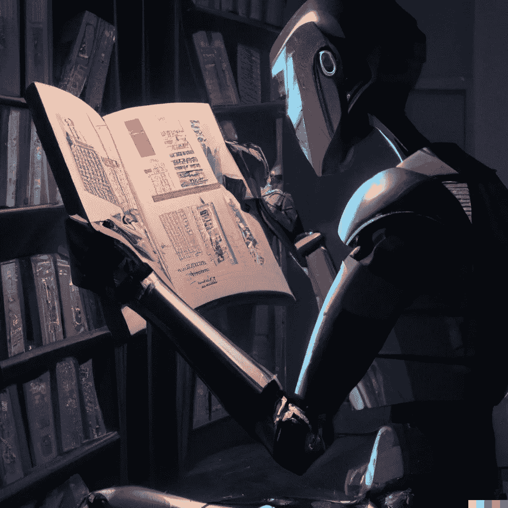

# 机器会思考吗？

> 原文：<https://medium.com/geekculture/can-machines-think-1336850b9f2f?source=collection_archive---------7----------------------->

[“Robot reading a nature paper](https://twitter.com/AravSrinivas/status/1518261641401430018?s=20&t=W8QMLZFIXMP8qkL_P1d6dA)”, generated by DALL-E 2.

## 思想的机械化比大多数人认为的更近。

从远古时代开始，人类就一直在努力解决机器思维的概念。

在公元前 500 年之前的早期希腊神话[中，一个巨大的青铜机器人 Talos 每天都会在欧罗巴海岸巡逻。他有人类的品质，如情感和判断——这是由……](https://en.wikipedia.org/wiki/History_of_artificial_intelligence)