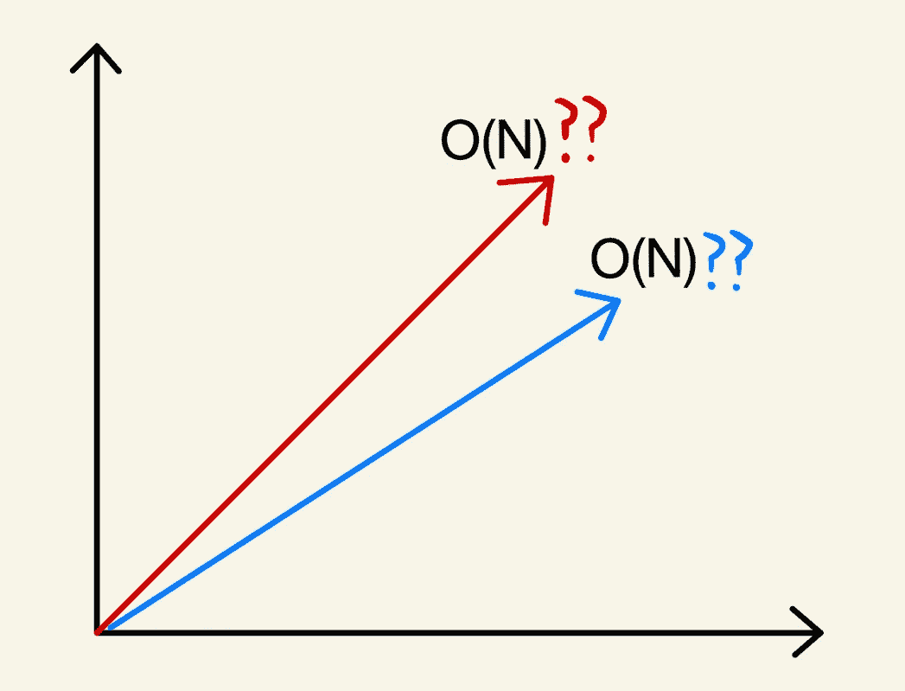
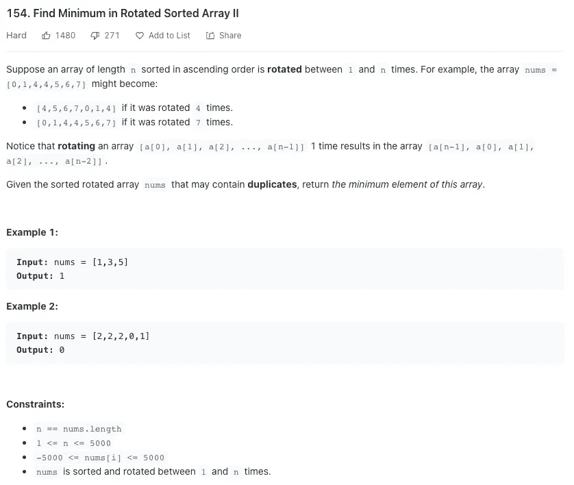
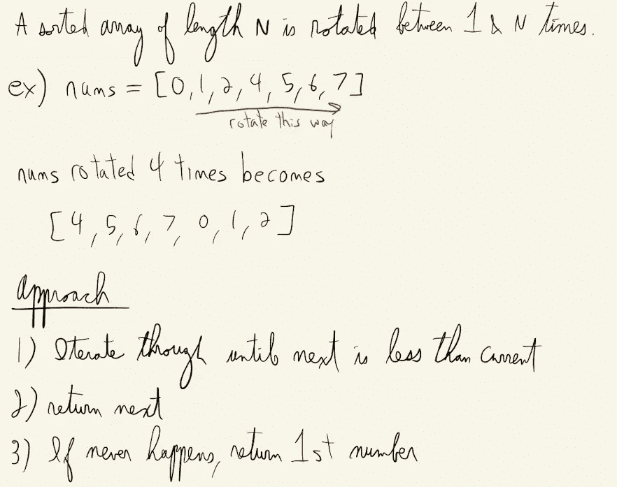
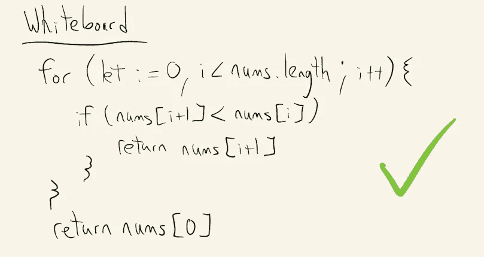
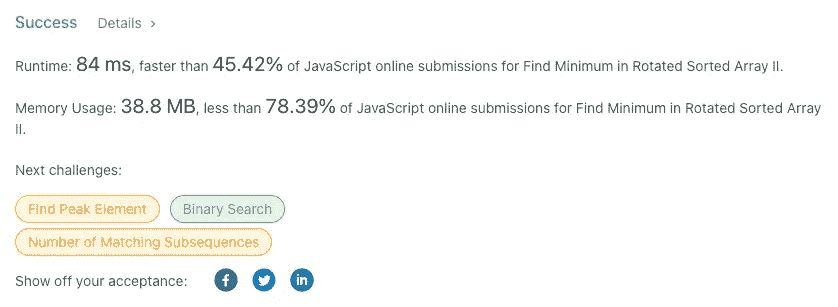
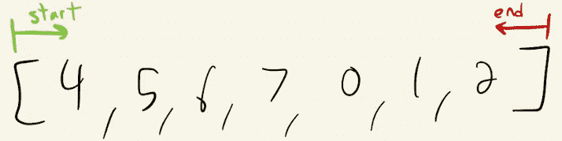
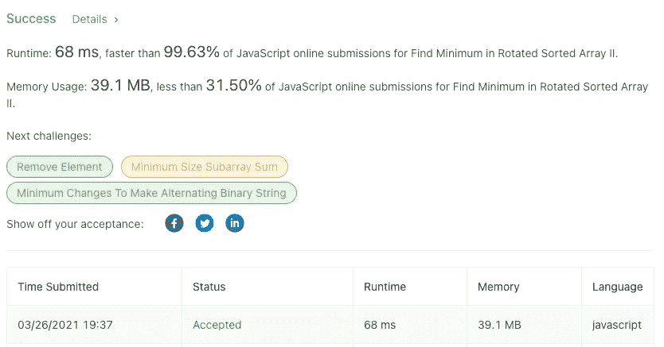

# 一个线性函数能比另一个快吗？

> 原文：<https://medium.com/geekculture/can-one-linear-function-be-faster-than-another-3fa4cded28f2?source=collection_archive---------13----------------------->

## 在现实世界中，具有相同大 O 符号的相似函数会有非常不同的运行时。



今天早些时候，我在 LeetCode 上练习一些问题时，受到了写这篇博客的启发。

如果你熟悉 LeetCode，你会知道一般的格式是给你一些问题来解决，你不仅要写正确解决问题的代码(和所有的边缘情况)，而且它还必须能够在一定的时间内运行才能被接受。对于输入大小为 10 的解决方案可能工作得很好，但是如果输入大小增加到 10，000，执行起来可能会非常慢。

## 设置

如果你不熟悉时间复杂性和大 O 符号，你可以在网上找到大量的资源来解释。我喜欢 Codecademy 的这个。在解决这些问题的时候，很多时候你想要一个线性的运行时间或者更好的运行时间，这意味着运行代码所需的时间随着输入的数量成直线增长。(如果输入大小为 100 的代码需要 100 毫秒，那么输入大小为 200 的代码需要 200 毫秒，依此类推。)

大 O 符号告诉你，我们通常会丢弃运行时中任何不太重要的部分，因为随着输入大小越来越大，它们变得无关紧要。例如，如果您有一个运行在 **O(2N) + O(logN)** 运行时的函数，当输入大小增加到非常大时，O(logN)部分并没有真正做出显著的改变，因此函数只是变成了 **O(2N)。**

实际上，我们可以通过去掉这个符号中的常数 2 来进一步简化这个问题，因为同样地，它对于表达函数如何执行并不是一个重要的因素。最后的符号是 **O(N)** 我们称之为线性函数。

## 错误

现在许多人犯的错误是认为我们忽略的其他因素完全无关紧要。虽然 Big-O 可能不关心它们，但作为程序员，我们当然应该关心。Big-O 更关注功能的长期增长率，而不是绝对性能。在前一种情况下，常数和非主导项可以去掉，但在后一种情况下，它们仍然非常重要。

这就是为什么两个函数一个运行时间为 O(N ),另一个运行时间为 O(N/2 ),这两个函数都可以称为线性的，但是对于足够大的样本量来说，实际运行时间却有很大的不同。

这可能听起来非常简单和明显，但在编写代码时考虑这一点很重要。仅仅因为你的解决方案是线性的，并不意味着它是线性运行时的最佳版本。

## 让我们看看它的实际效果

我们将使用激发这个博客的问题作为我们的例子。LeetCode #154



271 people are not fans it seems

这是一个简单的前提。给你一个数组，在某一点上是按升序排序的，但是它已经“旋转”了一个数，旋转的次数不知道。需要注意的是，它可以循环 n 次(其中 n 是数组长度),如上面 7 次循环的示例所示，并且可以返回到原始排序位置。

## 白板

我喜欢先画一个大纲，然后用伪代码解决这些问题。这样我可以从一个高层次来看待它，并在深入代码之前尝试找出我的方法中的漏洞，这样做可能会更令人困惑。



Here is what I wrote before attempting this problem. Excuse the chicken-scratch.

基本上我们想做的就是遍历数组，检查我们当前所在的元素是否小于数组中的下一个元素。如果我们得到一个数字，其中下一个元素更小，我们将知道这是旋转数组的最小值。

在最坏的情况下，我们一直到达数组的末尾，并且从未遇到比它的前一个数字小的数字。我们知道我们遇到了旋转数与数组长度匹配的边缘情况，并得到了一个排序的数组。这将是一个线性运行时，因为我们访问数组中的每个输入一次。

下面是一个简单的 JavaScript 实现:



You’ll notice a green check mark because I tested this code in my editor and it worked.

在这里，它实际上是打印出来的:

```
var findMin = function(nums) {
    for (let i = 0; i< nums.length; i++){
        if (nums[i+1] < nums[i]){
            return nums[i+1]
        }
    }
    return nums[0]
};
```

## 线性解

我运行了测试用例，它通过了，所以现在是时候将解决方案提交给 LeetCode，看看我们得到了什么。



太好了！我们通过了。很多次都足以让你继续前进。我们得到了一个线性解，它接受了我们的答案。但是我注意到我们的解决方案只比这个问题的其他提交方案快 45%。这意味着超过一半的人想出了更快的解决方案！

这让我想到，在最坏的情况下，我们只访问每个输入一次，怎么可能比线性解决方案运行得更快呢？也许是某种二分搜索法？但是我们不知道我们要找的最小数量是多少。好的，那么 Min 堆呢，在我们进行的过程中记录最小值。不..对于这样一个简单的问题来说，这似乎太复杂了..

嗯，如果我们能保持线性但提高速度呢？让我们试试那个！

## 更快的线性解决方案

如果对于每一次迭代，我们都在寻找两个连续的数字没有被排序，而是从两端开始呢？

我们可以有从开始和结束开始的指针，对于每个循环，只要不满足条件，我们就将开始指针向右移动，将结束指针向左移动。



现在，对于 10 个数字的输入，我们最多循环 5 次，而不是 10 次。

我们的运行时间将是 O(N/2 ),这简化为 O(N ),但实际上它比我们以前的解决方案快一倍。让我们用 JavaScript 实现它:

```
var findMin = function(nums) {
  let start = 0
  let end = nums.length-1

  while(start < end){
    if (nums[start] <= nums[start+1]){
        start++
    } else {
        return nums[start+1]
    }if (nums[end] >= nums[end-1]){
        end--
    } else {
        return nums[end]
    }
  }

  return nums[0]
};
```

这和之前的逻辑是一样的，但是现在在每次循环中，我们都将开始指针递增，结束指针递减 1。如果两个满足，我们退出循环并返回数组中的第一个数字，因为这意味着数组已排序。

毫无疑问，当我们在 LeetCode 中尝试这个新的解决方案时，我们得到了:



我们的解决方案使用稍微多一点的内存，但是运行速度更快，这是一个简单的折衷。

这就是为什么重要的是要记住，即使你可能已经得到了一个线性解决方案，仍然有机会进一步优化你的解决方案。