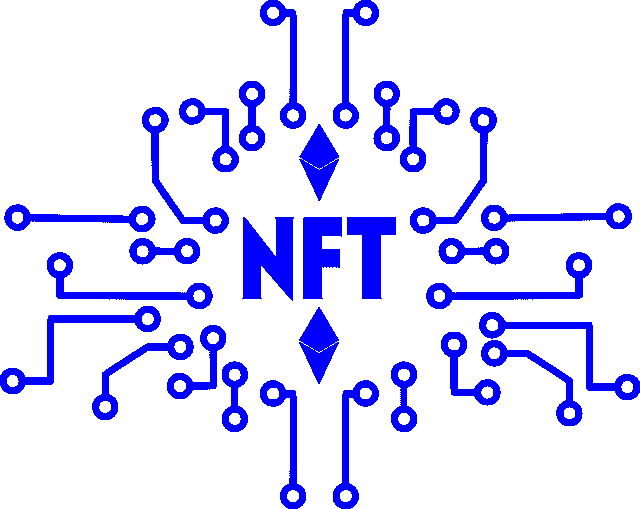

# PlayDapp (PLA)能从区块链游戏中赚钱吗？—市场疯人院

> 原文：<https://medium.com/geekculture/can-playdapp-pla-make-money-from-blockchain-games-market-mad-house-c7ccac9859f5?source=collection_archive---------21----------------------->

PlayDapp (PLA) 是一个让区块链游戏成为主流的尝试。为了解释，他们声称 PlayDapp 服务允许人们在没有加密货币的情况下玩区块链游戏。

因此，用户将不得不购买加密货币或获得一个加密货币钱包来玩区块链游戏。相反，用户将通过客户对客户的 C2C 市场[交易角色、钥匙、宠物和物品。](https://www.investopedia.com/terms/c/ctoc.asp)

