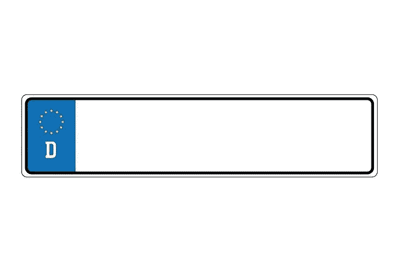

# Galaxy 项目能从 Web3 证书中赚钱吗？—市场疯人院

> 原文：<https://medium.com/geekculture/can-project-galaxy-gal-make-money-from-web3-credentials-market-mad-house-fff13bb6570?source=collection_archive---------11----------------------->

银河计划(Project Galaxy)试图利用数字证书赚钱。凭证是构成数字身份的活动、声誉和成就的记录。

银河项目[是一个区块链生态系统](https://galaxy.eco/build)，它包含应用程序模块、证书 Oracle 引擎和银河证书 API(应用程序…