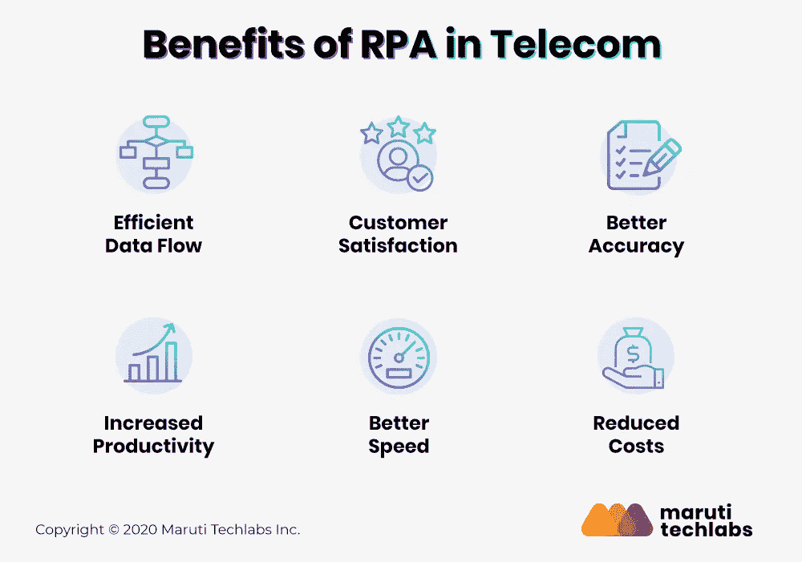

# 机器人过程自动化能让电信行业受益吗？

> 原文：<https://medium.com/geekculture/can-rpa-benefit-the-telecom-sector-2cd82e2c2da0?source=collection_archive---------20----------------------->

随着世界范围内技术的爆炸，今天的消费者配备了多种设备。物联网和 5G 等技术使得电子设备之间的互联更加无缝。采用越来越多设备的消费者数量的激增转化为电信行业的稳定增长。

电信业务流程管理正试图应对这种客户群激增的情况，这种情况无意中导致了客户期望值的提高、竞争、有效的缺陷解决方案，并要求一流的客户服务。

因此，电信公司需要一种更快、更高效的方法来管理日常运营。[电信领域的机器人流程自动化](https://marutitech.com/robotic-process-automation-services/?utm_source=medium&utm_medium=content_promotion&utm_campaign=can_RPA_benefit_the_telecom_sector)有助于提供高水平的服务。本文分析了电信领域的 RPA 趋势，并探讨了其挑战和优势。它减少了人工错误、周转时间，并探索了面向客户的机会，同时降低了运营成本。

# RPA 如何帮助电信运营商？

电信行业正在努力应对许多运营流程，如数据管理、提高业务灵活性、成本控制、提高业务效率和新模式/服务。电信行业特别受到以下挑战的限制，使其无法专注于更重要的任务:

*   **生产力降低:**电信服务提供商处理来自各种来源的海量数据，并依赖员工跨平台、数据库和应用程序工作。这种持续的人为干预降低了组织的整体生产力。
*   **管理费用:**管理多种硬件和软件成本、维护系统、数据安全和其他费用，如工资，占了很大一部分管理费用。
*   **出错风险增加**:各种手工操作活动容易出错。纠正这些错误会占用宝贵的时间，并影响客户满意度。

重复的流程阻碍了电信服务提供商专注于其他重要活动和他们的消费者，促使他们相互竞争，为他们的消费者提供经济、快速和先进的解决方案。

电信中的机器人过程自动化是电信部门可以探索以改进其业务流程的新兴技术之一。电信行业的 RPA 趋势支持跨多个平台的各种劳动密集型和耗时流程的自动化。 [RPA CoE](https://marutitech.com/rpa-coe/?utm_source=medium&utm_medium=content_promotion&utm_campaign=can_RPA_benefit_the_telecom_sector) 可以帮助电信组织克服各种障碍，帮助他们改善公司流程并获得竞争优势。

# 机器人过程自动化给电信行业带来的好处

电信行业的 RPA 趋势表明，在组织中采用自动化有助于克服各种障碍，允许他们改进公司流程并获得竞争优势。一些好处讨论如下:

*   **高效的数据流:** RPA 能够模拟人的动作，轻松地与界面交互。[电信行业的 RPA](https://marutitech.com/rpa-in-telecom/?utm_source=medium&utm_medium=content_promotion&utm_campaign=can_RPA_benefit_the_telecom_sector)通过提供电信行业的客户或员工所需的详细数据，可以在数据源和访问之间架起一座桥梁。
*   消费者满意度:电信领域的机器人流程自动化可能有助于各种后台任务的自动化。它使员工可以减少在耗时的后台事务上花费的时间，将更多的时间花在客户需求上，从而提高客户满意度。
*   **提高准确性:**使用 RPA 的机器人完全被编程为遵循手动程序。他们配备了一周七天、一天 24 小时运行的设备，并且始终以 100%的精度和一致性工作。
*   **效率和速度:** RPA 技术自动化了大多数非战略性和常规工作，使员工能够完全专注于需要人类智慧的事情。
*   **优化成本:**电信行业的 RPA 可以通过自动化重复且耗时的人工操作、削减人力成本和优化流程来节省资金。

单击此处了解 RPA 为您的企业带来的[更多好处。](https://marutitech.com/benefits-of-rpa-in-business/?utm_source=medium&utm_medium=content_promotion&utm_campaign=can_RPA_benefit_the_telecom_sector)

# 如何在电信行业实施 RPA 步指南

1.  **业务流程评估:**电信公司可以从评估流程中的每项活动开始，以提高效率和有效性，消除那些不符合法规且不会给组织带来价值的活动。
2.  **目标流程识别:**具有事务性组件的流程通常更易于自动化。公司应该使用诸如高容量、高体力劳动和重复性等参数来识别此类流程。
3.  **选择设计模型和自动化计划:**RPA 部署的下一阶段应该是重建选定的流程流，以优化其自动化潜力，同时牢记更广泛的公司结构，并根据流程要求对其进行个性化。
4.  **选择 RPA 服务提供商:**对于 RPA 实施，我们建议您聘请在处理复杂 RPA 项目方面具有专业知识并对运营挑战有透彻了解的专业顾问。
5.  **推出:**RPA 实施流程的最后一个阶段是在 IT 部门、业务部门和 RPA 解决方案提供商的帮助下推出计划。

众所周知，使用 RPA 可以改善整体电信业务流程管理。随着电信业务在全球范围内的增长和扩张，RPA 看起来是通过使用传统系统来简化业务流程的理想选择。电信领域中的这些 RPA 用例将在未来几年继续飞速发展，为这些技术提供各种机会来提供必要的自动化框架。

如果您也想从[成功的 RPA 实施](https://marutitech.com/successful-rpa-implementation/?utm_source=medium&utm_medium=content_promotion&utm_campaign=can_RPA_benefit_the_telecom_sector)中获益并获得竞争优势，请访问[此处](https://marutitech.com/contact-us/?utm_source=medium&utm_medium=content_promotion&utm_campaign=can_RPA_benefit_the_telecom_sector)，我们将与您联系。