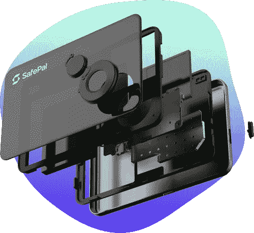

# SafePal (SFP)能从硬件钱包中赚钱吗？

> 原文：<https://medium.com/geekculture/can-safepal-sfp-make-money-from-hardware-wallets-1de69d7b44a3?source=collection_archive---------15----------------------->

SafePal (SFP) 是最吸引人的分散金融(defi)令牌之一，因为它们将它与一件硬件联系在一起。

为了解释这一点，SafePal 提供了一种加密货币和一种 T2 硬件钱包 S1。他们声称 SafePal 的钱包支持 15 种编程语言和 54 种区块链。此外，他们声称你可以在不了解你的客户的情况下在 S1 上存储密码…