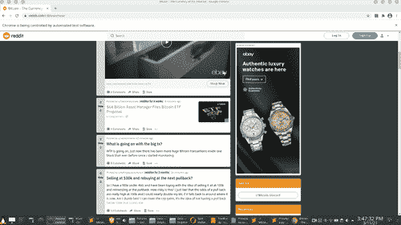
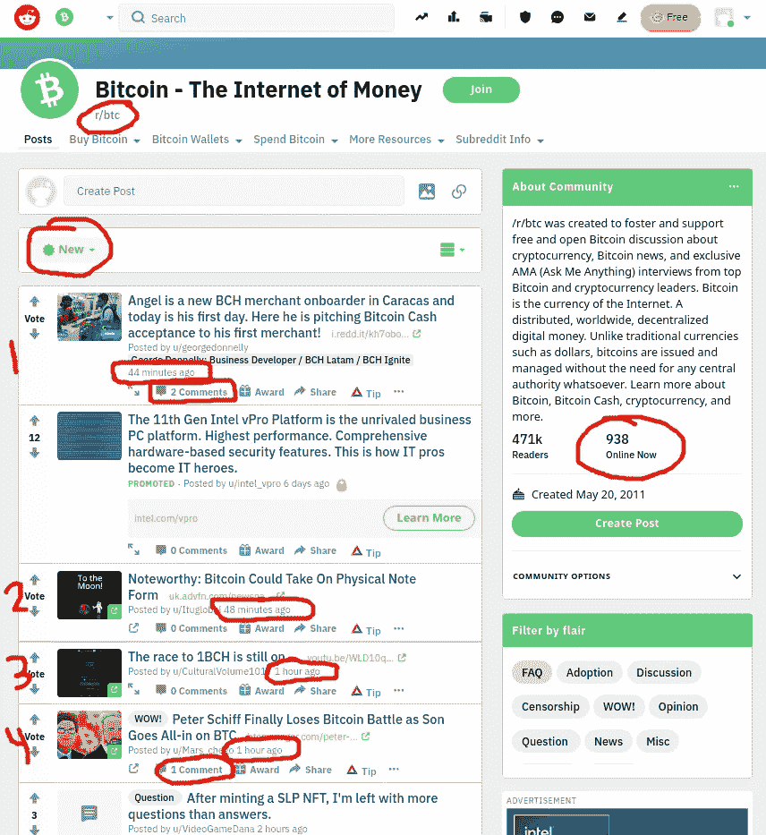
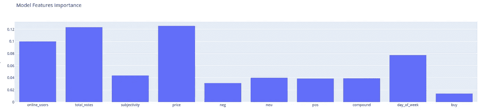
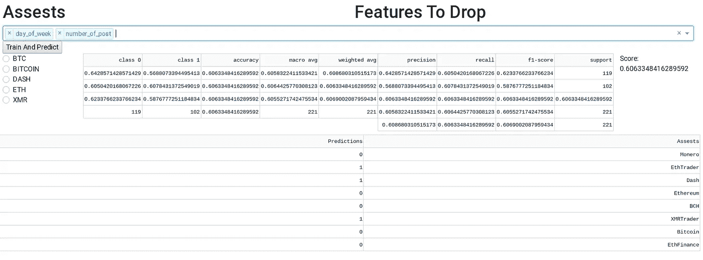
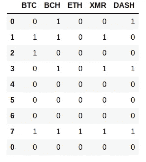
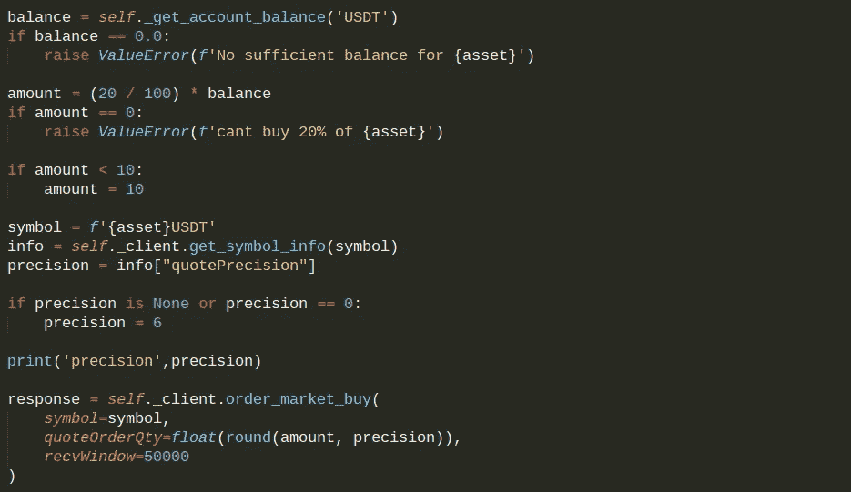
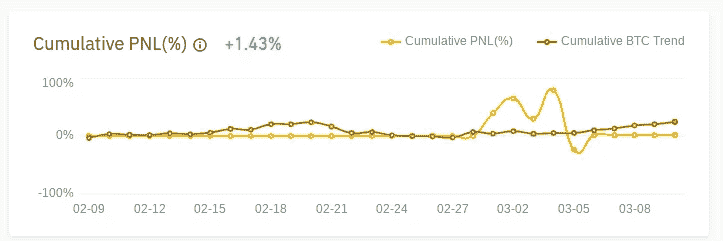

# 社交媒体能预测资产价格运动吗？

> 原文：<https://medium.com/geekculture/can-social-media-predict-asset-price-movement-9aad4becc133?source=collection_archive---------18----------------------->

## TradR.fun 是一个开源模型和交易应用程序，根据社交媒体活动和情绪产生买卖信号。

网上论坛似乎可以对价格变动有一定的预感。随着对某项资产的讨论增多，价格通常也会上涨。这是我想验证的直觉，如果正确，从这个项目中获益。*我希望即使不是整个项目的一部分，也能对其他人有用，它托管在* [*GitHub*](https://github.com/KyleBenzle/TradR) *和*[*python anywhere*](http://benzle.pythonanywhere.com/)*。如有任何问题或建议，请联系***。**

*使用从 Reddit 每小时收集的大量数据以及历史价格数据，建立了一个模型，试图预测积极或消极的未来价格走势。*

# *TradR 概述*

*这个项目有 5 个部分，最终结果是， [TradR.fun](https://tradr.fun) ，前端应用程序，用户可以看到每小时更新的买卖信号。*

*1.Web scraper / API —收集实时社交媒体和价格数据。*

*2.特征工程——使用什么数据和预测什么。*

*3.建立模型——最大限度地提高买入/卖出信号的准确性。*

*4.交易—进行实时交易。*

*5.app——用户实时互动应用。*

# *程序控制*

*几个模块由“Main_Control_Script.py”控制。每小时运行一次以下内容:*

*   *RedditScraper.py*
*   *PriceApp.py*
*   *分析. py*
*   */TradeMaker/Trade_Script.py*

# *1.抓取 Reddit*

*使用 Selenium 是因为它提供了更多的灵活性，没有任何限制，但是也可以尝试 API。*

**

*crypotocurrency 社区很好地分成了基于资产的独立论坛，因此它可以提供更细粒度的视图。因为加密货币全天候交易，而且论坛非常活跃，所以可以获得大量数据。*

***每小时报废日期:***

*   *所有注释文本*
*   *当前用户数量*
*   *最后一小时的帖子数量*
*   *最后一小时的评论数*
*   *最后一小时的投票数*
*   *来自 Nomic.com API 的每小时价格和交易量数据*

***对于资产/子资产***

*   *BTC、BCH、瑞士联邦理工学院、XMR、DASH*
*   *r/比特币，r/btc，r/以太坊，r/ethtrader，r/ethfinance，r/monero，r/xmrtrader*

**

*价格数据来自 Nomics.com 免费 API。*

*Reddit 刮刀的代码在这里[找到](https://github.com/KyleBenzle/TradR/blob/main/RedditScraper.py)，价格刮刀的代码在这里找到[。](https://github.com/KyleBenzle/TradR/blob/main/PriceApp.py)*

# *特征*

*总共使用了以下功能:*

*   *一天中的小时*
*   *星期几*
*   *用户数量/小时*
*   *每小时发布的数量*
*   *评论/小时*
*   *15 个最重要的单词*
*   *评论的 NLP*

*训练数据的目标是下一个小时百分比变化的+/-值。*

**

# *分析*

*随机森林模型用于对评论中使用的最重要的词进行分类，并用于基于上述所有特征的+/-价格信号分类。完整的代码可以在[这里](https://github.com/KyleBenzle/TradR/blob/main/Analysis.py)找到。输出是对文件" [SignalInput.csv](https://github.com/KyleBenzle/TradR/blob/main/SignalInput.csv) "的更新，其中 1 =买入，0 =基于每个子编辑和资产的卖出信号。*

**

# *贸易*

**

*分析的目标输出是每小时更新的买入/卖出信号。在 usr 把他们的 API 放入 config.py 文件后，信号被“trade_script.py”文件读入，每小时在币安进行一次交易。*

*买卖的基本算法是，对于买入信号，账户的 20%花在该资产上，对于卖出信号，所有资产将被卖出。*

**

# *应用*

*在 [https://TradR.fun](https://TradR.fun) 中，用户可以选择要包含的功能，并重新运行模型，以尝试获得最佳的分数和预测。*

**

# *结果*

*就性能而言，大约一个月后性能平平。这是非常保守的，算法的大部分时间都是以美元计价的。卖出信号似乎更常见，只有 10-20%的时候该算法会进行购买。*

**

# *未来的工作*

*继续用新数据测试准确性。*

*调整特征。*

*优化字数。*

*尝试包含价格数据的时间序列模型。*

*使用滑动窗口测试在什么时间间隔信号是最准确的。*

*增加用户在 TradR.fun 上交易的能力*

***感谢阅读，请联系**[**https://KyleBenzle.com**](https://KyleBenzle.com)**或上** [**推特**](https://twitter.com/KyleBenzle) **。***