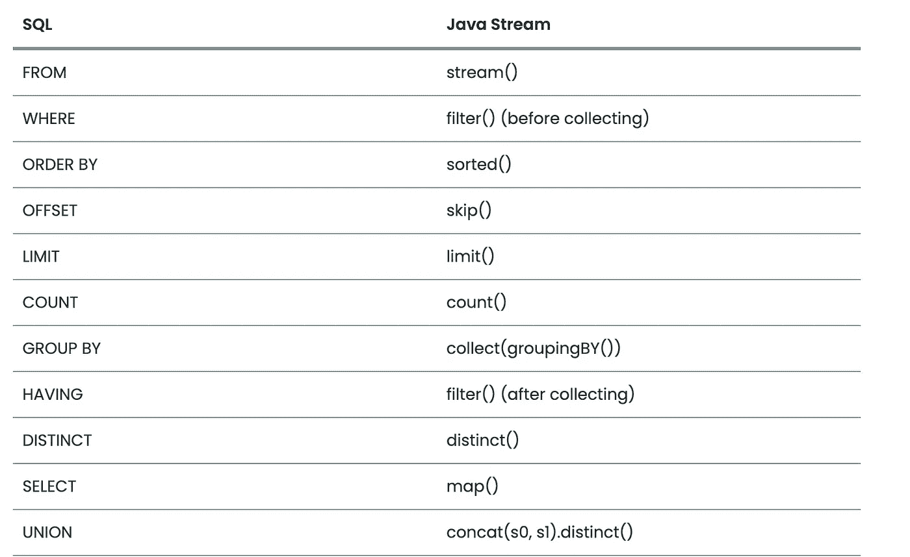

# Stream API 和 JPA 能成为朋友吗？

> 原文：<https://medium.com/geekculture/can-stream-api-and-jpa-be-friends-4e48d6af04aa?source=collection_archive---------15----------------------->


在本文中，我将向社区介绍 JPAstreamer 库。这个库的想法非常简单，但同时也很巧妙——从数据库中获取我们需要的实体，就像我们只是在 streamer 中处理一个实体流一样。

所以，我们有一个问题——我们在应用程序中使用 JPA，我们希望以某种方式更有效地在数据库上执行选择。同时，我们希望有一个直观的界面，就像在流 API 中一样。

为了解决这样的问题，发明了以下技术——Hibernate 查询语言(HQL)和 Java 持久性查询语言(JPQL)。但是它们提供了相当复杂的解决问题的方法，现在还不是很清楚。

使用 JPAstreamer 库，检索实体的方法发生了变化。它允许我们以类似流的方式编写实体选择，然后在基础上执行。

让我们按顺序看看这是如何发生的。

在幕后，JPAstreamer 使用了一个注释处理器，比如 Lombok 中的那个。在编译时，它为 JPA 实体分析我们的代码，并为它们生成一个元模型。也就是说，如果我们的代码有标有 [@Entity](http://twitter.com/Entity) 注释的 Book class，它将生成带有元模型的 Book$ class。在这里找到这个类:target/generated-sources/annotations，或者，如果您使用的是 Gradle，则是 build/generated/sources/annotation processor。

为什么我们需要元模型？

因为最终我们只想使用流接口，所以我们必须让库知道我们何时传递了关于选择的信息，以及我们何时已经处理了获得的结果。因此，我们基于我们的实体创建一个元模型，并对每个字段进行描述。

因此，当我们使用元模型的字段时，我们描述了实体选择规则。当我们使用实体字段时，我们处理选择返回的结果。

实际上，我们来看一个例子。为此，我将在 Spring Boot 创建一个项目，并向其中添加几个实体。

让我们将依赖项添加到项目中:

```
implementation ‘com.speedment.jpastreamer:jpastreamer-core:1.0.2’ annotationProcessor “com.speedment.jpastreamer:fieldgenerator-standard:1.0.2” implementation ‘com.speedment.jpastreamer.integration.spring:spring-boot-jpastreamer-autoconfigure:1.0.2’
```

接下来，我们创建实体:

库生成的类将如下所示:

现在让我们看一些如何使用库的例子。

我已经上传了一个示例代码[在这里](https://github.com/r331/jpastreamer-sample/blob/main/src/test/java/dev/ivanov/jpastream/StreamerTest.java)。

为了获得所有的实体，只需运行代码:

```
var books = jpaStreamer.stream(Book.class).toList();
```

现在我们试着过滤掉 2020 年以前的书。

```
var books = jpaStreamer.stream(Book.class) .filter(Book$.year.greaterOrEqual(2020)) .toList();
```

在控制台上，我们将看到以下请求:

```
Hibernate: select book0_.id as id1_1_, book0_.author_id as author_i5_1_, book0_.price as price2_1_, book0_.title as title3_1_, book0_.year as year4_1_ from book book0_ where book0_.year>=?
```

如果过滤不是通过元模型类完成的呢？

```
var books = jpaStreamer.stream(Book.class) .filter(x -> x.getYear() >= 2020) .toList();
```

这将导致控制台上出现以下查询:

```
Hibernate: select book0_.id as id1_1_, book0_.author_id as author_i5_1_, book0_.price as price2_1_, book0_.title as title3_1_, book0_.year as year4_1_ from book book0_
```

实际上，在这种情况下，我们已经在过滤中使用了选择的结果，因此我们必须使用元模型的字段来创建有效的选择。

我们可以组合选择:

```
var books = jpaStreamer.stream(Book.class) .filter(Book$.year.greaterOrEqual(2020)) .filter(Book$.price.in(1000.0, 1700.0)) .toList();
```

排序:

```
var books = jpaStreamer.stream(Book.class) .sorted(Book$.price) .toList();
```

相应地，数据库中的查询:

```
Hibernate: select book0_.id as id1_1_, book0_.author_id as author_i5_1_, book0_.price as price2_1_, book0_.title as title3_1_, book0_.year as year4_1_ from book book0_ order by book0_.price asc
```

排序可以变得更复杂:

```
jpaStreamer.stream(Book.class) .sorted(Book$.price.reversed().thenComparing(Book$.title.comparator())) .toList();
```

我们还可以使用 skip 和 limit 方法执行分页操作:

```
var books = jpaStreamer.stream(Book.class)
.sorted(Book$.price).skip(3).limit(3).toList();
```

数据库请求:

```
Hibernate: select book0_.id as id1_1_, book0_.author_id as author_i5_1_, book0_.price as price2_1_, book0_.title as title3_1_, book0_.year as year4_1_ from book book0_ order by book0_.price asc limit ? offset ?
```

我们还可以创建更复杂的查询，比如连接操作。

首先，我们将获得所有书籍的作者:

```
var authors = jpaStreamer.stream(Book.class).map(Book::getAuthor) .toList();
```

我们会在控制台上看到:

```
Hibernate: select author0_.id as id1_0_0_, author0_.name as name2_0_0_ from author author0_ where author0_.id=? Hibernate: select author0_.id as id1_0_0_, author0_.name as name2_0_0_ from author author0_ where author0_.id=? Hibernate: select author0_.id as id1_0_0_, author0_.name as name2_0_0_ from author author0_ where author0_.id=? Hibernate: select author0_.id as id1_0_0_, author0_.name as name2_0_0_ from author author0_ where author0_.id=?
```

这样不好:)我们通过加盟来解决这个问题:

```
var configuration = StreamConfiguration.of(Book.class) .joining(Book$.author); 
var authors = jpaStreamer.stream(configuration) .map(Book::getAuthor).toList();
```

现在一切都很好。

连接配置是可配置的，有一个枚举:

```
public enum JoinType { 
*/** Inner join. */* INNER, 
*/** Left outer join. */* LEFT, 
*/** Right outer join. */* RIGHT }
```

值得一提的是，文档中的作者制作了一个漂亮的表格，其中列出了 SQL 操作及其到流的映射:



结论

我真的很喜欢溪流，这个图书馆对我来说是一个愉快的发现。在我看来，它允许对数据库查询所需的逻辑进行更加透明和简单的描述。这反过来又会导致更可靠、更易于维护的应用程序。感谢您的关注！