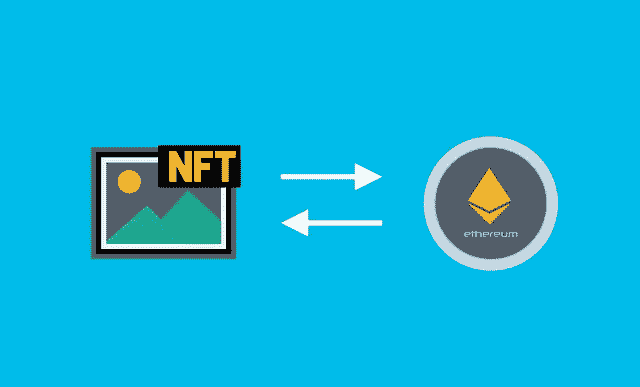

# 海洋协议(Ocean)能从数据中获利吗？—市场疯人院

> 原文：<https://medium.com/geekculture/can-the-ocean-protocol-ocean-profit-from-data-market-mad-house-96bb2e146134?source=collection_archive---------18----------------------->

**海洋协议(OCEAN)** 是通过区块链和不可伪造令牌(NFT)将数据货币化的努力。

海洋协议通过将数据封装在可互操作的 [ERC-721 数据 NFTs & ERC20 数据令牌](https://oceanprotocol.com/)中来标记数据。NFT 是一种标记，用作数字构造(如艺术品)的唯一标识符。

