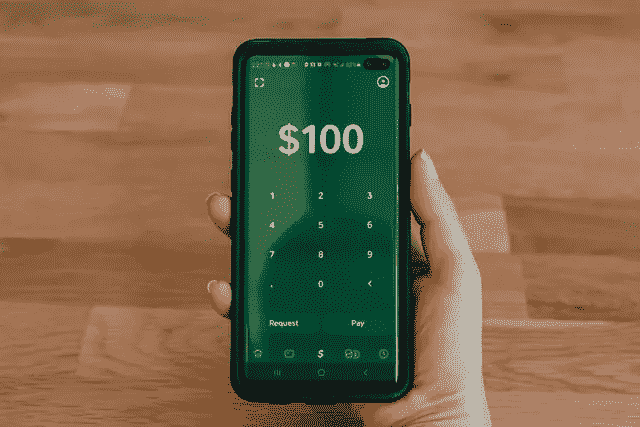

# 帕克斯元(USDP)能和脸书的诺维一起成长吗？—市场疯人院

> 原文：<https://medium.com/geekculture/can-the-pax-dollar-usdp-grow-with-facebooks-novi-market-mad-house-3500dbcb476?source=collection_archive---------26----------------------->

奇怪的是，马克·扎克伯格的 Meta 或元宇宙梦可能会增加 USDP 稳定币的价值。

解释一下，**脸书的** [Novi wallet 使用 Pax Dollar](https://www.novi.com/) 来实现无手续费的货币转账和交易。目前，Novi 允许等待名单上的用户在美国和危地马拉之间发送 Pax 美元。

