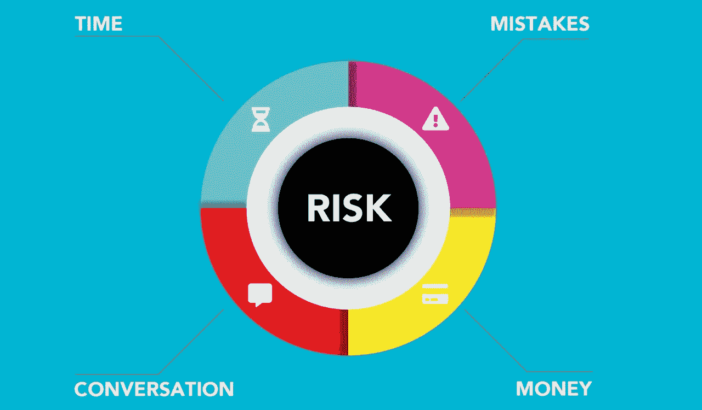

# 世登网络(SDN)能赚钱吗？—市场疯人院

> 原文：<https://medium.com/geekculture/can-the-shiden-network-sdn-make-money-market-mad-house-ce26e50e81b6?source=collection_archive---------14----------------------->

施登网络公司(SDN)可以通过同时运营几个区块链来赚钱。

为了解释这一点，他们打算把[石登打造成一个在](https://shiden.astar.network/)[草间弥生区块链](https://kusama.network/)上运营的多连锁店 DApp 中心。实际上，施登是区块链的一个额外的层，支持各种区块链解决方案。石登声称支持的区块链解决方案包括以太坊虚拟机、Web 程序集和第二层。

