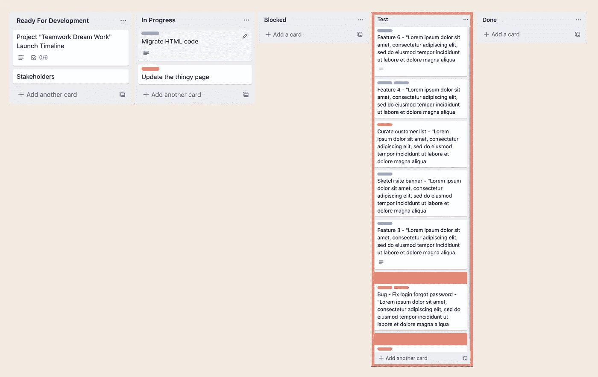

# 我们能克服测试瓶颈吗？

> 原文：<https://medium.com/geekculture/can-we-overcome-testing-bottlenecks-e6eb82d3c755?source=collection_archive---------35----------------------->

> 打破传统的 QA 孤岛，让开发人员能够进行质量检查。

瓶颈往往是软件开发团队中的常见现象，并且最常见于测试阶段。如果您继续经历这种症状，那么您并不孤单，因为来自世界各地的软件开发团队都在经历这些阶段。但是我们(团队)能做些什么来防止这种事情发生呢？

Made for Medium post.

首先，让我举例说明敏捷软件开发团队所经历的一个典型的瓶颈。

Development tasks piled up in QA testing column.

虽然我们通常将所有的测试分配给一个 QA 来捕捉它们，但重要的是要记住，这个瓶颈首先出现并不是他们的错。但如果不是他们的错呢？那该怪谁呢？

本文应该强调几个需要思考和改进的公共领域。

Traditional QA practices are outdated

如果在整个软件开发周期中有一个特别的领域影响了我们通过*测试*的速度，那就是我们仍然相信在*的传统实践*中，将测试*(通常)*外包给单个 QA 工程师。

软件技术自问世以来已经走过了漫长的道路，并且在过去的 10 年中呈指数级增长。我们已经看到科技公司的创建以越来越快的速度全面扩张。现在，虽然我们已经做了许多调整，但有一个我们忽略了，为了帮助我解释，让我们快速参考一下使命陈述:

我们在团队中继续采用的传统测试实践拖了我们的后腿，具体来说，我们将所有的测试分配给专门的 QA 团队成员。虽然这在十年前可能对开发团队很有用，但是我们需要记住软件已经进化了。测试已经不仅仅是根据验收标准进行检查，测试的范围已经扩大，但是对单一 QA 的依赖仍然保持不变。

考虑以下关键方面:

*   承认由于许多系统变得如此多样化和复杂，测试已经成为一个更加耗时的过程。
*   QA 工程师是测试方面的专家，他们需要分享和教导开发人员成为更自信的测试人员。
*   如果他们缺乏信息，适当地填写你的接受标准，并与开发人员一起工作，在开始时帮助他们理解你[QA]检查的所有领域。

越多的企业认识到 [**软件测试正在发展的事实**](https://qatoddy.medium.com/software-testing-is-evolving-heres-how-d435307060f9) **，**并且在前进中需要改变，那么越多的团队将越快受益。

测试环境、部署管道以及其他有助于实现代码从开发到生产的安全通道的基础设施都需要*时间*来设置。这种类型的工作通常由开发人员在早期阶段采用，维护有时会相隔几个月。

维护不良的基础设施通常是由于软件团队缺少专门的开发人员或团队。集成测试环境和部署管道需要频繁维护和不断优化，以保持效率，没有它，这些环境开始对我们不利。

对于一些公司来说，不可能总是有专门的 DevOps 人员，所以请考虑以下几点:

*   以简单性为目标，这样做将促进更多的开发者帮助维护它的可能性。
*   投入时间定期更新和维护您的发布渠道。

帮助维护这些环境和管道的开发人员越多，软件的升级和发展就越容易。

那么这个想法是如何与*瓶颈*联系起来的呢？好吧，如果 QA/DEV 工程师一直在等待代码到达正确的测试环境，那么改进管道的需求需要一些关注。

当所有正在开发和测试的东西都必须“昨天发布”时，反馈时间是很重要的。确保管道定期优化非常重要。对于一个特性来说，一个小时的发布构建时间对于到达正确的环境来说是正常的，这是不合理的，并且考虑到一个特性可以在开发人员的本地机器和测试环境之间来回切换，这是浪费时间。

一个缺乏持续优化的环境，冒着最终无法以*速度*交付的风险，这是由于一个先进软件的增长。最初建立的这些环境有时不再是正确的解决方案，但是因为企业并不总是愿意允许这样的改进，所以*瓶颈*会出现。

根据您的经验，自动化套件可以被视为是福还是祸，但最终，自动化在提供额外的信心方面发挥了重要作用，以确保您即将交付的产品不会意外破坏您当前的工作产品。

虽然自动化一切听起来像是一个响亮而勇敢的想法，但它并不总是一个实际可行的事情，如果您的团队已经承担了庞大的任务，那么您很快就会注意到维护可能会变得不堪重负，因此考虑以下内容:

*   明确您想要自动化什么，确定您的业务关键流程和应该自动化的系统。

首先关注关键业务功能的自动化实现，确保第一次就能准确完成。最浪费的事情莫过于一开始做了半吊子的工作，结果却让它拖了你的后腿。

寻求开发人员的帮助，因为他们仍然是开发专家，他们在自动化方面的知识和支持非常重要。自动化是一种技术实现，与他们合作并记住以下几点:

*   开发人员应该能够在没有 QA 工程师的情况下运行和维护自动化框架。

自动化维护会导致测试瓶颈的出现，尤其是在无人照管的情况下。但是一个所有开发人员都致力于构建和维护自动化框架的团队将会避开瓶颈。

开发是一个过程，我们工作的方式会影响我们在这个过程中可能遇到的潜在障碍。因此，我确实相信'*测试瓶颈'*可以通过正确的行动来克服。

[***订阅***](https://qatoddy.medium.com/subscribe) *如果你喜欢你读过的？留下掌声👏敬请关注更多内容！*