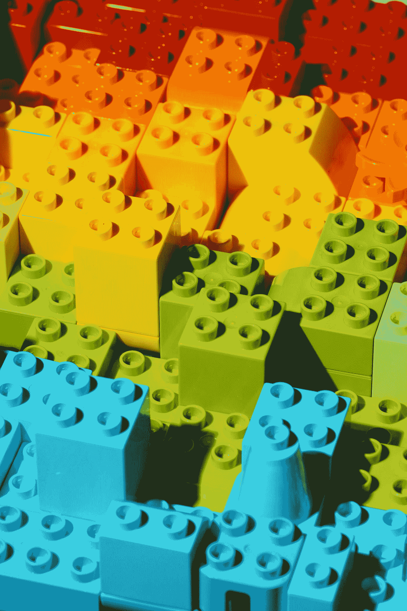

# 我们能从经过训练的神经网络中恢复训练数据吗？

> 原文：<https://medium.com/geekculture/can-we-recover-the-training-data-from-trained-neural-networks-c93d52529532?source=collection_archive---------4----------------------->

## 我们能从经过训练的神经网络中重建精确的训练数据吗？

Photo by [Sen](https://unsplash.com/ja/@sen7?utm_source=medium&utm_medium=referral) on [Unsplash](https://unsplash.com?utm_source=medium&utm_medium=referral)

# 目录

1.  介绍
2.  核心理念
3.  含义
4.  隐含偏差定理
5.  重建损失函数