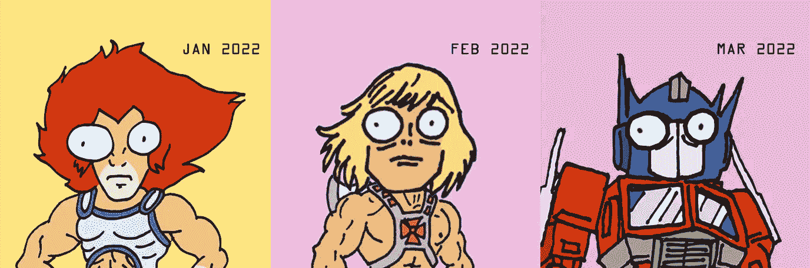
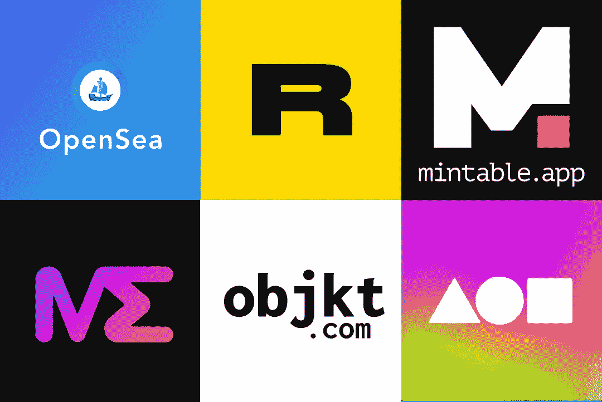
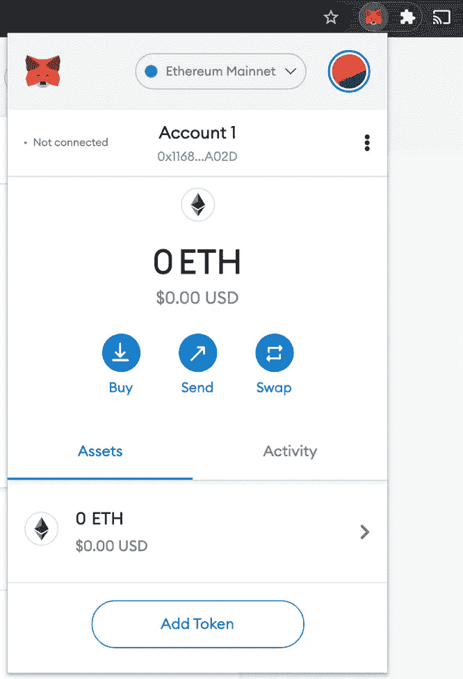
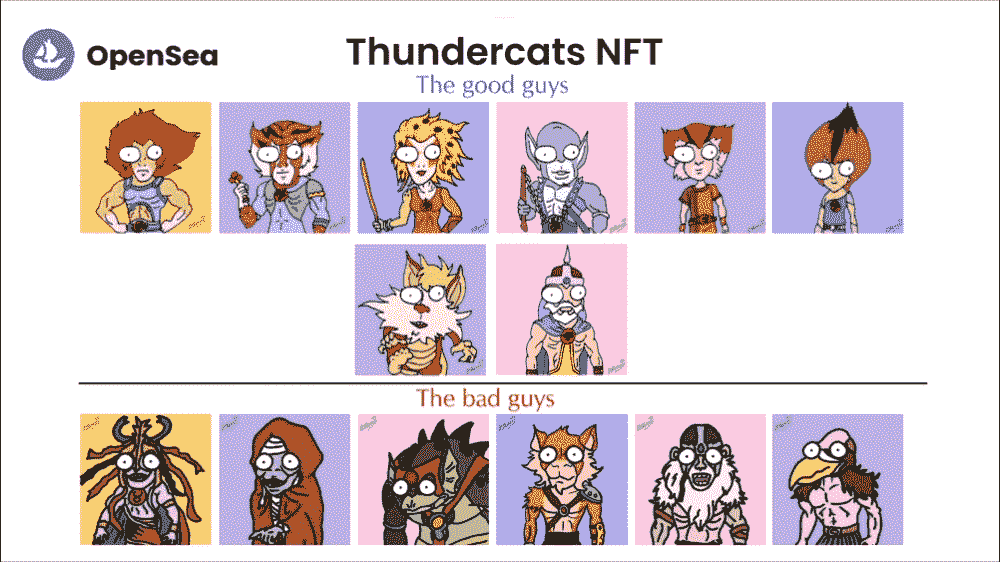
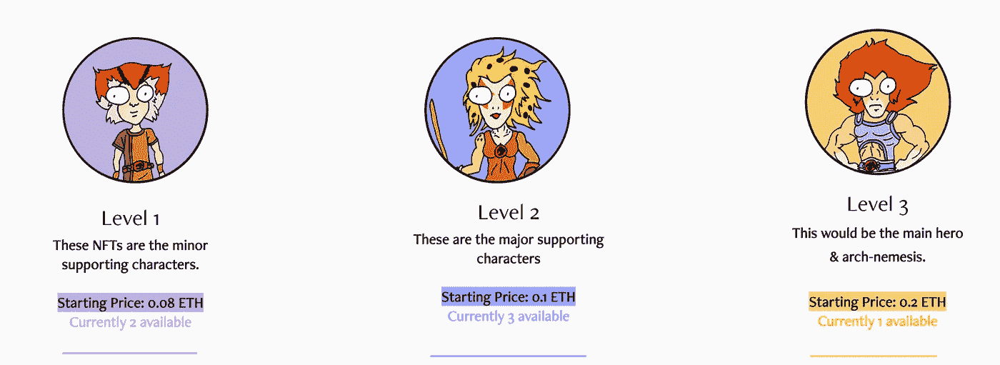
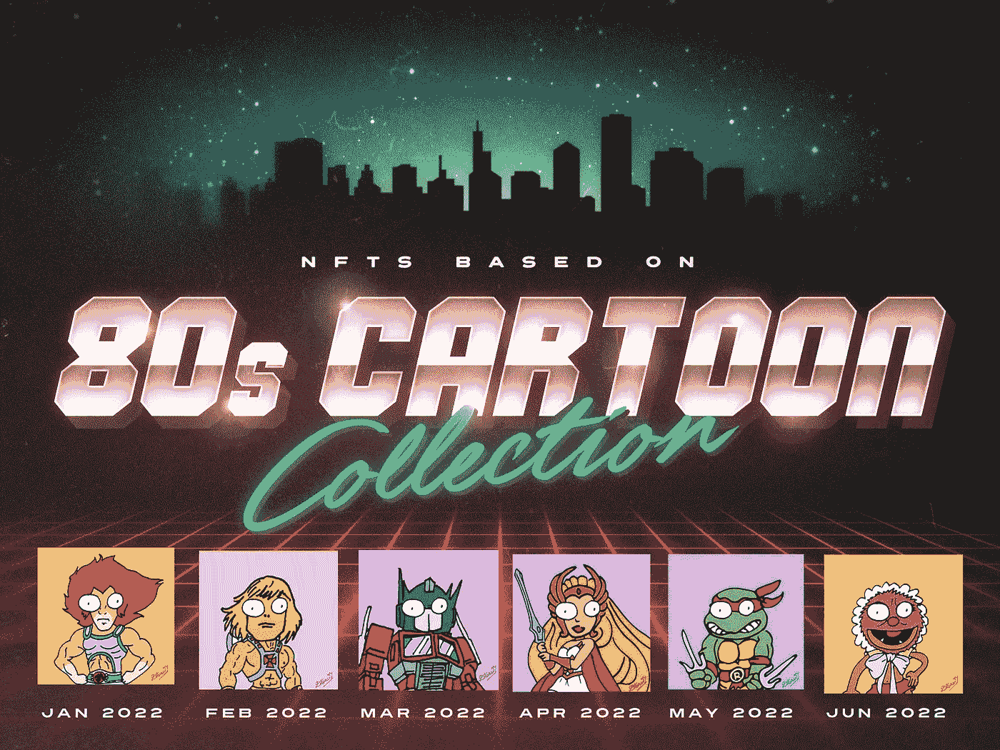

# 加拿大艺术家试图铸造 80 年代的卡通 NFTs:初学者指南

> 原文：<https://medium.com/geekculture/canadian-artists-attempt-at-minting-80s-cartoon-nfts-a-beginner-s-guide-148c11f41821?source=collection_archive---------10----------------------->

## 经验教训:铸造 NFT 是一项昂贵的爱好

NFTs(不可替代令牌)最近似乎很流行。在 2021 年初，NFT 的数字艺术作品“最初的 5000 天”以 6930 万美元的价格售出后，它开始受到很多关注。从那以后，有点像西部拓荒，因为每个汤姆、迪克和哈利都开始冲进 NFT 空间，希望达到同样的结果。但是你没有意识到的是，你看到的很多东西都是建立在炒作& FOMO(害怕错过)之上的。仅仅因为你把一些东西放在那里，并不意味着人们会买它。此外，如果你是 NFT 游戏的新手，这可能是一个相当昂贵的爱好——正如我在本文中记录的那样。

# 首先，NFT 到底是什么？

上面的视频是我试图提取 NFT 周围的技术术语的尝试。简而言之，NFT 是用于代表特定资产的唯一加密货币令牌。在这种情况下，资产是我的数字艺术作品。这些 NFT 可以买卖，但由于它们在区块链(记录交易的分散式数字账本)上运行，它们所代表的资产的所有权和有效性可以被跟踪。因此，当像我这样的艺术家拍卖一件位于 NFT 的艺术品时，买家会购买一个代表我的艺术品的独特令牌，然后通过区块链证明我的数字艺术的真实性和所有权。

现在你的下一个问题可能是，这太荒谬了——我可以对数字作品进行截屏，然后说我拥有它。没错。但这就等于说，我可以在一辆兰博基尼 Urus 前自拍，并发布到社交媒体上，假装我拥有它。并不意味着你拥有它。车主为这辆车支付了 25 万美元，并且有文件显示这辆兰博基尼是注册在他们名下的。同样，你可以核实区块链上一件特定的 NFT 艺术品的所有权，那是不能被篡改的。

既然我们已经得到了理论的方式，让我们进入“**如何铸造 NFT** ”..术语“*”指的是将数字文件转化为以太坊区块链上的加密收藏品或数字资产的过程。*

*为了让你们了解一下我的背景，我是 Denny ku rien——我不是 NFTs 方面的专家——事实上我是边学边做。我在多伦多经营一家品牌设计工作室，名为 Rayvn Design。我管理着一个完整的设计师团队，他们让我每天忙于为各种客户服务。创建 NFT 在我看来纯粹是一种爱好(尽管很昂贵)。我喜欢在下班后和周末做这件事。就像我在我的[推特上说的](https://twitter.com/80s_nft)(白天是品牌顾问，晚上是 NFT 艺术家)。*

# *如何用 5 个步骤铸造 NFT:*

## *第一步:创作你的作品。*

*我决定创作一组动画 gif，灵感来自我最喜欢的 1980 年代的卡通人物(如雷猫、希曼、变形金刚、特种部队、布偶娃娃、忍者神龟等)。).我做的第一件事是买了一个闪亮的新 iPad Pro 12.9”(1529 加元)和 Apple Pencil 第二代(169 加元)。我还从 App Store 购买了 Procreate 应用程序(13.99 加元)，并着手创建了一套基于雷猫的动画化身。这些都是手绘的，涂上颜色，并使用 Procreate 制作动画。*

# *第二步:选择你的市场*

**

*有许多网上市场，你可以列出，出售和购买你的非功能性食物。其中最大的是 [OpenSea.io](http://opensea.io/) (也被称为 NFTs 的 e-Bay)。但是还有其他的你可以选择，像[基金会、](https://foundation.app/) [魔法伊甸园](https://magiceden.io/)、[稀有](https://rarible.com/)、[objkt.com](https://objkt.com/)等等。而且不一定都要在以太坊区块链上..还有索拉纳、特佐斯等。但是我决定用 OpenSea 在以太坊区块链铸造我的。*

# *第三步:连接一个加密钱包。*

**

*Metamask Crypto-Wallet*

*一旦你选择了 Opensea，它就会要求你连接到一个密码钱包。*

*我选择了 [Metamask](https://metamask.io/) 作为我的钱包——因为它为我的 Chrome 浏览器提供了一个扩展。设置好之后，我连接了我的 Metamask 钱包(目前包含 0 加元到 Opensea marketplace)。*

*我现在准备出售和购买 NFT(希望按照这个顺序)。但是，唉，Opensea 并没有让它变得那么容易..请继续阅读。*

# *第四步:上传你的作品到市场*

**

*My ThunderCats collection on opensea*

*我上传了我的雷猫动画 gif(600 x600 像素)，放在我创建的名为“[雷猫 NFT](https://opensea.io/collection/thundercatsnft) ”的收藏下。他们现在可以在市场上看到..但这并不意味着你已经“铸造”了任何非功能性思维。你只是把它们挂起来展示。就像我前面提到的，“铸造”东西实际上意味着把它放在以太坊区块链上..这要花费$$$(请继续阅读)，*

# *第六步:出售你的 NFT*

*现在在区块链列出你的 NFT，Opensea 收取所谓的“汽油费”。当你进行国际电汇付款时，汽油费就是这里的银行所说的“交易费”。当时(2022 年 1 月 18 日)我正在列出我的 NFTs，在 Opensea 上的天然气费是 0.09 ETH(297 加元)。这是你支付的一次性费用，用于在以太坊区块链上列出你的作品。*

*这是我必须自己弄清楚的事情，这就是如何为你的 Metamask 加密钱包提供资金。因为即使 Metamask 说它接受 Visa & Mastercard，我发现我的加拿大 TD Visa 信用卡不允许我购买或出售加密货币(hmmm..不知道为什么)。碰巧的是，当我开车送我的孩子去学校的时候，我在 CHFI 上听到了一个关于这家加拿大公司的广播广告，这家公司叫做“[NetCoins](http://ttps//netcoins.app)”——这是一家从事 cryto-currency 买卖的第三方供应商。因此，这个过程包括我通过 Interac 电子货币转账向 NetCoins 发送加拿大元，然后他们将这些钱兑换成 ETH(显然是另收费)。之后，您将 ETH 从 Netcoins 发送到 Metamask，现在您就可以开始铸造了。*

**

*所以我列出了我的 6 个 gif 动画角色出售。这些都是 1/1..没有版本(也就是说，如果你买了一个版本，你就独占了这个版本——没有其他版本与之相似)。我所有的角色根据他们在卡通系列图腾柱上的位置分为 3 个价格类别。次要配角的价格为 0.08 ETH(266.36 加元)，主要配角的价格为 0.1 ETH(332.95 加元)，包装顶部是定价为 0.2 ETH(665.89 加元)的主要英雄&死对头。我想我还不如把我的投资收回来。*

*我不指望有人会购买它们——因为我仍在建立自己的品牌和社区。我的目标群体是那些和我经历过相同时代的人..我是看着 80 年代的周六早间卡通片长大的，这些卡通片几乎塑造了我这一代人。每个月我都计划画一系列新的卡通人物。对于二月来说，他是宇宙的主宰。这是未来 6 个月的路线图。*

**

*My 80s cartoon collection road-map for the next 6 months*

*所以，在总共花费了**2008.99**加元，并在区块链上“铸造”了我的作品之后，我现在可以称自己为 ***博尼化的 NFT 艺术家*** 。这和我在 90 年代中期的感觉是一样的，当时我创建了我的第一个 HTML 编码的网站，并把它上传到了“万维网”上——我很自豪地知道我在互联网上有了自己的网站。*

# ***吸取的教训***

## *研究其他区块链*

*就像他们说的，“**经验**是一个**贵的老师**，但它比其他任何一个**老师教得都好”。**现在我已经知道在区块链以太坊造币有多贵，我打算尝试把我的作品放在不同的平台上，比如 objkt.com[——它使用ꜩ的区块链(比区块链以太坊环保得多)，而且 Tezos 的煤气费非常便宜(造币和收藏不到一美元，这对艺术家和收藏家来说是好事)。Opensea 是最大的市场，但它不是唯一的市场，而且由于以太坊的天然气价格，很难在那里起步。一般来说，用户将不得不支付 50 至 150 美元的汽油费，才能获得你的一件作品，这意味着你必须为它们定价超过这个数额(这就是我所做的)——当然，这可能是非常昂贵的起步费用，尤其是如果你是像我这样一位不知名的艺术家。如果你已经有了一些来自其他地方的收藏家，比如实体艺术或你自己的艺术商店，情况可能会有所不同。](https://objkt.com/)*

## *研究不同的定价和铸造策略*

*除非有忠实的客户，否则你的 NFT 项目不会有任何进展。句号。客户希望低买高卖。因此，如果我在ꜩ造币厂(Tezos)，我可能会每天掉 1 NFT，并尝试以 2ꜩ(10 加元)的价格出售。我会每天这样做 5 天。然后我会将底价提高到 3ꜩ(15 加元)，并发布下一组 5 nfts。我将继续这种模式，每 5 NFts 提高底价。这将激励我的追随者购买，因为他们知道价格会上涨。幸运者将是那些较早进入这一市场的人，他们能够低买高卖。*

*无论如何，如果你想知道更多关于我的 NFT 之旅，那么看看以下内容:*

*[我的 NFT 网站](https://www.creative-director.ca/nft)*

*[我的推特(@80s_nft)](https://twitter.com/80s_nft)*

*[我的 Instagram (@geekartist77)](https://instagram.com/geekartist77)*

*谁知道呢，几年后，我那糟糕的 80 年代卡通涂鸦可能会成为下一个“ [*”无聊猿游艇俱乐部*](https://boredapeyachtclub.com/)”NFT 收藏品。*

# ***最新更新(2022 年 2 月 9 日)…***

***所以我提到的在 Tezos 上造币的策略似乎奏效了！！！***

*我放了 3 件基于我的新 [**希曼 NFT 系列**](https://objkt.com/collection/KT1PuJYBHBGXNvHAXxCZZRdweCrGJaaDkhFW) 的作品，每件 2 泰兹(10.44 加元)，它们都在 20 分钟内售罄！更有甚者，第二天，其中一个买了的人又重新挂牌 135 Tez！！！(781 加元)。*

**

*😊这让我很开心，也证明了有一个团体看到了我作品的潜力。我现在会试着在 Tezos 上建立我的社区，保持低价，也许每个角色会发行 3 个版本，这样会有更多的人购买。*

*我还要感谢一个特别的人——卡洛[——在阅读了他在 Medium 上的文章，并加入了他的私人时事通讯& discord channel 之后，我获得了关于 Tezos 市场趋势的丰富知识。这是一个艺术家、分析师和收藏家的不和谐社区，他们 24/7 都在呼吸这种东西。](https://medium.com/u/4562f6de5dd?source=post_page-----148c11f41821--------------------------------)*