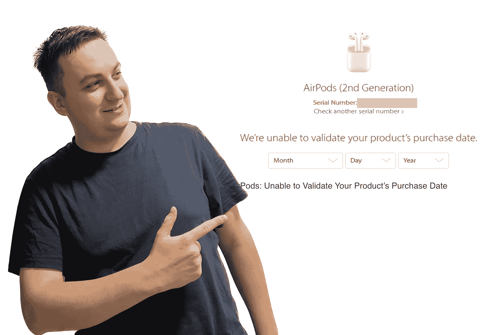

# 无法验证 Apple AirPods 的购买日期

> 原文：<https://medium.com/geekculture/cannot-verify-the-date-of-purchase-for-your-apple-airpods-a0962e7d4ebe?source=collection_archive---------6----------------------->

## 这意味着什么以及如何进行

Apple AirPods Pro 2nd generation verification — Image courtesy of the [Jakub Jirák](https://jakubjirak.com)

苹果为苹果用户提供了一个非常有趣的工具，可以快速检查他们的设备是否在保修期内，或者他们是否可以验证购买日期。因此，如果你曾经困惑于你的车是否还在保修期内，没有什么比自己检查更容易的了。只需进入[这个网站](https://checkcoverage.apple.com/) …