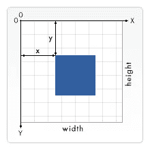
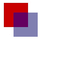
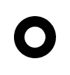

# 如何打造一个像毕加索一样的

<canvas>！……嗯，差不多……</canvas>

> 原文：<https://medium.com/geekculture/how-to-build-a-canvas-like-picasso-well-almost-687479ce7fda?source=collection_archive---------40----------------------->

如果我告诉你，你可以创造一个艺术作品，甚至包括动画！如果这还不够，如果那些动画也是交互式的呢！你只需要知道 JavaScript 和 HTML。觉得好到不真实？嗯，在 HTML5 中它被称为

<canvas>元素，它可以帮助你创造你想做的任何事情。</canvas>

2004 年由苹果公司发布，用于实现小部件并在 Safari 中使用，

<canvas>元素帮助 FlashPlayer 摆脱了 JavaScript 的强大功能。它的库主要用于“2d”图形，但它也有能力创建“3d”设计。(如果你想看看兔子洞有多深，它甚至可以用来生成[虚拟现实网络应用](https://dev.to/azure/build-a-web-vr-game-with-javascript-using-the-babylonjs-framework-aek)。)</canvas>

元素有许多用途:动画、游戏图形、数据可视化、照片处理和实时视频处理。读完之后，假设这是一个复杂的工具，需要一定水平的天才。但是，实际上，这真的很简单。

# 

<canvas>的基础知识</canvas>

让我们看几个基本的例子来演示在

<canvas>上获得形状是多么容易:</canvas>

你要做的第一件事是创建一个基本的 HTML 模板:

```
<!DOCTYPE html>
<html lang="en">
  <head>
    <meta charset="UTF-8">
    <meta name="viewport" content="width=device-width, initial-scale=1.0">
    <meta http-equiv="X-UA-Compatible" content="ie=edge">
    <title>HTML 5 Boilerplate</title>
    <link rel="stylesheet" href="style.css">
  </head>
  <body>

  </body>
</html>
```

接下来，您只需在元素中添加

<canvas>标记:</canvas>

```
<canvas id = "mycanvas" width = "150" height = "150" ></canvas>
```



随着我们向前推进，重要的是想象您将如何在

<canvas>中放置物品。对于您将看到的“2d”示例，我们将依赖于 x 和 y 轴。</canvas>

就这样。你已经创造了你的第一个

<canvas>！现在，让我们开始添加一些快乐的小形状。让我们继续创建一个新文件，并将其命名为“application.js”。在该文件中，我们添加两个矩形:</canvas>

```
function draw() {
      const canvas = document.getElementById('canvas');
      if (canvas.getContext) { 
        const ctx = canvas.getContext('2d');

        ctx.fillStyle = 'rgb(200, 0, 0)';
        ctx.fillRect(10, 10, 50, 50);

        ctx.fillStyle = 'rgba(0, 0, 200, 0.5)';
        ctx.fillRect(30, 30, 50, 50);
      }
    }
```

值得注意的代码:*canvas . get context(' 2d ')*—这一行代码释放了< canvas >元素的力量。这使得程序员可以访问一个巨大的方法库，这些方法可以做任何事情，从在<画布>上放置简单的矩形，到为游戏编写实现重力等效果所需的物理程序。

上面的示例应呈现以下内容:



就像矩形一样，圆形也相对容易渲染。然而，它们确实需要更多的数学知识:

```
function draw() {
  const ctx = document.getElementById('canvas').getContext('2d');
  ctx.beginPath();
  ctx.arc(50, 50, 30, 0, Math.PI * 2, true);
  ctx.arc(50, 50, 15, 0, Math.PI * 2, true);
  ctx.fill('evenodd');
}
```



这个特殊的功能利用了

<canvas>的“填充规则”，特别是[的奇偶规则](https://en.wikipedia.org/wiki/Even%E2%80%93odd_rule)。</canvas>

最后，我将演示一个简单的动画:

```
const sun = new Image();
const moon = new Image();
const earth = new Image();// Initializes the image files
function init() {
  sun.src = 'canvas_sun.png';
  moon.src = 'canvas_moon.png';
  earth.src = 'canvas_earth.png';
  window.requestAnimationFrame(draw);
}

function draw() {
  const ctx = document.getElementById('canvas').getContext('2d');
  ctx.globalCompositeOperation = 'destination-over';// Clears the each frame before rendering the new one 
  ctx.clearRect(0, 0, 300, 300); // clear canvas

  ctx.fillStyle = 'rgba(0, 0, 0, 0.4)';
  ctx.strokeStyle = 'rgba(0, 153, 255, 0.4)';
  ctx.save();
  ctx.translate(150, 150);

  // Earth
  const time = new Date();
  ctx.rotate(((2 * Math.PI) / 60) * time.getSeconds() + ((2 * Math.PI) / 60000) * time.getMilliseconds());
  ctx.translate(105, 0);
  ctx.fillRect(0, -12, 40, 24); // Shadow
  ctx.drawImage(earth, -12, -12);

  // Moon
  ctx.save();
  ctx.rotate(((2 * Math.PI) / 6) * time.getSeconds() + ((2 * Math.PI) / 6000) * time.getMilliseconds());
  ctx.translate(0, 28.5);
  ctx.drawImage(moon, -3.5, -3.5);
  ctx.restore();

  ctx.restore();

  ctx.beginPath();
  ctx.arc(150, 150, 105, 0, Math.PI * 2, false); // Earth orbit
  ctx.stroke();

  ctx.drawImage(sun, 0, 0, 300, 300);

  window.requestAnimationFrame(draw);
}

init();
```

我希望对

<canvas>元素的简短介绍有助于证明做真正酷的事情并不那么困难。就像任何语言一样，有许多方法可以实现相同的目标，你只需要走出去尝试一下！</canvas>

> “我想不出还有什么比能够通过绘画向他人表达自己更有收获的了。锻炼想象力，尝试才能，有创造力；对我来说，这些东西真的是你灵魂的窗户。”

黑客快乐！