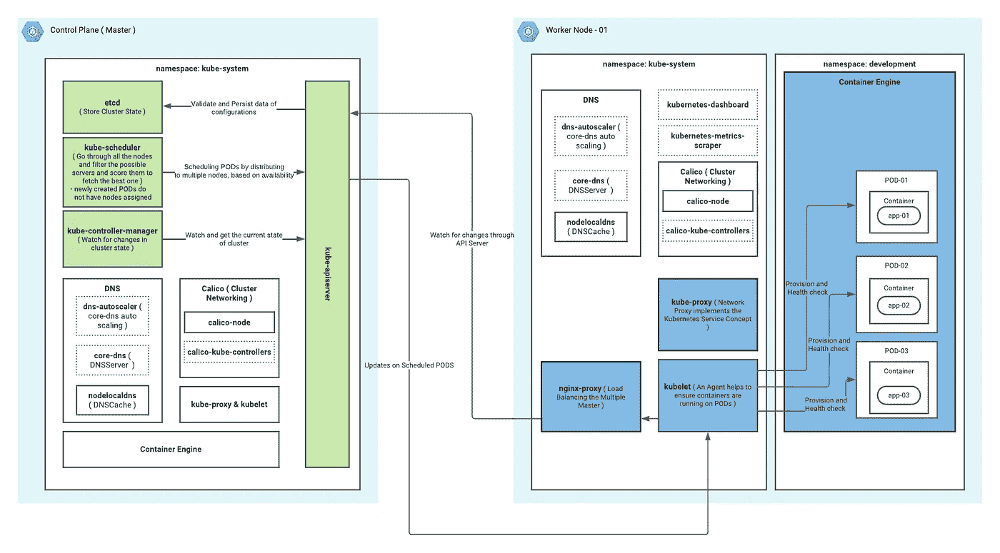
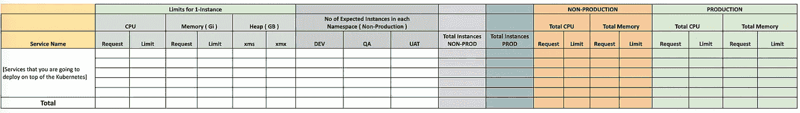
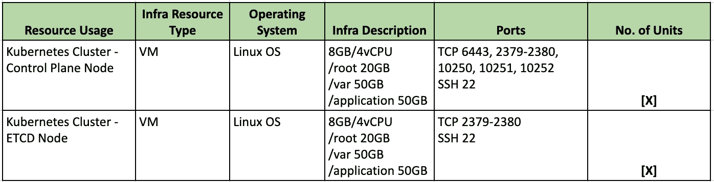
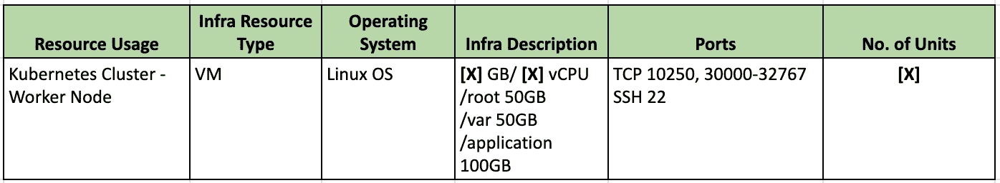

# 容量规划— Kubernetes 集群部署

> 原文：<https://medium.com/geekculture/capacity-planning-kubernetes-cluster-deployment-4192c007efda?source=collection_archive---------5----------------------->

如今，大多数组织倾向于数字化，并试图采用开源集装箱化平台来满足他们在数字化方面的需求。当我们考虑集装箱化平台的当前选项时，我们有:

***Kubernetes、Openshift、Hashicorp Nomad、Docker Swarm、Rancher、Mesos、Google Container Engine (GKE)、Google Cloud Run、AWS Elastic Kubernetes Service(EKS)、Amazon EC2 Container Service (ECS)、AWS Fargate、Azure AKS Service、Azure Managed Openshift Service、Azure Container Instances、Digital Ocean Kubernetes Service、Red Hat OpenShift Online、Linode Kubernetes Engine***

请参考此处的[链接](https://devopscube.com/docker-container-clustering-tools/),以获得更深入的细节对比。在本文中，我的目的是提供更多关于 kubernetes 集群容量规划和部署 Kubernetes 集群时需要考虑的事项。因为当我们开始部署集群时，最好不要只部署一个集群，这样做的目的是确保部署是稳定的，并且能够在未来的使用情形中处理更多的负载和部署。

**1。了解 Kubernetes 架构和主要组件交互**

之前，只要更好地理解架构和每个组件如何相互作用。然后，只有在部署中出现任何问题时，我们才能让它正常工作，或者可以轻松找到根本原因。通常，下图说明了对架构和流程的高级理解。这种理解通常足以开始部署。

**2。选择部署脚本和主要注意事项**

在正式选择部署脚本时，基于 kubernetes.io 有两种选项可用，

*   [Kubespray](https://kubernetes.io/docs/setup/production-environment/tools/kubespray/)
*   [kops](https://kubernetes.io/docs/setup/production-environment/tools/kops/)
*   [kubeadm](https://kubernetes.io/docs/setup/production-environment/tools/kubeadm/)

在我看来，最好使用 kubeadm，并按照 kubernetes 文档提供的步骤，根据您的需要准备 ansible 脚本。然后，您将可以完全控制部署，并了解我们实际部署的是什么。准备脚本时，请确保您正在处理以下场景。

*   脚本应该支持多个服务器选项，如在安装时更改每个组件中的节点数。
*   卸载/重置群集的脚本。
*   脚本应该更新证书，因为默认情况下，kubeadm 只生成 1 年的证书，所以您的脚本应该在您重新运行它时更新它。
*   脚本应该能够在集群中添加和删除额外的工作节点。
*   确保 docker 相关数据目录指向您的/application 目录，该目录是用大量磁盘空间创建的。否则，默认情况下 docker 数据目录将指向/var，将来您可能会遇到磁盘空间问题，或者您需要增加/var 目录。

**3。选择部署模式**

Kubernetes 为高可用性集群部署提供了两种选择。

*   具有堆叠的控制平面节点，其中 etcd 节点与控制平面节点位于同一位置
*   具有外部 etcd 节点，其中 etcd 运行在与控制平面分离的节点上

这可以根据实际需要来选择。如果采用高可用性要求的环境，并且需要在主要 kubernetes 组件的每个级别都有 HA，则可以采用外部 etcd 选项。这种拓扑结构将控制平面和 etcd 成员分离。因此，它提供了一种高可用性设置，其中丢失控制平面实例或 etcd 成员的影响较小，并且不会像堆叠高可用性拓扑那样影响集群冗余。

**4。分析需求并规划集群硬件需求**

当我们处于实施阶段的开始时，很难决定将多少微服务部署到 kubernetes 集群，并且在为基础架构供应提供硬件规格时，这始终是一个障碍或难点。下面是我想出的一个模板，用来在项目的起点避免这种阻碍。

基于此，填充您将要部署的服务，最初从支持用例所需的公共服务开始。然后添加一行与用例相关的服务，并提及估计的服务数量，考虑未来的供应。这将是对未来可以开发的微服务的粗略估计。

然后根据总内存和 cpu 限制来决定每个工作机所需的 RAM 和 CPU。因为对于控制平面和 ETCD 节点，我们可以使用已定义的值，但是工作者节点将根据您将要开发的用例的数量而改变。因此，我们需要为未来做好准备。

这里，在一个典型的高可用性系统中，确保保持[x] = 3。

当谈到工作节点时，它取决于我们前面的分析。这里要注意的一点是，最好将负载分配给多个工作人员，而不是纵向扩展。建议横向扩展，这样，即使一台服务器出现故障，其他服务器也可以管理和调度 pod。工作节点硬件规范的典型模板如下所示:

在这里，请确保[X]大于 3，因为我们过去一直遵循奇数，您可以使用 3，5，7 个工作节点，这取决于您之前获得的统计数据。

**5。监控集群**

在这里，也有多种选择。

*   Kubernetes 本身有一个仪表板，您可以使用它来监控集群。
*   这是一个命令行工具
*   还有一个叫做 https://k8slens.dev/的开源工具，这也是管理 kubernetes 集群的一个有用工具。

**参考文献**

[1][https://kubernetes . io/docs/setup/production-environment/tools/kube ADM/ha-topology/](https://kubernetes.io/docs/setup/production-environment/tools/kubeadm/ha-topology/)

[https://devopscube.com/docker-container-clustering-tools/](https://devopscube.com/docker-container-clustering-tools/)

[https://kubernetes.io/](https://kubernetes.io/)