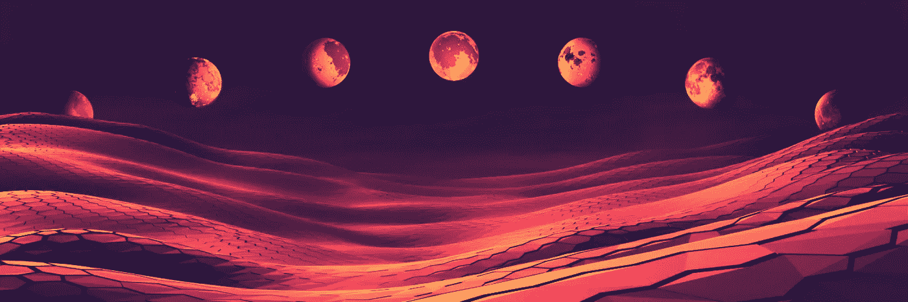

# 碳补偿储备王国

> 原文：<https://medium.com/geekculture/carbon-offset-reserve-kingdoms-c44186848676?source=collection_archive---------3----------------------->

一段时间以来，我一直在思考一种方法，我们可以在能源网络链上为社区创造一些有趣的东西。如果我们与其他蓬勃发展的生态系统相比，EWT 美元的持有者似乎虽然看好这一愿景，但在区块链并没有太多事情可做。一年前 Carbonswap 还活着的时候，有一段很有趣的时期，但可悲的是，当事情变得越来越有趣时，当 devs 变得沉默时，它就消失了。大约在同一时期，一些人聚在一起，重新启动了 EWDOGE 这个社区项目。目标是在能源网络链上建立一个去中心化的绿色地球组织(注意这个聪明的缩写:)。
几个月后，我们现在有了:

## [Carbonpaws.io](http://Carbonpaws.io)

在 EWC 交易碳信用和其他代币的指数。
[**伊努**](https://raregems.io/energyweb/iinu) **集合** 一个治理 NFT 的集合向其持有者出让碳信用额。
**GreenFund**
从美元 EWD 交易中收取收入的国库。
**community fund** 用 EWD 代币奖励有限合伙人的财政部。

坦率地说，用有限的资源和持怀疑态度的社区进行建设是一个巨大的挑战(这不是没有原因的，因为许多项目在启动后不久就消失了)。尽管如此，我们现在有了一些有用的东西，而且似乎准备扩大规模。非常感谢 Vulcan、Marin 和 Yamobe，他们从一开始就为 EWD 项目编码/构建/创作，几乎没有任何经济补偿。还要特别提到马文，他建立了 [Raregems.io](https://raregems.io/) ，一个奇妙的多连锁店 NFT 市场。

我们现在已经到了这样一个地步，已经到位的 DeFi 工具可以用来为能源网络社区和地球启动一个积极的循环。

这就是[软木塞项目](https://twitter.com/cork_project)的由来；EWDOGE 绿色基金资助的第一个项目。**碳抵消储备王国**是一款我们希望建立在 EnergyWeb 链上的游戏，利用低成本的交易费用，用象征性的碳信用奖励玩家。

## 力学

*王国、狼、$软木令牌和碳信用……*
为了启动游戏，每个基努人将很快收到一个月亮 NFT，这将是进入王国的通行证。有了钱包里的 NFT，持有者就可以为游戏创建一个玩家角色。游戏的目标是用狼群(不同的 NFT 卡)控制虚拟的土地。每块土地将持有一些象征性的碳信用，这些信用将在每场游戏结束时分配给控制玩家。将有可能移动到邻近的土地和攻击对手(类似于风险游戏)。在游戏中移动将花费$科克*代币，这些代币将被收集在一个抵消钱包中。随着玩家竞争、行动和争夺土地，他们将有效地抵消碳。玩家也将在游戏前获得不同的狼卡，以便建立他们的包，并在攻击他人和保卫自己的土地时将它们置于危险之中。一个排行榜将保持跟踪和显示最好的抵消玩家和团队作为王国的战斗。

> *关于$科克:
> 可以通过绑定$EWD 和碳信用额来创建。将有可能收回潜在的碳信用额(解除绑定),但 EWD 的部分将在此过程中被烧掉。inu NFTs 还将被动赚取$软木代币，他们可以申领这些代币来玩游戏。

我想在这里指出，虽然任何人都可以从$EWD 和碳信用创造$科克代币，但目标不是强迫玩家购买$科克(支付以赢得)，而是使用 inu collection，已经建立的工具和 dapps，在玩游戏时获得一些乐趣，同时抵消二氧化碳(玩，赚&抵消)。

**这里有一些关于机械的想法:**

*   每块土地上可用的碳信用额将是一种货币激励，玩家只需付出很少甚至没有任何成本就可以参与其中。
*   这应该会奖励更活跃的玩家，同时也让对游戏不感兴趣的 inu 持有者选择退出，仍然可以赚取$软木代币，这些代币可以兑换回碳信用额。
*   不同王国的$科克代币的抵消将创造一个对抗和竞争的环境，以及鼓励团队成员之间的战略规划(我认为这是一个发展和加强电子战社区的好方法)。
*   随着更多游戏的进行，这种$科克币将推动对$EWD 的需求，并创造一种通货紧缩的燃烧机制。(例如每周一次的战斗)
*   如果对$EWD 有更多的需求，这将允许财政部购买更多的碳信用来填充土地。更多的碳信用将创造更大的货币激励，并可能增加有兴趣加入的玩家数量(正循环)。
*   扩大规模将为开发不同的游戏模式打开大门。
*   这整个概念有能力为地球做好事，参与者几乎不用付出任何努力。由于玩家有获胜的竞争和财务动机，二氧化碳的抵消会自然发生。

我有点厌倦了过多的项目在玩神秘游戏，以便围绕他们的项目进行炒作。因此，在那里，我列出了我们过去几个月来一直在努力的主要想法。将不会有现金抢 NFT 薄荷糖，没有白名单研磨，没有预售代币，当然；这并不保证我们会在实验中成功。但是我希望你们能够看到这一愿景，并且知道我们将继续建设这个社区。我们愿意集思广益，从电子战生态系统的参与者那里获得投入和创造力；游戏可能需要一些时间来开发，但我们已经开始奠定基础。
那些想要参与并帮助发展的人，请随时伸出援手！

*-特工 K*

______________

推特:【https://twitter.com/cork_project
不和:[https://discord.gg/k9Whe8bADN](https://discord.gg/k9Whe8bADN)
电报:[https://t.me/ENERGY_DOGE](https://t.me/ENERGY_DOGE)