# Cardano 911 —钱包命令行界面(第一部分)。

> 原文：<https://medium.com/geekculture/cardano-911-wallet-command-line-interface-part-one-ad0ee5ac8509?source=collection_archive---------3----------------------->


***Cardano Wallet CLI*** 的目标受众通常是精通技术的用户，他们在 ***【代达罗斯】*** 之外运行钱包的应用编程接口(API)并直接使用高级 API 功能。这些受众包括应用开发者、股权池运营商和交易所的员工。许多 CLI 命令必须只能“在线”和“同步”运行，但其中一些命令不需要活动服务器和同步数据库，可以“离线”和/或“不同步”运行。这个故事是献给那些希望拥有一个更加灵活和强大的卡达诺钱包，而不是代达罗斯和 Yoroi 的 ADA 持有者。

# 装置

在继续之前，我们必须安装两个库。我是一个 Mac 用户，所以我会告诉你如何用 ***ZSH*** 默认 shell 在 macOS Monterey 上安装它。安装前，请熟悉 mac 的 [***关守***](https://support.apple.com/en-us/HT202491) 。

***提示:*** Cardano CLI 支持 Linux、Mac 和 Windows 操作系统。

如果你不想自己编译 [***二进制文件***](https://developers.cardano.org/docs/get-started/installing-cardano-node) 你可以直接下载[***cardano-node-1 . 30 . 1-MAC OS***](https://hydra.iohk.io/build/7739444)**和*[***cardano-wallet-2021–09–29***](https://github.com/input-output-hk/cardano-wallet/releases/download/v2021-09-29/cardano-wallet-v2021-09-29-macos64.tar.gz)[T47](https://hydra.iohk.io/build/7739444)*

*解压两个库，并将第一个文件夹重命名为 **cardano-node** ，将第二个文件夹重命名为 **cardano-wallet** 。创建 ***cardano*** 目录，放在***/Users/<userName>/***(主目录)中:*

```
*/Users/swift/cardano/*
```

*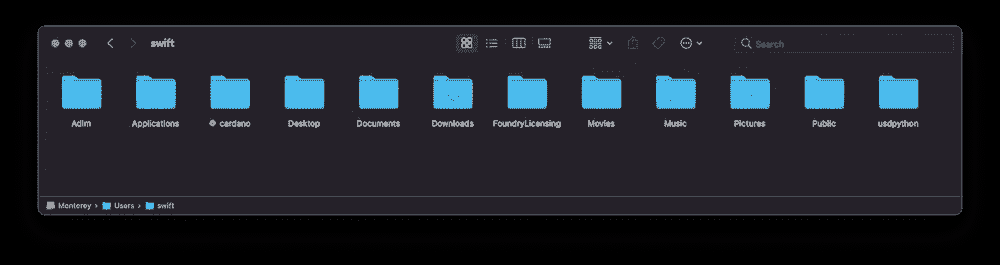*

*macOS Home directory*

*将***cardano-wallet***和 ***cardano-node*** 文件夹放入父 ***cardano*** 文件夹中。然后在主目录下创建一个隐藏的 ***。zshrc*** 外壳资源文件:*

```
*touch ~/.zshrc*
```

*在 ***文本编辑*** app 中打开，命令如下:*

```
*open ~/.zshrc*
```

*在**T5 设置钱包 CLI 工具的路径。zshrc** 文件并保存它:*

```
*export PATH="/Users/swift/cardano/cardano-wallet:$PATH"
export PATH="/Users/swift/cardano/cardano-node:$PATH"tilde=~
export CARDANO_NODE_SOCKET_PATH="${tilde}/cardano/db/node.socket"echo "Cardano CLI tools are installed..."*
```

****提示***:Cardano***node . socket***是在 cardano-node 启动时自动创建的，只要节点还在运行，socket 就会一直存在。*

*然后在终端中使它们可执行:*

```
*chmod +x ~/cardano/cardano-wallet
chmod +x ~/cardano/cardano-node*
```

*最后，我们将下载带有网络配置的 JSON 文件。*

****警告*** :如果你是 Cardano 新手，请先考虑在 ***testnet*** 上做实验。不要使 ***mainnet*** 过载。*

*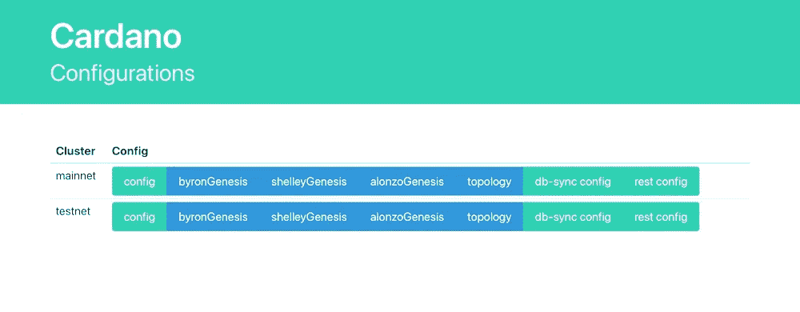*

*进入[***https://hydra . iohk . io***](https://hydra.iohk.io/build/7191656/download/1/index.html)复制 5 个主配置文件:*

*   *mainnet-config.json*
*   *mainnet-byron-genesis.json*
*   *mainnet-shelley-genesis.json*
*   *mainnet-alonzo-genesis.json*
*   *mainnet-topology.json*

*在 ***cardano*** 目录下创建 ***config*** 文件夹，放入这五个 JSONs。注销您的 mac 帐户，然后再次登录。之后再创建三个空文件夹: ***/db*** 、 ***/keys*** 和 ***/wallets*** 。*

*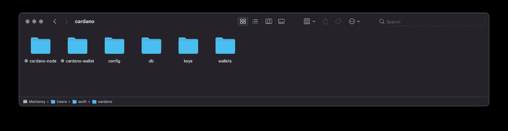*

*现在我们准备好摇摆了。*

# *运行节点和服务器*

*在我的故事的第一部分，我将只探索离线命令，所以没有必要与 ledger 完全同步。然而，在开始使用钱包之前，我必须执行两个重要的命令。*

*在 ***终端*** app 中打开一个 ***第一个*** 会话，执行帮助下载卡达诺账本到**~/卡达诺/db/** 文件夹的命令:*

```
*arch -x86_64cardano-node **run** \
    --**topology** ~/cardano/config/mainnet-topology.json \
    --**database-path** ~/cardano/db/ \
    --**socket-path** ~/cardano/db/node.socket \
    --**host-addr** 127.0.0.1 \
    --**port** 1225 \
    --**config** ~/cardano/config/mainnet-config.json*
```

*如果没有错误，您将看到它正在运行:*

*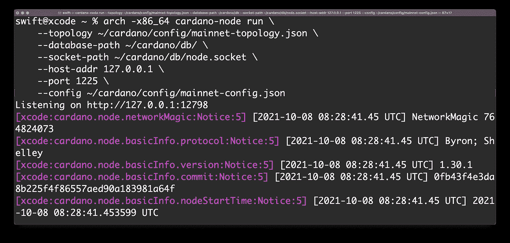*

****提示:*** 记住，在你的电脑上下载一个完整的分类账数据库平均需要一整天的时间。*

*在 ***终端*** 中打开一个 ***第二个*** 会话，执行下一个命令，帮助监听服务器:*

```
*arch -x86_64cardano-wallet **serve** \
    --**port** 8090 \
    --**mainnet** \
    --**database** ~/cardano/wallets/db \
    --**node-socket** $CARDANO_NODE_SOCKET_PATH*
```

*如果一切正常，在第二个终端的窗口中，您将看到以下内容:*

*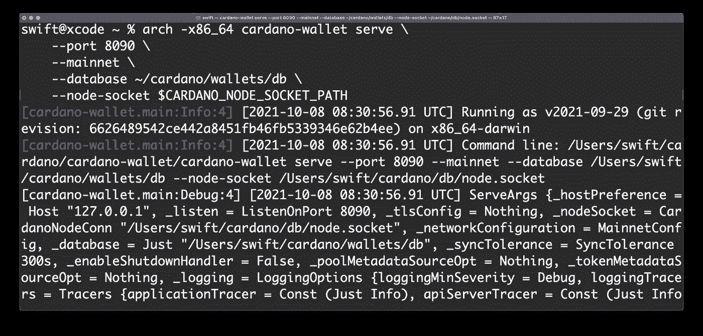***

# *检查版本*

*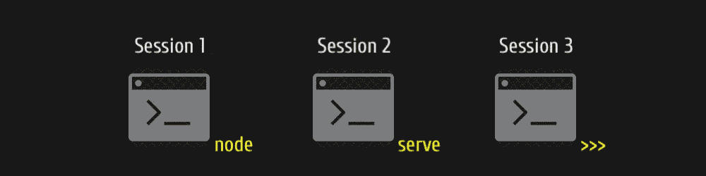*

*让我们检查所有的版本。在*终端运行一个 ***第三个*** 会话，首先检查一个***cardano-wallet***实用程序版本:**

```
****cardano-wallet** version**
```

**如果一切正常，您将看到如下结果:**

**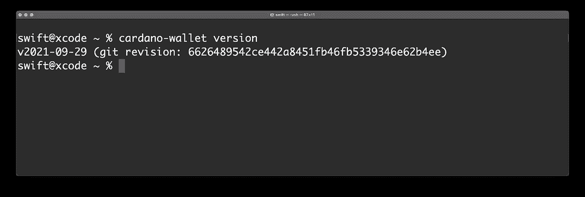**

**除此之外我们还应该弄清楚 ***cardano-node*** 和 ***cardano-address*** 版本是什么:**

```
****cardano-node** version**
```

**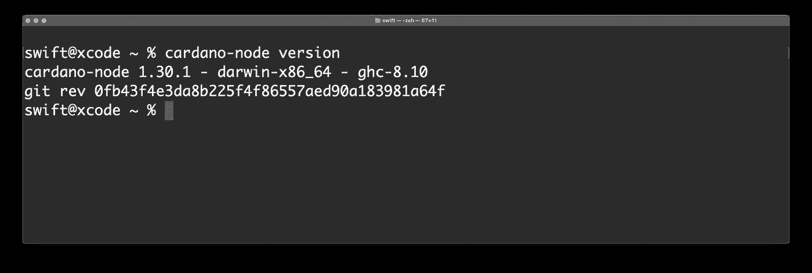**

**最后，完全满足好奇心:**

```
****cardano-address** version**
```

**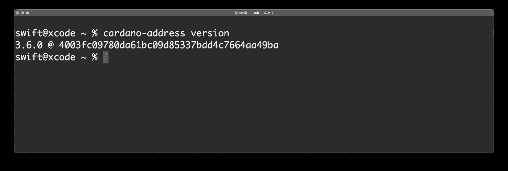**

# **查询区块链和网络参数**

**运行***cardano-CLI***query 命令，可以很容易地发现同步过程是如何进行的，以及有多少数据块已经加载到本地数据库中。**

```
****cardano-cli** query tip --mainnet**
```

**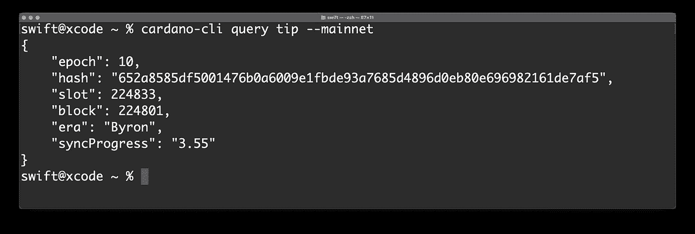**

**Sync progress 3%**

**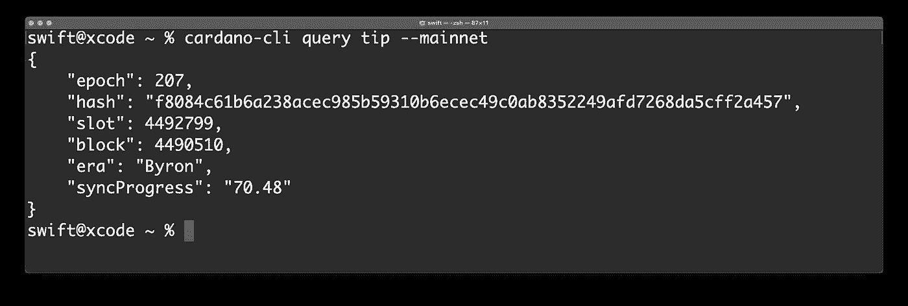**

**Sync progress 70%**

**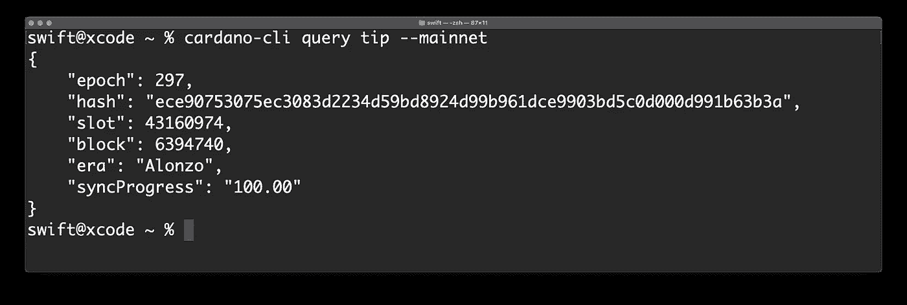**

**Sync progress 100%**

**当你使用***cardano-wallet***命令时，你可以得到另一层有用的信息。**

```
****cardano-wallet** network information**
```

**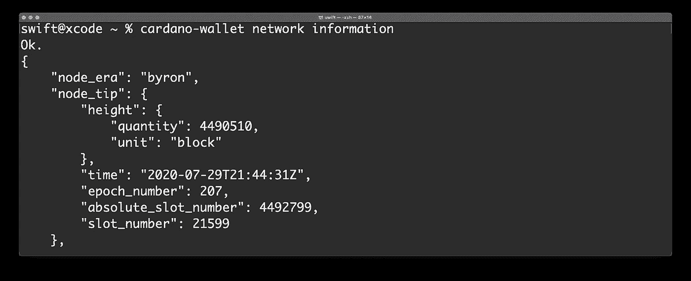**

```
****cardano-wallet** network parameters**
```

**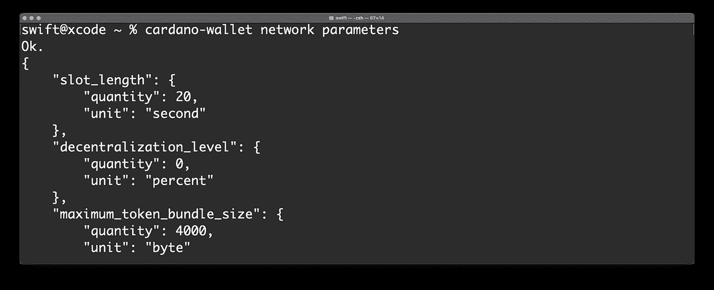**

**当然，我们可以查询任何单个参数，例如，Tx 的最大大小:**

```
****cardano-cli** query protocol-parameters --mainnet | jq .maxTxSize**
```

**此刻***maxTxSize******= 16kb***。**

# **离线和不同步命令**

**事实上，IOHK 的工程师一直在开发开发人员友好的工具。尽管我们使用命令行，但没有什么比使用***cardano-wallet***API 创建/管理钱包更简单的了。**

**私钥或种子短语的生成无疑应该离线完成——远离陌生人的视线。**

**为了生成一个新的 wallet，我们唯一需要知道的是一个 ***BIP39 主恢复短语*** 的正确长度——在 Cardano CLI 中它可以是 15 个、18 个、21 个或 24 个字。**

*****提示*** :在这里 阅读关于恢复短语架构 [***。***](/geekculture/cryptocurrency-911-how-does-12-word-seed-phrase-work-9d892de9732)**

**我选择了 21 个单词，那是黑客的 2048 种可能的组合。**

```
**cardano-wallet **recovery-phrase** generate --size 21 > primary**
```

**我所有的 21 个字都写进了一个叫做 ***初级*** 的文件里(你可以在 ***cardano*** 文件夹里找到)。我使用了一个重定向操作符" ***>*** "将命令输出重定向到一个文件。**

**这是一个 ***seed*** (又名 ***recovery*** 或 ***助记符*** )短语，能够在应用特殊数学后生成一个 ***私钥*** 。除了你之外，任何人都不能访问 seed/privkey——永远保密。**

**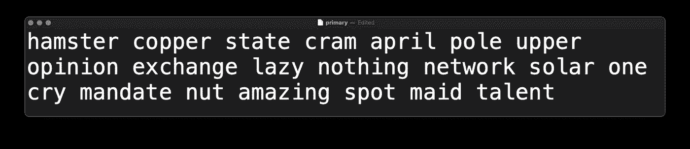**

**为您的资金提供额外的保护，可以提供一个***bip 39******二因子*** 9 个或 12 个字的可选种子短语。我选 9，我们也生成吧。**

```
**cardano-wallet **recovery-phrase** generate --size 9 > second-factor**
```

**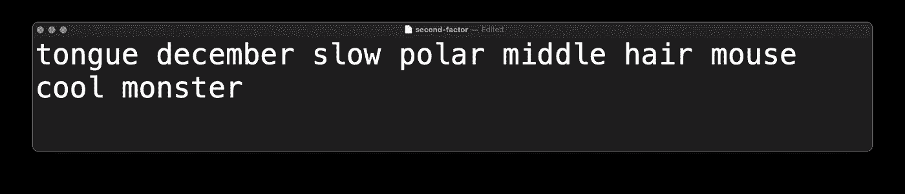**

# **在线命令**

**现在我可以基于我的两个种子创建一个名为 ***和 yJazz*** 的钱包了。**

```
**cardano-wallet **wallet** create from-recovery-phrase AndyJazz
    --port 8090 /
    --address-pool-gap 20**
```

**执行命令，复制粘贴 21 个单词的短语，然后输入可选的 9 个单词的短语，最后输入 10 个字符的密码。我输入了有史以来最烂的密码(pass phrase)——***0123456789***——*一个黑客的节日。***

***您的密码长度可以是 10 到 255 个字符。***

***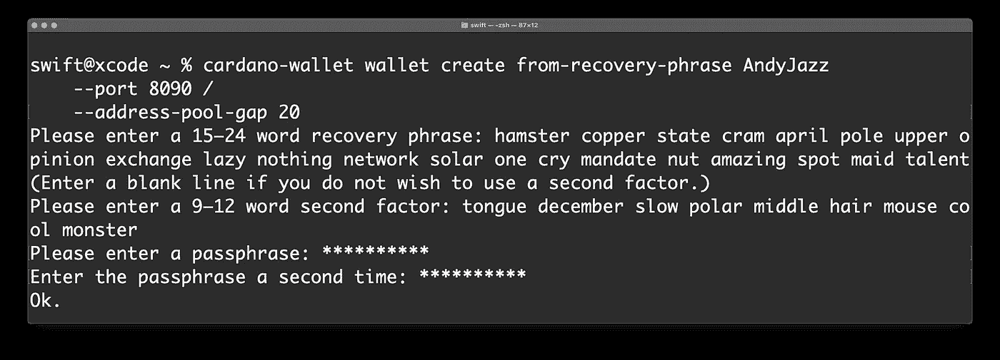***

****吼吼！感觉自己像邪恶博士。:))****

**我现在唯一想看到的是一个关于我全新钱包的信息。这很容易。**

```
**cardano-wallet **wallet** list**
```

*****提示*** :该命令要求你在 Cardano 网络上。**

**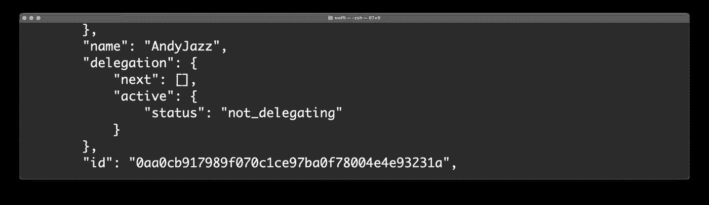**

**你可以想象 Cardano 网络中的每个钱包不仅有它的名字，还有它自己的十六进制 ***ID*** 。**

```
**0aa0cb917989f070c1ce97ba0f78004e4e93231a**
```

**有了这个 ***ID*** 你就可以获取、更新和删除你的钱包。当您将此标识符输入到 ***地址*** 命令中时，您将看到所有使用和/或未使用的地址都是用 ***Bech32*** 方案编码的:**

```
**cardano-wallet **address** list --state unused 
                            0aa0cb917989f070c1ce97ba0f78004e4e93231a**
```

**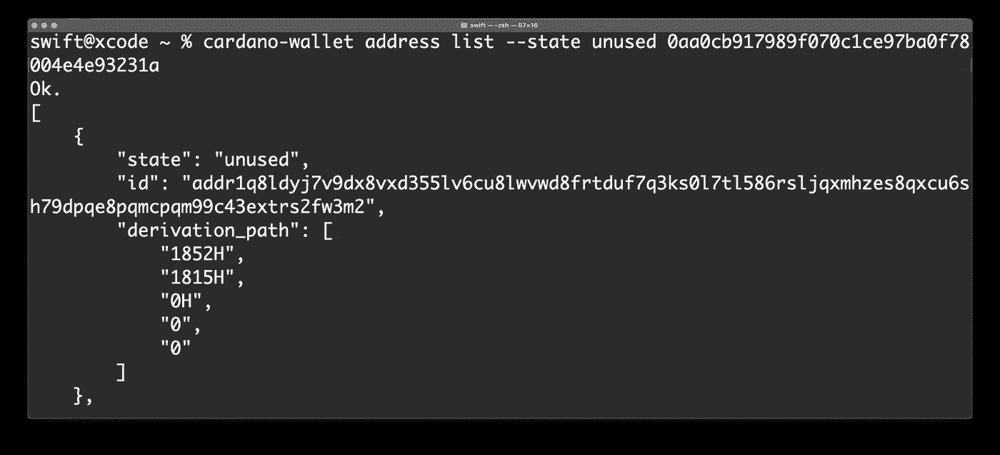**

**可以看到，第一个未使用的带有 ***index=0*** 和 ***addr1*** 前缀的地址是:**

```
****addr1**q8ldyj7v9dx8vxd355lv6cu8lwvwd8frtduf7q3ks0l7tl586rsljqxmhzes8qxcu6sh79dpqe8pqmcpqm99c43extrs2fw3m2**
```

**而最后一个带**的*索引=19* 的**是:**

```
****addr1**qyvx0lf6fdech3xwknkq47zaksddyu0ca90e20nry9p22wy86rsljqxmhzes8qxcu6sh79dpqe8pqmcpqm99c43extrsx4t3y0**
```

****

*****提示:*** 如果同步过程结束，可以停止运行一个节点。为此按下**<CTRL><C>**快捷键为 ***第一个*** 终端会话。**

*****重要:*** 在 mainnet 中进行交易之前，在 testnet 中使用 ***tADA*** 进行练习。否则，如果交易执行不正确，您将面临资金损失的风险。**

# **使用 cardano 钱包的代达罗斯插座**

**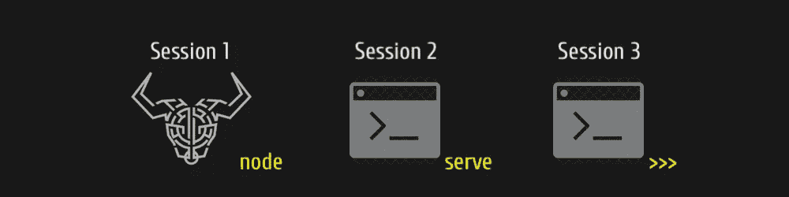**

**如果您之前已经安装了代达罗斯钱包，那么您当然可以将钱包的节点套接字用于命令行工具。正如我前面所写的，套接字只在节点运行时存在。代达罗斯是一个很好的例子来说明什么是 ***被动节点*** 。好了，现在是启动和同步代达罗斯的时候了，这需要一些时间。**

**既然代达罗斯与网络完全同步，那我们就在 ***~/里换个路径吧。zshrc*** 文件为我们的全局变量***CARDANO _ NODE _ SOCKET _ PATH***。**

```
**export CARDANO_NODE_SOCKET_PATH=$(ps ax | grep -v grep | grep cardano-wallet | grep mainnet | sed -E 's/(.*)node-socket //')**
```

> **Global Regular Expression Print，或者说 ***grep*** ，是一个小的命令家族，它在输入文件中搜索一个搜索字符串，并打印与匹配的行。尽管乍一看这似乎不是一个非常有用的命令，但 grep 被认为是任何 Unix 系统中最有用的命令之一。**

**要检查一切是否正常，请在命令行中键入:**

```
****echo** $CARDANO_NODE_SOCKET_PATH**
```

**终端将打印 socket 文件的位置路径。如果 wallet 安装在默认目录中，则路径如下:**

```
**/Users/**<userName>**/Library/Application Support/Daedalus Mainnet/cardano-node.socket**
```

**现在，如果我们创建一个查询—无论我们是否与分类帐同步，**

```
**cardano-cli **query** tip — mainnet**
```

**我们将收到预期的响应:**

****

# **下一步是什么**

**在接下来的故事中，我们将了解什么是***_ path***以及如何生成 ***私钥*** 和 ***公钥*** 。在故事中了解更多信息:**

**[***Cardano 911 —钱包命令行界面(下)***](/@arkit/cardano-911-wallet-command-line-interface-part-two-982a096c50e2) 。**

# **捐赠给作者**

****

**Click on the picture to make the QR code bigger**

```
**addr1q9w70n62nu8p7f9ukfn66gzumm9d9uxwppkx7gk7vd7gy0ehfavj97gkncwm8t8l8l8x9e4adzmw2djh4y5gd9rmtewqr99zr3**
```

**目前就这些。**

**如果这个故事对你有帮助，请按下 ***拍拍*** 按钮和 ***按住*** 吧。在 Medium 上，每个故事最多可以拍 50 次*。***

***如果您有任何问题，您可以通过[***Cardano stack exchange***](https://cardano.stackexchange.com/users/4023/andy-jazz)联系我。***

**快乐的赌注！**