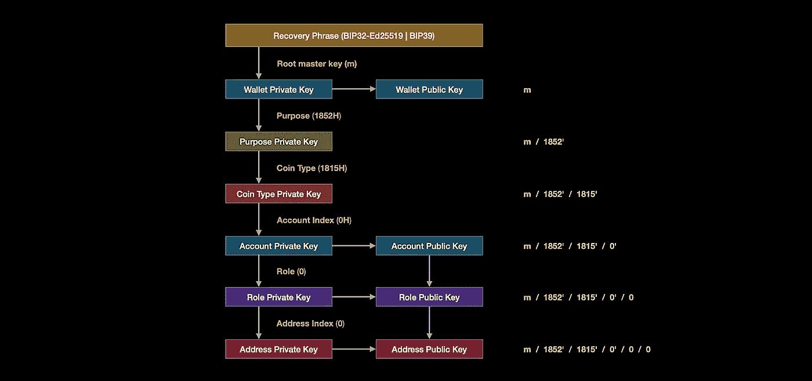
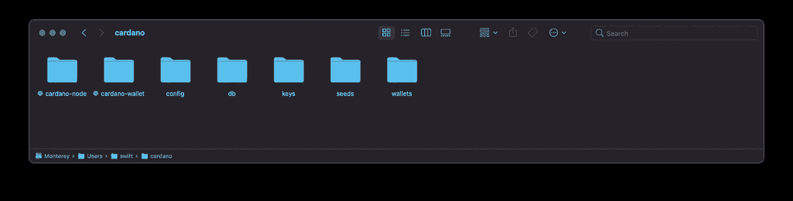
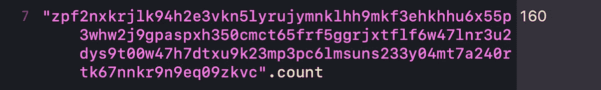
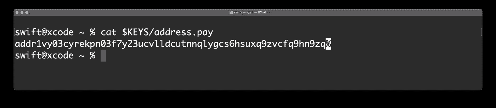

# Cardano 911 —钱包命令行界面(第二部分)。

> 原文：<https://medium.com/geekculture/cardano-911-wallet-command-line-interface-part-two-982a096c50e2?source=collection_archive---------3----------------------->


这是前面写的第一个故事的续篇。除非您阅读了前一部分，否则您应该通过以下链接阅读:

[***Cardano 911 —钱包命令行界面(上)***](/geekculture/cardano-911-wallet-command-line-interface-part-one-ad0ee5ac8509) 。

# 拜伦时代与雪莱时代的地址

我们目前在卡尔达诺区分了五个不同的时代，但我想马上指出其中两个是 CLI 的基础——他们是拜伦和雪莱。

*   ***拜伦纪元*** 始于纪元 0
*   ***雪莱纪元*** 始于公元 208 年
*   ***快板纪元*** 始于公元 236 年
*   ***玛丽纪元*** 始于公元 251 年
*   ***阿隆佐纪元*** 始于公元 290 年

拜伦式地址(传统)和雪莱式地址的主要区别在于，拜伦式具有更快的区块链同步，而雪莱式具有股权委托和更快的钱包恢复。

此外，上述类型的地址在视觉上彼此非常不同。下面是在代达罗斯生成的拜伦时代 ***Base58*** 编码地址(现已废弃)的样子:

```
**DdzFF**zCqrhso9PfdXvRQ7hcaR1g6rDFc1VMXhthCpEuqioSh4bRKNizwvwUx6sdxSAUFmDr1v8nRkQJ7wojoyun68HsfMD7hLm7CfCKT
```

这里有一个雪莱时代的标本，用 ***Bech32*** 方案编码:

```
**addr1**qyuudk3newmzjwcz4eyypnpcexvcyww4znuw5g40dlt7fdeecmdr8jak9yas9tjggrxr3jvesgua298cag723m7hujmspd3k22
```

***警告*** : **两个地址都是虚构的。不要把资金送到那里！**

在本文的第一部分，我展示了如何使用下面的命令在屏幕上显示所有未使用的地址:

```
cardano-wallet **address** list \
    --state unused 0aa0cb917989f070c1ce97ba0f78004e4e93231a
```

让我们看看第二十个地址:


存放在名为***derivation _ path***数组中的那 5 个字符串是什么？

# 派生路径

了解什么是 ***派生路径*** 以及它如何工作是至关重要的。派生路径与 ***高清钱包*** 相关，这是一种钱包，其中有一个种子短语，可以解锁支持网络上的许多帐户、地址或私钥。

> 导出路径是一段数据，它告诉分层确定性(HD)钱包如何在密钥树中导出特定密钥。衍生路径被用作比特币标准，并作为 BIP32 的一部分与 HD 钱包一起推出。BIP32-Ed25519 是 Cardano 中 BIP32 的某种扩展。

最新 Cardano 钱包的衍生途径是这样的:

```
**m** / **purpose'** / **coin_type'** / **account_index'** / **role** / **address_index**
```

没有什么比把它形象化更好的了。



Shelley-Era Derivation Path with 3 hardened indices

好吧，让我们弄清楚什么是什么。

## m

*   **根万能钥匙**。

## **目的’**

*   对于拜伦时代的地址，用 Base58 方案编码，开发人员使用值 ***44H*** ，因为它标识了 ***BIP44-Ed25519*** 。

```
**m** / **44H** / **1815H** / **0H** / **0** / **19**
```

*   对于使用 Bech32 方案编码的 Shelley-era 地址，开发人员使用新值 ***1852H*** ，因为它标识[***CIP 1852***](https://cips.cardano.org/cips/cip1852/)。顺便说一下，1852 年是阿达·洛芙莱斯去世的那一年。

```
**m** / **1852H** / **1815H** / **0H** / **0** / **19**
```

## **硬币 _ 类型’**

*   每个通过 ICO 的令牌都有自己的标识符，名为 ***coin_type*** 。ADA 的标识符是 ***1815*** ，或者十六进制的 ***0x717*** 。完整的硬币类型列表您可以在这里找到[](https://github.com/satoshilabs/slips/blob/master/slip-0044.md)*。值得注意的是，1815 年是阿达·洛芙莱斯出生的一年。*

## ***账户 _ 索引’***

*   *通常为 ***0*** ，但也可以是从 ***0*** 到 ***2*** 的任意数字。正如你注意到的，路径中的三个值后面是*，代表 [***硬化***](https://wiki.trezor.io/Hardened_and_non-hardened_derivation) 。**

> **虽然***cardano-wallet***或***cardano-address***实用程序会给你一个看起来不错的输出，但是如果你不在每个值后面加上 ***H*** ，以后生成的支付地址将无效。如果您将资金发送到这样的地址，它们将会丢失！**

## ****角色****

*   **目前只有三个角色—***【0】***是一个外部链，***【1】***是一个内部链，***【2】***是一个定位地址。在代达罗斯，您可能已经注意到了下面的钱包定位地址的派生路径。**

```
****m** / **1852H** / **1815H** / **0H** / **2** / **0****
```

*   **将来， ***角色*** 插槽可能会扩展新的角色。**

## ****地址 _ 索引****

*   **默认情况下，代达罗斯钱包 4.3 版为每个账户创建 20 个地址。如果你看看地址的索引，你会看到它们来自于 ***0*** 到 ***19*** 。**

> **当使用 CLI 时，没有什么可以阻止您创建一个直接指向某个疯狂索引的地址，如 100 万(使用标志 **address-pool-gap 1000000** )，但如果您将资金发送到从该密钥生成的支付地址，它不会显示在您的钱包中，因为默认情况下，它会在序列中的每 **20 个地址中期待一个交易**。******

# **根主密钥**

**在继续之前，我建议在 ***cardano*** 目录下再创建一个名为/ ***seeds*** 的文件夹，并添加两个新的环境变量。**

****

**我在 ***~/中声明了两个新变量。zshrc*文件。****

```
**export SEEDS="/Users/swift/cardano/seeds$SEEDS"
export KEYS="/Users/swift/cardano/keys$KEYS"**
```

**重启终端应用程序是个好主意，重启后，生成一个 24 个字的种子:**

```
**cardano-wallet **recovery-phrase** generate > $SEEDS/**primary****
```

**我去了***~/cardano/seeds/***目录，复制了这个句子。这是:**

```
**cargo better circle waste aspect laptop title student announce forget version dolphin seminar census next gun lumber balcony maximum express trend first chronic grit**
```

**是时候为 Shelley 时代的地址生成一个 800 位 ***根私钥*** 了。我不得不提到，在 Cardano CLI 中仍然支持传统样式，因此不仅可以创建 ***谢莉*** 样式的钱包，还可以创建 ***拜伦*** 、 ***伊卡洛斯*** 和 ***耶梦加得*** 样式的弃用钱包。**

```
**cat $SEEDS/**primary \** | cardano-wallet **key** from-recovery-phrase **Shelley** > $KEYS/**root.prv****
```

> *****cat*** 命令(concatenate 的简称)是 Linux/Unix/Mac 操作系统中最常用的命令之一。 ***cat*** 命令允许我们创建单个或多个文件，查看包含的文件，连接文件，并在终端或文件中重定向输出。**

**和**

> **垂直管道 **|** 用于将一个命令传输到另一个命令。也就是说，它将第一个命令的输出定向到第二个命令的输入。**

**我们的第一把钥匙闪闪发光…**

```
****root_xsk1**zpf2nxkrjlk94h2e3vkn5lyrujymnklhh9mkf3ehkhhu6x55p3whw2j9gpaspxh350cmct65frf5ggrjxtflf6w47lnr3u2dys9t00w47h7dtxu9k23mp3pc6lmsuns233y04mt7a240rtk67nnkr9n9eq09zkvc**
```

**现在我们应该对相应的 ***根公钥*** 执行一个命令:**

```
**cat $KEYS/**root.prv** \
  | cardano-address **key** public --with-chain-code > $KEYS/**root.pub****
```

**得到了带有“***root _ xvk 1***”**前缀的 nice 公钥。****

```
******root_xvk1**9kvyaegkd0t6gem0xxvy8fvwqxased2h00zg5f2wpmfzzxcnl2gata0u6kdctv4rkrzr34lhpe8q4rzgltkha6427xhd4a88vxtxtjquymcr8****
```

****你可能会问:真的有 ***800 位*** 私钥吗？确实如此，我们来数一数。根私钥的长度是 160 个字符+"***root _ xs k1***"**前缀。使用 ***Bech32*** 方案对密钥进行编码。 ***Bech32*** 字母表共包含 32 个字符——小写 ***a*** 到 ***z*** 字母和 ***0*** 到 ***9*** 数字，但不包括数字*和字母 ***b* 所以，数学很简单——你有 ***32 ⁶⁰*** 或者 ***2⁸⁰⁰*** 可能的组合。*********

********

****160 characters excluding “**root_xsk1**” prefix****

# ****派生帐户密钥****

****从父根密钥派生子密钥时，必须提供两个、三个或五个路径段。仅提供前 3 个或所有 5 个路径段(即 ***目的*** ， ***硬币 _ 类型*** ， ***帐户 _ 索引*** ， ***角色*** ， ***地址 _ 索引*** )，您将与 Shelley key 打交道然而，提供 2 个路径段(即***account _ index***和***address _ index***)，您将打算导出一个遗留 Byron 密钥。****

****有了这个头脑，没有什么可以阻止我们生成 ***账号密钥*** 。****

```
****cat $KEYS/**root.prv** \
  | cardano-wallet key child **1852H**/**1815H**/**0H** \
  | tee $KEYS/**account.prv** \
  | cardano-wallet key public --with-chain-code > $KEYS/**account.pub******
```

> *******tee*** 命令读取标准输入，然后将其内容写入标准输出。它通常用于分割程序的输出，这样它既可以显示又可以保存在文件中。该命令可用于在数据被另一个命令或程序更改之前捕获中间输出。****

****我们的第一个伪装者是一个 ***账户私钥*** :****

```
******acct_xsk1**wzjkw933vws6kyf8he6dng5w67mmtreg5vu0ms6cx5p9g2y5p3w3ptwh5gxh8cjyu6m299cvmhr992589vwg53d0vpvn23f5rwmeqst2ycrkacr3peaskss8cw0wr49daamrxvqqw3860grjvkjnmzk25u69sr5s****
```

****第二个是 ***账户公钥*** :****

```
******acct_xvk1**eq6sddwe8z6wacc02prws0lznl62q8lgwnlxw7n5sdewar30tesx5fs8dms8zrnmpdpq0su7u822mmmkxvcqqaz057s8yed98k9v4fc5c9nj4****
```

# ****地址键****

****准备好继续前进了吗？让我们生成提供所有 5 个路径段的地址键。****

```
****cat $KEYS/**root.prv** \
  | cardano-wallet key child **1852H**/**1815H**/**0H**/**0**/**0** \
  | tee $KEYS/**address.prv** \
  | cardano-wallet key public --with-chain-code > $KEYS/**address.pub******
```

****我们的 ***私有地址键*** :****

```
******addr_xsk1**czawxjvtgwtd02rdqz0u429mdyv2l7ewqc0jn5ypupuux255p3wl5gnknmfwth923rtzmdy0mnhntd2mf6wjdujvu9nzlfnqr2n95y6pl9w3fpyxyl0pj26wamsqmn282lt35scwtf7fkctlaz4ard2z0qajq93m****
```

****当然还有 ***公共地址键*** :****

```
******addr_xvk1**6cu8v3duckqq3ac48ghc0h5har6dwln7lly4n5qsy4ydqa2fxrlyr72azjzgvf77ry45amhqphx5w47hrfpsuknundshl69t6x65y7qq8rand****
```

****大家知道一个 ***支付地址*** 是由一个 ***公钥*** 构成的:****

```
****cat $KEYS/**address.pub** | cardano-address **address** payment \
    --network-tag 1 > $KEYS/**address.pay******
```

****你想在屏幕上看吗？****

```
****cat $KEYS/**address.pay******
```

********

****你可以看到这个地址是 ***的缩写*** ，这是因为它是 Shelley 地址的 ***支付部分*** 。让我们来读一下[官方文件](https://github.com/cardano-foundation/CIPs/blob/master/CIP-0019/CIP-0019.md)的摘录:****

> ******付款部分******
> 
> ****基本上，Shelley 地址的第一部分表示与该地址相关联的资金的所有权。我们称之为支付部分。拥有支付部分的人拥有该地址的所有资金。事实上，为了从一个地址消费，必须提供一个证人证明该地址可以消费。在`PubKeyHash`的情况下，它意味着提供用对应于散列公钥的签名密钥(以及用于验证的公钥本身)制作的交易体的签名。对于货币脚本，这意味着能够提供源脚本并满足验证脚本的必要条件。****
> 
> ******代表团部分******
> 
> ****Shelley 地址的第二部分表示与该地址相关联的股权的所有者。我们称之为，代表部分。谁拥有委托部分，谁就拥有与该地址相关联的任何资金的股权。在大多数情况下，支付部分和委托部分属于同一方。然而，也可以构建由不同实体拥有和管理两部分的地址。我们称这样的地址为错位地址或混合地址。****

# ****锁定键****

****我相信您已经猜到了如何生成锁定键—只需为*段插入" ***2*** "值，而不是" ***0*** "。*****

```
**cat $KEYS/**root.prv** \
  | cardano-wallet key child **1852H**/**1815H**/**0H**/**2**/**0** \
  | tee $KEYS/**staking.prv** \
  | cardano-wallet key public --with-chain-code > $KEYS/**staking.pub****
```

****它们的前缀分别是 ***stake_xsk1*** …:****

```
****stake_xsk1**nrttj2wevrr4n8sm3gxpfx5v963y7mfdvmrt6vy247xm6tv5p3wn5nt2k89na2hpnc9f9s7drp87c84dcp0n7c36nyj2e3tlt68tamn5enexxa752rgyuyle9yg39qrasvhvzm2xa74xx4u5sscegzy4gcdue3ju**
```

****……和 ***stake_xvk1*** 分别为:****

```
****stake_xvk1**80frhh998pkd6fhxfqnz5dpcftauzq7fqvczurlsxnaua0u5hq7hfn8jvdmag5xsfcflj2g3z2q8mqewc9k5dma2vdtefpp3jsyf23s6g6xle**
```

# ****创建委派地址****

****您有 5 个子命令供您使用，允许您创建所需类型的卡达诺地址:****

*   ****引导程序****
*   ****支付****
*   ****桩****
*   ****委托****
*   ****指针****

****我们将借用 ***委托*** 子命令。它看起来是这样的:****

```
**$ cardano-address recovery-phrase generate --size 24 \
    | cardano-address key from-recovery-phrase Shelley > root.prv $ cat root.prv \
    | cardano-address key child 1852H/1815H/0H/2/0 > stake.prv $ cat root.prv \
    | cardano-address key child 1852H/1815H/0H/0/0 > **address.prv** $ cat **address.prv** \
    | cardano-address key **public** --with-chain-code \
    | cardano-address address **payment** --network-tag mainnet \
    | cardano-address address **delegation** $(cat stake.prv | cardano-address key public --with-chain-code)**
```

# ****未完待续…****

****在下一个故事中，我们将了解如何提交事务。****

# ****捐赠给作者****

********

****Click on the picture to make the QR code bigger****

```
**addr1q9w70n62nu8p7f9ukfn66gzumm9d9uxwppkx7gk7vd7gy0ehfavj97gkncwm8t8l8l8x9e4adzmw2djh4y5gd9rmtewqr99zr3**
```

****目前就这些。****

****如果这个故事对你有帮助，请按下 ***拍*** 按钮和 ***按住*** 吧。在 Medium 上，每个故事最多可以拍 50 次*。*****

*****如果您有任何问题，您可以通过 [***卡达诺证券交易所***](https://cardano.stackexchange.com/users/4023/andy-jazz) 联系我。*****

****快乐的赌注！****