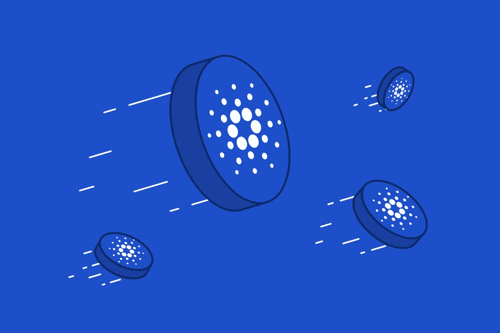
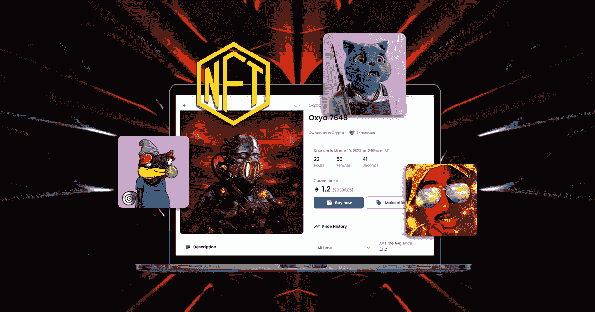

# 卡尔达诺 NFT 市场开发:在卡尔达诺区块链上推出 NFT 市场

> 原文：<https://medium.com/geekculture/cardano-nft-marketplace-development-launch-nft-marketplace-on-cardano-blockchain-768cb6073262?source=collection_archive---------18----------------------->

ft 或不可替代的代币作为数字资产，要求其本身具有稀缺性和按需性，从而具有恒定的评估价值。这是因为它的独特性和所拥有资产的所有权证书。密码发烧友们正为一个能以符合人体工程学的环境吸引他们的市场而神魂颠倒。 [**卡尔达诺 NFT 市场开发**](https://www.appdupe.com/nft-marketplace-development) 检测任何可能的对令牌化资产的置换，并预先避免它。

这里的 NFT 非常灵活，因为它们能够构建在不同的区块链平台上。加密资产的无缝交易首先是类似以太坊的区块链的结果。

# **卡达诺是什么？**

[**Cardano**](https://www.coinbase.com/learn/crypto-basics/what-is-cardano) 是公用的第三代区块链，是大毒蛇共识算法。这是一个分散的区块链平台，由以太坊的创始人之一区块链开发。它们在加密货币市场的区块链网络中使用得最多。它们的显著特征在众多特征中脱颖而出，因为它为平台的发展提供了科学基础。为了进一步解释卡尔达诺区块链，他们有两层。它们是卡尔达诺定居层(CSL)和卡尔达诺计算层(CCL)。

博客里提到了大毒蛇共识算法。除了 Cardano 软件上的 ouroboros 之外，它什么也不是，只是表示它的利害关系证明一致算法的东西。将会添加信息，即它们被分为时段和槽。这实现了交易，铸造了 ADAs(卡达诺加密货币),并有助于提高网络的安全性。

# **卡达诺的基本特征**

*   他们倾向于持有良好的未来想法，以维持市场。
*   顶级的安全性、可伸缩性和有效的互操作性使它们与众不同。
*   数字合同旨在避免任何形式的侵权。
*   他们的目标是为涉及密码的应用奠定基础。
*   它们很节能，每小时仅利用约 6 千兆瓦，而其他产品通常每小时消耗高达 150 千兆瓦。

# **卡尔达诺 NFT 市场开发**

众所周知，实际的贸易始于市场，止于市场。这样一个 NFTs(稀有的数字资产)市场吸引了更多的观众。此外，卡尔达诺 的 [**NFT 市场为所实施的项目提供了多种报价。**](https://www.appdupe.com/nft-marketplace-development)

*   高可扩展性
*   高交易速度
*   高度安全的环境
*   跨链合规性
*   互用性
*   优越的收入模式

# **卡尔达诺 NFT 市场的方方面面**

保持一些保持平台可持续发展的关键特性，以及大量的优势。NFT 市场，因为它的功能是交易其持有的方面，是一个良好的市场像卡尔达诺必须的。

*   店面
*   过滤器和列表
*   交易和投标
*   钱包整合
*   高级搜索
*   评级和评论

# **创办卡达诺 NFT 市场发展公司需要遵循的关键步骤**

回到博客的本质，在分析了卡尔达诺 NFT 市场的所有方面后，卡尔达诺 NFT 市场应该如何发展？

## **选择一个利基市场作为目标市场**

利基选择和对市场的深入分析将作为发展的基础。这使得更好的市场更容易进入市场。一级和二级市场是基于特定的利基市场，例如，艺术，音乐，视频等。，借助市场中的 NFTs 的数字资产。这使得进入市场更加容易。设置这样的先决条件将使市场的建设高端化。

## **用户角色规范**

在任何进一步的进展之前，在市场类型的利基或规范确定之后，重要的是确保用户角色，以获得难忘的体验，将密码爱好者带回市场。

## **UI 设计开发**

开发卡达诺 NFT 市场时，首先要考虑的是用户界面设计将是至关重要的。这个用户界面保留了许多功能并显示价格。来自专业开发人员的高性能 UI 设计对于无错误导航和可持续性至关重要。这取决于开发者、创造者和交易者。

## **智能合同开发**

智能或数字合同将是市场和这里发生的每一笔交易的法律保障。智能合约在 Cardano 网络中存储了自动执行的代码，它有三种特定的开发语言:马洛、普路托斯和哈斯克尔。他们详细说明了买卖双方如何进行交易的条款。

## **钱包整合**

交易随着交易而完成，数字钱包与市场相结合。这个数字钱包也可以储存在 NFT 收藏中作为奖励。在这种情况下，用户应该将钱包链接到他们在 Cardano 的 NFT 市场。为了吸引更广泛的受众，集成多个加密钱包将是答案。卡尔达诺的土著象征是阿达。

## **个性化功能**

拥有多种功能的能力是卡尔达诺·NFT 的优势。它们的集成必须具有基本的方面集成，如店面、钱包集成、投标选项和搜索过滤器，以使市场保持正常运行。由于个性化的范围更广，添加到他们将使市场的用户界面即兴创作。

## **试运行**

在这个阶段，代码的无错行为得到了保证。为了在 mainnet 上成功启动，必须在多个基于 Cardano 的测试上广泛运行几个测试。

## **储物解决方案**

对于链外 NFT 数据，需要一个针对 NFTs 的可靠解决方案。分散存储解决方案可以从各种解决方案中进行选择，因为 IPFS 是商界人士中最著名的，而 NFT 市场存储数据。

**结束语——为什么要推出 Cardano，因为你在 NFT 市场已经取得了行业领先地位？**

卡尔达诺区块链是潜在吸引更大的密码狂热分子参与市场开发的先驱之一。它们为构建 NFT 平台提供了广泛的好处。

接近一个典型的 [**卡尔达诺 NFT 市场发展公司**](https://www.appdupe.com/nft-marketplace-development) 将是一个从加密世界中攫取利润的机会。

随着可伸缩性的降低，增加的流量通常会降低性能。Cardano 的高可伸缩性不仅是它最好的品质，还能同时方便大量的观众。作为白标解决方案的助手，它们也解决了对快速交易、网络带宽和数据存储的期望。

关注快速交易的利益证明共识算法和分割成子网的 RINA 技术降低了节点的带宽需求，这是非常了不起的。他们承诺拥有 51%的股份，这是通过用户的直接参与来实现的，这重申了安全分析师对继续执行可靠的安全协议的承诺。除此之外，决定为 Cardano 的可扩展性、互操作性、灵活的技术、开源、激励等创建一个 NFT 市场。