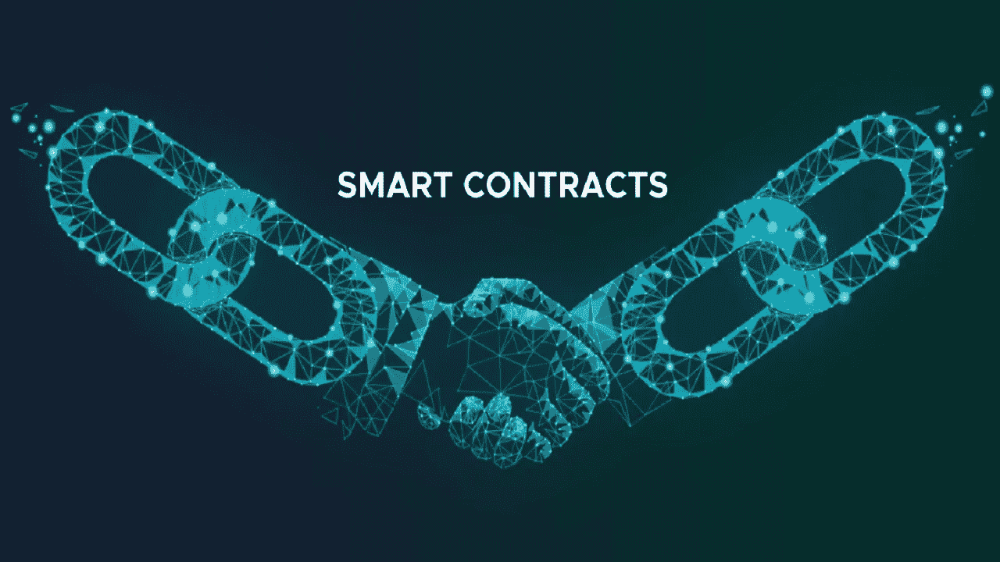
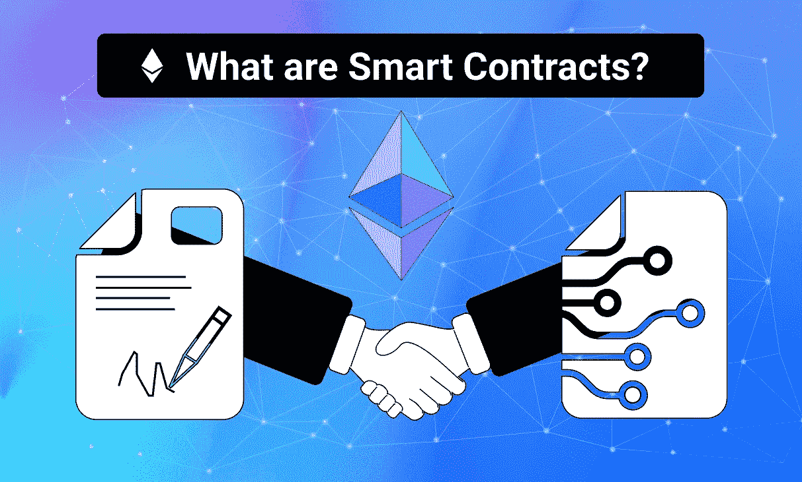

# 卡尔达诺 NFT 市场智能合同

> 原文：<https://medium.com/geekculture/cardano-nft-marketplace-smart-contract-7471300dc232?source=collection_archive---------5----------------------->

**Cardano NFT Marketplace Smart Contract**

自从区块链诞生以来，就有很多意见从各个角落流出来。虽然其中许多人在密码世界传播了积极的信息，但其他人却导致了对这项技术的怀疑。这种怀疑的思路之一是，基于区块链的应用程序消耗大量能源。这种指责从比特币和以太坊网络的最初区块链就存在了。然而，专注于能源效率的新网络已经定期发布，这些网络有助于消除这种想法。Cardano 是一个成立于 2017 年的区块链网络，是最早使用环保协议的网络之一。在这篇博客中，我们将看到更多关于 [**在卡尔达诺区块链开发基于智能合同的 NFT 市场**](https://bit.ly/3NvzTxc) 的内容。

# 什么是 NFT 市场？

NFT 市场是一个平台，人们可以在这里交易由不可替代代币(NFT)支持的产品。该平台通常是分散的，尽管仍存在一些集中的 NFT 市场。市场使用区块链上的智能合约，当所有约束条件都满足时，智能合约会自动执行。市场平台出售支持艺术、音乐、游戏、视频、迷因甚至虚拟世界中的小块土地的 NFT。NFT 市场可以出售基于通用或利基的 NFT 项目。一些受欢迎的 NFT 市场包括[**【OpenSea】**](https://opensea.io/)[**Rarible**](https://rarible.com/)**[**LooksRare**](https://looksrare.org/\)、Solsea、SuperRare、Nifty Gateway、NBA Top Shot、分散地、Axie Infinity 和沙盒。从本质上讲，NFT 市场促成了所有疯狂的交易，这些交易构成了 2021 年下半年 NFT 的繁荣。**

# **更多关于区块链 Cardano 的信息**

**Cardano 是一个区块链网络，它使用名为 Ouroboros 的利益证明(POS)协议，这使得它比当时存在的工作证明(POW)使用的能量少得多。Cardano 网络的加密货币是$ADA，这是目前使用的顶级加密货币之一。区块链是通过同行评审研究建立的首批网络之一，并在开发过程中使用了基于证据的方法。**

**卡尔达诺区块链的一些好处包括一个安全的协议，它不能妥协，直到 51%的持有者是恶意的，这对于这样规模的网络是不可能的。此外，还向积极参与验证过程以维持网络运行和可持续性的参与者提供奖励。此外，卡尔达诺区块链网络据说是最高效的区块链之一，一些报告指出，它的能效几乎是比特币链的 400 万倍。**

# **卡尔达诺 NFT 市场的显著特征**

*   ****Storefront** —作为用户端门户，显示各个 NFT 的详细信息。**
*   ****搜索过滤**——精准找到买家需要的 NFT 产品。**
*   ****列表门户**——经平台管理员批准后，列出 NFT 的待售物品**
*   ****竞价门户** —对 NFT 物品进行竞价并了解拍卖统计数据**
*   ****集成钱包** —持有通过平台交易的加密货币和 NFT 资产**
*   ****评论和评级**——让人们更多地了解特定的 NFT 产品。**

# **使用智能合约开发卡达诺 NFT 市场的步骤**

****

****Developing a Cardano NFT Marketplace Using Smart Contracts****

*   **使用智能合约创建一个 [**卡尔达诺 NFT 市场**](https://bit.ly/3NvzTxc) 始于广泛的规划。你应该决定利基、目标市场、要使用的技术，并以此为基础设计白皮书。**
*   **在这之后，你应该开始工作的前端功能，这是在卡尔达诺 NFT 市场发展的重要步骤之一。您应该使用高级编程技术为平台集成用户界面(UI)和用户体验(UX)。**
*   **然后，继续进行后端开发，确保门户的安全性和健壮性。这是开发卡尔达诺 NFT 市场智能合约的重要阶段之一，因为智能合约的功能就是在这个阶段定义的。**
*   **之后，测试平台的错误并立即解决它们。这是卡尔达诺 NFT 市场开发过程中的重要一步，因为良好的测试可以确保软件完美运行。**
*   **最后，在卡尔达诺区块链上推出供公众使用的平台。定期处理社区反馈并发布更新以跟上趋势。**

## **摘要**

**因此，我们可以说，基于智能合同进行卡达诺 NFT 市场开发确实是一个明智的想法，因为区块链是其他网络中发展最快和最激烈的竞争对手之一。如果你想在卡尔达诺区块链建立一个 NFT 市场，一些有经验的公司可以帮助你完成这个过程。这些公司倾向于以客户为中心，在不影响服务质量的情况下满足他们的所有需求。因此，这是一个非常好的想法，尽快着手卡尔达诺 NFT 市场的发展，以在虚拟空间中脱颖而出。**