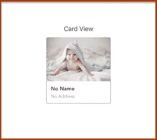
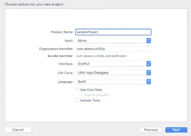

# IOS 中的 CardView(Swift & Swift ui)

> 原文：<https://medium.com/geekculture/cardview-in-ios-swift-swiftui-52b4ac9d8f32?source=collection_archive---------3----------------------->

卡片视图是移动应用、软件和网站等开发中非常有用的组件之一。今天我将向大家展示如何使用 Swift & SwiftUI 在 IOS 中创建卡片视图。为了更好的理解，请阅读完整的博客。

# ***步骤 1)***

*通过使用 SwiftUI 创建项目，如下所示*

**

# ****第二步)****

*在这里，我使用 SDWebImageSwiftUI 将图像放入卡中。如果您想将其添加到项目中，请单击下面的链接。*

*[https://github.com/SDWebImage/SDWebImageSwiftUI](https://github.com/SDWebImage/SDWebImageSwiftUI)*

# ****【步骤 3】****

*现在创建一个名为 **CardView** 的视图，如下所示，并定义一些 **let** 常量，这些常量将用于代码的下一部分。*

# **步骤 4)**

**之后，现在使用一个 **ZStack** 到主体变量中，然后使用一个 **RoundedRectangle****

**在这段代码中， **ZStack** 就像(把盘子一个接一个地放入堆栈中)视图堆栈。**圆角矩形**用于将**矩形**放在**卡片视图**的后面。在 RoundedRectangle 中，我们使用了三个修饰符。**

*   ****。strokeBorder** 用于给矩形添加边框，就像这里我们给边框**宽度** 1 的**灰色**颜色。**
*   **我们已经在**中定义了。框架**是控制**卡片宽度**高度&是**卡片高度**让常量进入**第三步**。**矩形**的高度**或**宽度**。这里卡片的宽度是****
*   ****。背景**用于给**矩形**赋予背景**颜色**。**

# *****【步骤 5】*****

**之后使用 **VStack** 下的**圆角**带**框架**和**转角**半径**

****。拐角半径**是从 **VStack** 边界的拐角开始的半径。**

# *****【第六步】*****

**之后，**通过使用 **SDWebImageSwiftUI** 导入****

**如果您将 **SDWebImageSwiftUI** 添加到您的项目中，那么您可以导入它，否则无法导入它。请参见**步骤 2** 将其添加到项目中。**

# *****第七步)*****

**之后使用 **WebImage** 进入那个 **VStack****

****WebImage** 是 **SDWebImageSwiftUI** 的组件。 **WebImage** 将获取 **URL** type **url** 并将图像显示在屏幕上。**

**这里**

*   ****。resizable()** 用于调整图像的大小。如果您不使用此选项，则无法调整图像大小。所以非常重要。**
*   ****。判断**是否将该图像填充到父视图中。**
*   ****。帧**是图像的尺寸**
*   ****。clipped()** 是将图像裁剪到父视图的边界。**

# *****【第 8 步】*****

**之后使用**网页图片**下面的 **VStack****

**这里我只是将两个文本垂直显示，并给出自定义的**字体**、**大小**、**粗细**、&、**颜色**等。**

# ****完整代码:****

**现在，您可以在任何想要进入的地方使用这个卡片视图**

****

**如果你有任何疑问，请在下面评论。感谢你阅读这篇文章🙇‍♂️!:)**

## **订阅模式**

** [## 米（meter 的缩写））阿巴斯正在创建 IOS 开发者| Patreon

### 立即成为 M.Abbas 的赞助人:获得世界上最大会员的独家内容和体验…

www.patreon.com](https://www.patreon.com/abbasgujjar)**