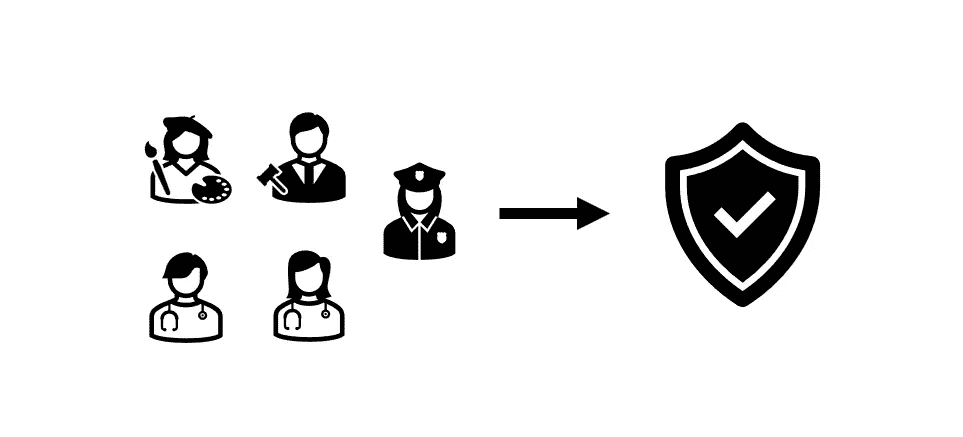

# 对转向网络安全的人的职业建议

> 原文：<https://medium.com/geekculture/career-tips-for-people-pivoting-to-cybersecurity-25d5a3016f53?source=collection_archive---------18----------------------->

[这是一个雨天](https://www.youtube.com/watch?v=ZlYDqL_mudI&t=28s)，我带着它去阅读和学习，同时我在 medium 上看到了这篇关于职业生涯的伟大文章&网络安全:[解决你的网络安全职业转型挑战|作者 Jamie Dicken | 2022 年 5 月| Medium](/@Jamie_Dicken/troubleshooting-your-cybersecurity-career-transition-challenges-4283a6feb4ca) —作者从招聘的角度阐述了这个话题，实际上是很好的见解！