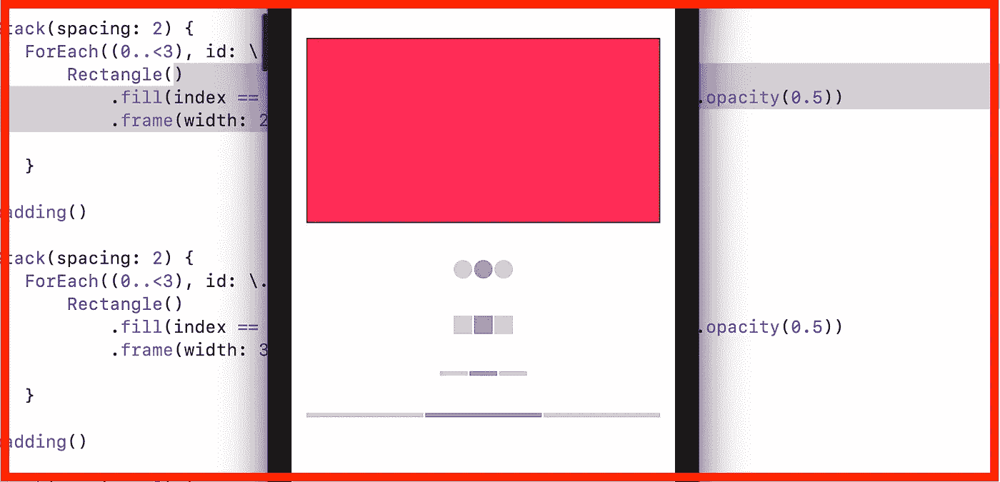
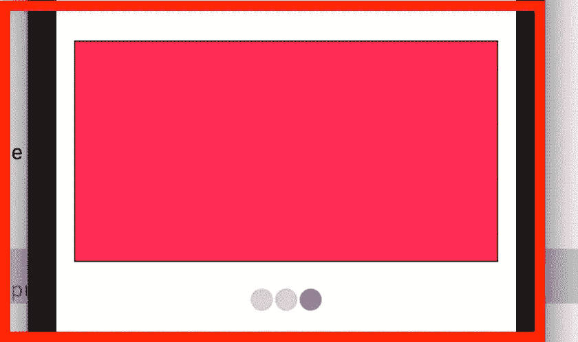
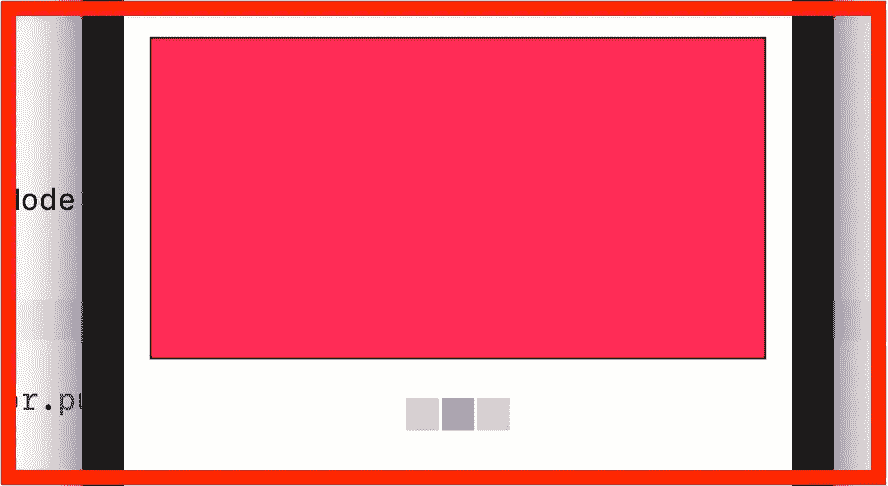
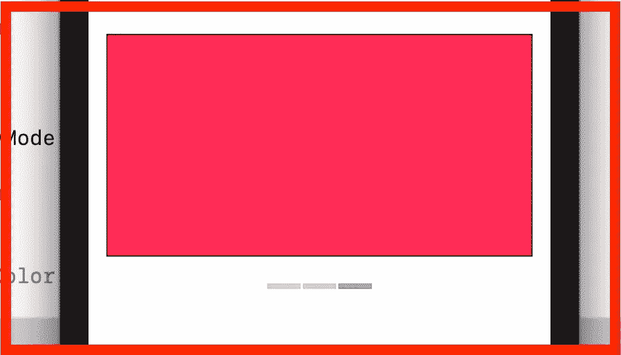
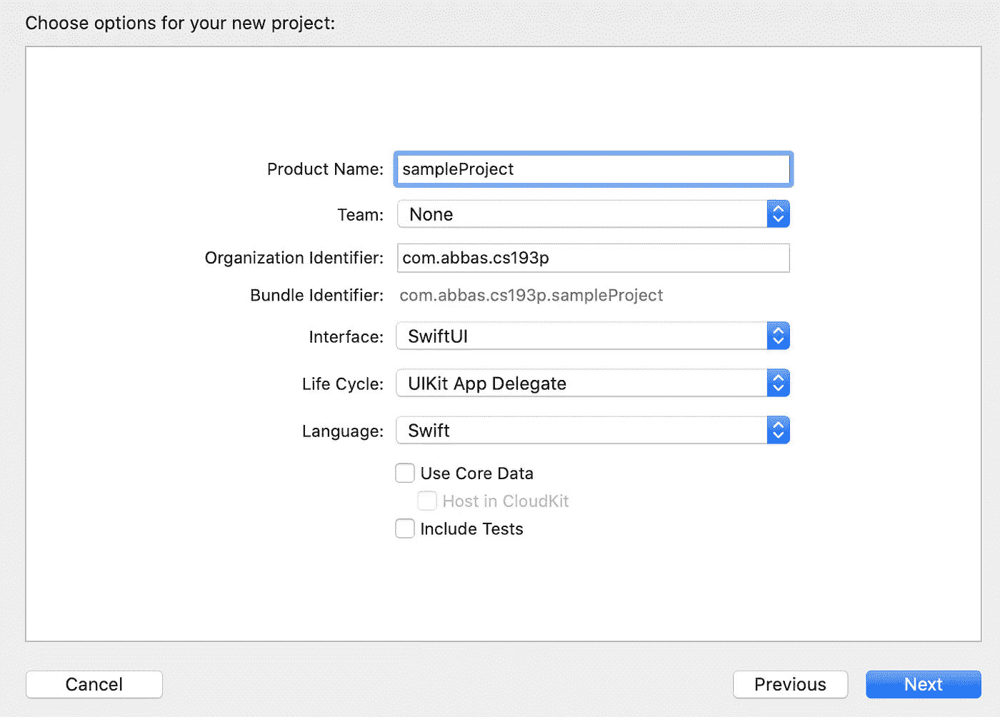
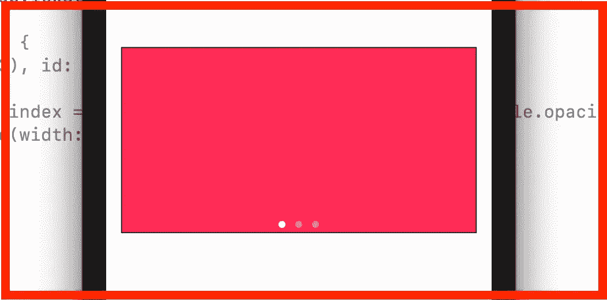
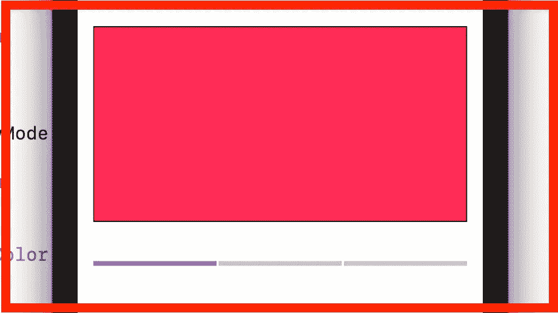

# IOS 中的旋转木马(Swift、SwiftUI)

> 原文：<https://medium.com/geekculture/carousel-in-ios-swift-swiftui-c0aecbbf238e?source=collection_archive---------4----------------------->

嗨，在这个博客里的家伙们，我要告诉你们，你可以通过使用 XCode 中的 Swift & SwiftUI 在 IOS 中创建一个 **Carousel** 。在这篇博客中，你可以看到四种旋转木马的设计。让我们开始吧。

# 第一步

在 XCode 上创建一个 SwiftUI 项目，如下所示。

# 第二步

现在，我们的主要 SwiftUI 文件是 ContentView.swift。当我们运行应用程序时，该文件将默认打开。现在在视图之外写一个小的虚拟 CardView。像下面这样

 [## 三星 Galaxy S21 超 5G 出厂解锁安卓手机 128GB 美版智能手机…

### 三星 Galaxy S21 Ultra 5G 手机在各方面都是史诗般的，具有引人注目的新设计，迄今最快的 Galaxy 处理器，以及…

amzn.to](https://amzn.to/35knqeL) 

# 第三步

现在在 ContentView 中创建一个@State 变量**索引**，并赋予默认值“0”。之后使用框架高度为 200 的 VStack。

> 使用交互式用户界面元素在多个子视图之间切换的 TabView。

在那个 **VStack** 里面写 **TabView** ，它带**两个**参数一个是**选择**另一个是**视图**。将**索引**与**选项卡视图**中**选择**绑定，并在**选项卡视图**闭包内使用 ForEach 并打印 **CardView()** 。出于演示目的，我在这里打印了三次 **CardView()** 。之后，对于 **TabView** 样式，我使用 **tabViewStyle** ，通过使用 **TabView** 这样的修饰符。

> 。tabViewStyle(PageTabViewStyle(indexDisplayMode:。总是))

通过编写该代码，您将看到**转盘**的默认设计，如下图。

# **定制**转盘设计…

> 使用**。千万不要用**代替**。总是在**里面的**。用于定制转盘设计的 tabViewStyle** 。

## **第一个转盘设计:**

现在，请阅读以下内容，定制设计旋转指示器。

对于自定义设计的旋转指示器，您只需要打印水平行的元素。例如，如果我想将圆形显示为旋转指示器，则创建圆形的水平行。记住圆圈的数量应该等于 TabView 项目的数量。在**步骤 3** 中，我正在打印 3 个卡片视图，所以我们将在这里创建 3 个圆形水平行。

现在我们只需要将我们的**索引**变量与圆的**填充**颜色绑定。现在，如果圆的**指数**等于**自指数**，那么圆的颜色将是暗的，否则颜色将是亮的。

> **在步骤 3 中，在 VStack 内的 TabView 下编写此代码。**

在那之后，我们的旋转木马会像这样。

**第二个转盘设计:**

现在对于**第二个转盘设计，**我只是用**矩形()**替换了**圆形()**。

> **在步骤 3 中，在 VStack 内部的 TabView 下编写此代码。**

在那之后，我们的旋转木马会像这样。

**第三转盘设计:**

现在对于**第三个转盘设计，**我使用的是**矩形()**而不是**圆形()**，宽度**为 30，**高度**为 5。**

> **在步骤 3 中，在 VStack 内的 TabView 下编写此代码。**

在那之后，我们的旋转木马会像这样。

**第四个** **转盘设计:**

现在对于**第四转盘设计，**我使用的是**第三转盘设计**中的矩形，但是宽度从**矩形()**的框架中移除。现在矩形占据了所有的空间。

> **在步骤 3 中，在 VStack 内的 TabView 下编写此代码。**

在那之后，我们的旋转木马会像这样。

# 完整代码:

**希望你全部理解。如果没有，请在下面评论:)👍**

## 订阅模式

 [## 米（meter 的缩写））阿巴斯正在创建 IOS 开发者| Patreon

### 立即成为 M.Abbas 的赞助人:获得世界上最大会员的独家内容和体验…

www.patreon.com](https://www.patreon.com/abbasgujjar)