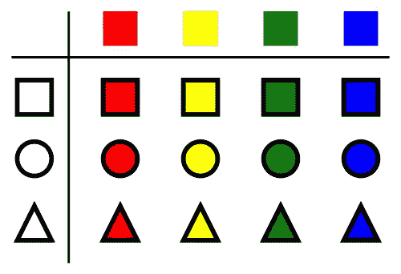

# Python 中的笛卡尔积

> 原文：<https://medium.com/geekculture/cartesian-products-in-python-807e8b55d1d5?source=collection_archive---------11----------------------->

使用 itertools 变得简单

`itertools.product`函数返回两个或多个可重复项的*笛卡尔积*。

# 什么是笛卡尔积？

假设我们有两组值，例如:

*   `a`是值的集合`(1, 2, 3)`。
*   `b`是值的集合`("a", "b", "c", "d")`。