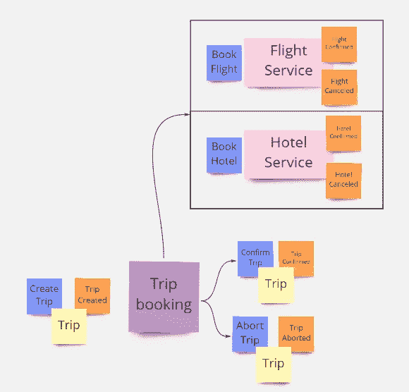
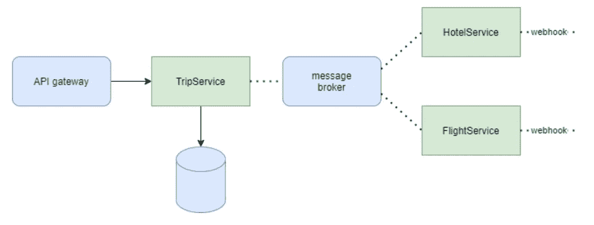
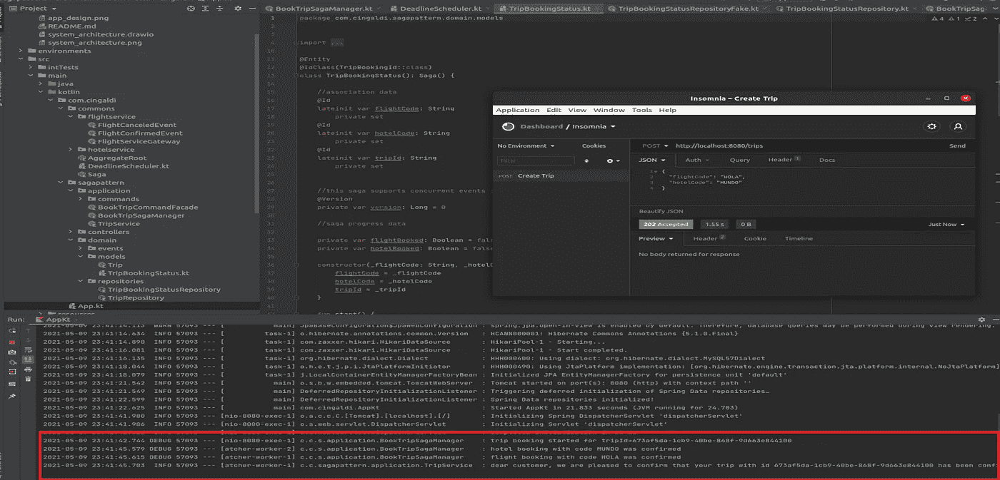

# 案例研究:DIY 传奇模式的实现

> 原文：<https://medium.com/geekculture/case-study-a-diy-saga-pattern-implementation-190927220a0a?source=collection_archive---------12----------------------->


Photo by [Jorge Fernández Salas](https://unsplash.com/@jorgefdezsalas?utm_source=unsplash&utm_medium=referral&utm_content=creditCopyText) on [Unsplash](https://unsplash.com/s/photos/airport-el-prat?utm_source=unsplash&utm_medium=referral&utm_content=creditCopyText)

对于软件工程师来说，从事事件驱动架构的工作是最令人满意的经历之一:看到有多少简单的动作协作形成新兴的行为并创造奇迹，这是令人震惊的。 [Saga 模式](https://www.cs.cornell.edu/andru/cs711/2002fa/reading/sagas.pdf)是一种以[基础](http://www09.sigmod.org/disc/disc99/disc/nsf_acad_ind/brewer/)方式设计长期分布式事务的优雅方式，在能够承受巨大工作负载的分布式反应系统中培养可伸缩性和弹性，同时提供良好的用户体验

在本文中，我们将看到如何在不使用专门框架的情况下实现 saga 模式(如 [Axon](https://docs.axoniq.io/reference-guide/axon-framework/sagas) 、 [Eventuate Tram](https://eventuate.io/docs/manual/eventuate-tram/latest/getting-started-eventuate-tram-sagas.html) 等，它们主要用于 CQRS/ES/CDC 实现的上下文中)。我们的目标是提高对这种机制的理解，看看即使使用“普通的”堆栈，例如流行的 Spring Boot/斯普林数据，也能实现这种机制。对于实现，我使用了 Kotlin，因为这是一个继续练习这种现代优雅的 JVM 语言的好机会😊

**注:通过这篇文章，我们假设读者已经对什么是 Saga 模式以及它是如何工作的有所了解:有很多文章和论文** [**对它进行了全面的解释**](https://microservices.io/patterns/data/saga.html) **。尽管如此，如果你喜欢这个故事，并且想从我这里读到关于模式和分布式系统基础的深入描述，就在这里留下评论吧！**

> TL；这是代码:[https://github.com/cingaldi/sagapattern](https://github.com/cingaldi/sagapattern)

# 分析阶段

## 要求

让我介绍一下我们的使用案例:

> 我们正在开发一个旅行管理平台:我们的客户可以创建 ***旅行*** 在那里他们可以预订航班和酒店。我们可以使用第三方服务将使用的**代码**来处理这两种预订。如果成功预订了航班和酒店房间，我们会通知客户行程已经 ***确认。如果行程确认失败，我们会通知客户***

首先要注意的是:

*   一旦航班和酒店预订完成，行程就可以确定了。假设这两个步骤异步发生。因此，他们可以在几秒钟、几小时或永远不给我们一个结果
*   出于系统性能的考虑，所有的交互都应该以非阻塞的方式执行
*   如果由于某种原因，航班或酒店无法预订，我们应该恢复整个操作。所以每一次预订都应该被取消(看看*最终一致性*的概念是如何出现的)

用一个微型的[事件风暴](https://www.eventstorming.com/)对这些需求建模，这就是我们想要实现的



看看那里的紫色便笺:这被称为*策略*，表示在我们的工作流程中有一个步骤需要做出一些决定，可能在我们的系统之外。在这种情况下，我们可以把它概括概括为

*   **一旦**航班和酒店被预订**然后**确认行程
*   **当**航班或酒店取消**时，则**取消旅行

通常，一项政策会转化成一个传奇故事

## 体系结构

现在想象我们在这样的建筑中工作



我们看到我们已经准备好异步处理工作流，并为外部服务提供一致的外观。整个事务将由 [**TripService**](https://github.com/cingaldi/sagapattern/blob/master/src/main/kotlin/com/cingaldi/sagapattern/application/TripService.kt) 协调，它公开一个 REST API 来创建一个旅行

# 传奇的基石

## 传奇经理

[这个](https://github.com/cingaldi/sagapattern/blob/master/src/main/kotlin/com/cingaldi/sagapattern/application/BookTripSagaManager.kt)是传奇的*入口点*,充当粘合代码:简而言之，它为传奇中涉及的每个事件实现一个监听器，并决定在哪个事件之后发送什么命令。Spring framework 提供了开箱即用的事件总线，所以我们不会在这个细节上纠缠太多。注意，Saga 管理器属于应用程序层:它不实现真正的领域逻辑，它只负责编排流程

那么，为什么不能在 TripService 中添加一些事件监听器呢？答案当然是 SRP，并指出应用服务包装一个聚合根，而 Saga 管理器不只是处理一个聚合根

## 佐贺州和佐贺储存库

[传奇状态](https://github.com/cingaldi/sagapattern/blob/master/src/main/kotlin/com/cingaldi/sagapattern/domain/models/TripBookingStatus.kt)(或者，为了简单起见，只是*传奇)*是位于核心的东西，并且是一个领域概念，所以——一般来说——我们可以在我们无处不在的语言中找到它，它的名称代表*状态、*进程、进程或类似的东西。它代表了应用程序状态的一部分，所以我们可以把它看作一个域[模型](https://github.com/cingaldi/sagapattern/tree/master/src/main/kotlin/com/cingaldi/sagapattern/domain/models)对象，就像实体、聚合根或值对象一样。它是持久的，所以它将有一个关联的*传奇* *存储库。*我们对这个传奇的期望是

*   **建立数据关联**由于 saga 对来自不同聚合的事件做出反应，我们需要将 saga 与参与编排的每个聚合绑定。我们可以在代码中看到,`hotelCode, flightCode, tripId`唯一地标识了这个传奇。因此，saga 存储库定义了查询方法来获取与它们相关的状态
*   **保持现状**无论你发现什么，只要与每一步决策相关，传奇就能持续下去。注意，我们正在定义包含状态转换逻辑的方法，封装对象状态并保持行为接近数据是一个好的 OOP 习惯
*   **决定下一步**每次 saga 状态改变时，一些命令可以被调度，这就是 saga 如何协调所涉及的组件。因此，每个方法都决定下一步应用什么命令

## 指挥部的门面

好吧，这不是生死攸关的问题，但是如果你想要一个很好的关注点分离，一个有表现力的代码，和更高的可扩展性，这个模式正好适合你。简而言之，我们将**命令**的概念实现为一条消息，该消息流入总线并匹配正确的处理程序，该处理程序反过来将该命令应用于一个集合。如果这看起来类似于 ApplicationService/UseCase 所做的事情，那么你没有错:它是类似的，但是以一种更加分离的方式

实现这种模式的方法很少，最简单的是提供一个合适的**facade**对象，它将包装对所需服务的依赖，并公开尽可能多的函数覆盖，就像我们有更多的命令对象一样。最复杂的方法是使用反射和注释来匹配命令和正确的处理程序。让我们坚持一个折中的[解决方案，它提供了足够的灵活性并使用了 Kotlin 的语法糖](https://github.com/cingaldi/sagapattern/blob/master/src/main/kotlin/com/cingaldi/sagapattern/application/BookTripCommandFacade.kt)

## 处理截止日期

不要忘记传奇是用来处理**异步**进程的。如果有一件事是所有异步的事情都做的，那就是当你需要它们的时候不要出现。酒店服务器可能会崩溃，航空公司可能会破产，所以有时我们需要以某种方式结束

出于这个原因，saga 可能会有**截止日期。**截止时间是由基于时间的事件触发的特定事件监听器。它可以在传奇故事开始一段时间后触发。在这两种情况下，尽管解决方案在 SagaManager 级别上看起来微不足道，但它的实现依赖于可用的基础设施工具

你可以只使用一个 cronjob 或者一个[外部触发器](https://kubernetes.io/docs/concepts/workloads/controllers/cron-jobs/)。此外，一些面向消息的中间件(如[亚马逊 SQS](https://docs.aws.amazon.com/AWSSimpleQueueService/latest/SQSDeveloperGuide/sqs-message-timers.html) 或 [with some hacks，RabbitMQ](https://stackoverflow.com/questions/4444208/delayed-message-in-rabbitmq) )提供*延迟消息* 功能，让您在 saga 启动时发出命令，如“10 分钟后，触发超时事件”。在这一点上，我们将让我们的传奇优雅地失败

在我们的例子中，我们将使用 Kotlin 协程来采用一种快速而简单的解决方案。现在只需要扩展代码来持久化预定的任务并健壮地为它们服务。此外，像优化一样，为 saga 管理器提供定位任务和在成功完成的情况下取消任务的方法会很好

## 测试传奇

通常，我们可以从测试的样子中得到多少代码是好的。重要的是要有一个简单的方法来测试整个故事，定义工作流可以遵循的所有可能的路径，并断言结果是预期的。在使用了 *Axon Framework* 之后，我爱上了他们流畅的、行为驱动的测试工具。基本上，我们想测试(也)SagaManager，测试应该是这样的:

```
given(SomePriorEvents)
when(CertainEventTriggered)
then(DispatchedThisCommand)
```

当然，断言反对 CommandDispatcher 很有帮助。此外，为了跨步骤调用保持状态，我们可以使用一个[假的 SagaRepository](https://github.com/cingaldi/sagapattern/tree/master/src/test/kotlin/com/cingaldi/sagapattern/__fakes) ，它保存了 saga 的一个实际实例。这可以增加关于解决方案的[测试](https://github.com/cingaldi/sagapattern/blob/master/src/test/kotlin/com/cingaldi/sagapattern/application/BookTripSagaManagerTest.kt)信心，其中我们使用存根来测试单个步骤



how it looks like

# 少了什么？

*   我们只实施了快乐之路，但是当酒店或航班未被确认时会发生什么？
*   我们并没有真正管理内部故障。如何克服并发写入导致的异常？如果消息代理无法将任务分配给酒店/航班服务，会发生什么情况？
*   航班(或酒店)甚至可以在确认后取消，这可能会触发客户的退款政策。我们如何扩展这个传奇来完成这个过程的这一部分？

# 结论

在本文中，我们实现了一个小应用程序，它借助 Saga 模式编排了一个分布式事务。用例相当简单，实现离生产级还很远。尽管如此，开发它对我来说很有趣，也给了我一些小挑战。希望读者也是如此，我将以一个提示结束这个故事:**如果你想知道更好的东西，就从头开始编码吧！**