# 卡珊德拉连接

> 原文：<https://medium.com/geekculture/cassandra-connect-99081b036c55?source=collection_archive---------21----------------------->

融合 Cassandra 和 Python

Image Credits: Upslash.com, Color Crescent

# 卡珊德拉是什么？

Apache Cassandra 是一个分布式 NoSQL 数据库，提供成功的应用程序所需的连续可用性、高性能和线性可伸缩性。

Apache Cassandra 是一个开源的分布式 NoSQL 数据库，始于脸书内部，于 2008 年 7 月作为开源项目发布。Cassandra 提供了现代应用程序所需的连续可用性(零宕机)、高性能和线性可扩展性，同时还提供了操作简单性和跨数据中心和地理位置的轻松复制。Cassandra 每秒可以处理数 Pb 的信息和数千个并发操作，使组织能够跨混合云和多云环境管理大量数据。

DataStax 为卡桑德拉的“是什么”和“为什么”提供了一个奇妙的前景。跟随[链接](https://www.datastax.com/cassandra)。

然而，考虑到 Cassandra 的安装本身需要一些时间和精力，开始使用它确实是一个微妙复杂的过程。在本文中，我将带您一步一步地完成这个过程，安装并确保 Cassandra 在本地系统中启动并运行。此外，本文还简要介绍了如何通过 DataStax 访问云版本的 Cassandra。在本文的最后，我将讨论如何配置 Cassandra-Python 集成，以便通过 Python 使用 Cassandra 执行常见的数据库操作。

所以我们从这里开始。

# Cassandra 安装—本地系统

Cassandra 安装遵循以下顺序:

Java 安装(8u202 或更早版本)

卡珊德拉装置

Python2 安装(到目前为止，Cassandra-Python 集成要求 Python2 无缝工作)

Apache 节俭安装

# Java 安装

跟随[链接](https://www.oracle.com/in/java/technologies/oracle-java-archive-downloads.html)。必须登录 Oracle 才能继续。请确保选择早于 Java SE 8u202 的版本。

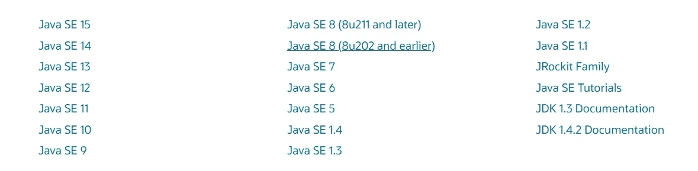

Choose the Highlighted Java Version

一旦下载了 JAVA，设置一个新的系统环境变量 JAVA_HOME。这应该会下载到 Java 文件夹的链接。

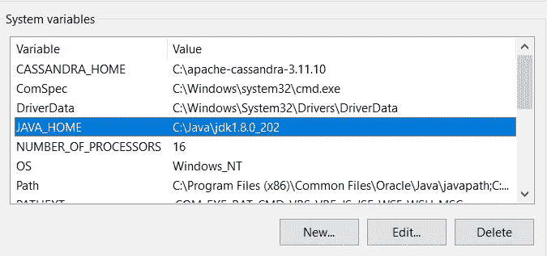

JAVA_HOME System Variable Creation

# 卡珊德拉装置

跟随[环节](https://apachemirror.wuchna.com/cassandra/3.11.10/apache-cassandra-3.11.10-bin.tar.gz)。

请确保在您的系统中安装了 7zip 来处理"。tar.gz "文件。

从下载的文件夹中提取。tar.gz "文件。创建另一个系统变量 CASSANDRA_HOME，并链接到提取的文件夹。

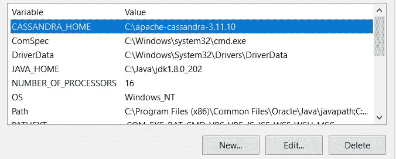

CASSANDRA_HOME System Variable Creation

# Python 2 环境

嗯，这不是强制性的，但我自己观察过几次，并和我的一些朋友一起检查过，当我们试图通过 Python 3 环境启动 CQL (Cassandra 查询语言)时，Cassandra 遇到了问题。因此，建议创建一个 Python 2 环境，并尝试从这个 Python 2 环境中启动 Cassandra。

我已经使用 Anaconda 提示符完成了这项工作。我创建了一个名为 Python2 的 Python 2 环境。

# Apache 节俭安装

其中一个步骤执行起来很快。

跟随[链接](https://apachemirror.wuchna.com/thrift/0.14.2/thrift-0.14.2.exe)并执行。' exe '文件。这将在一秒钟内闪烁。不涉及任何安装步骤，只需执行文件。

完成这 4 个步骤后，我们就可以开始使用 Cassandra 了。

# Cassandra 查询语言执行

启动命令提示符或 Anaconda 提示符。激活 Python 2 环境。建议在管理模式下启动提示符。将目录更改为提取的 Cassandra 文件夹中的 bin 文件夹。

我已经将提取的 Cassandra 放在了我的 c 盘中，所以更改目录命令看起来像这样:

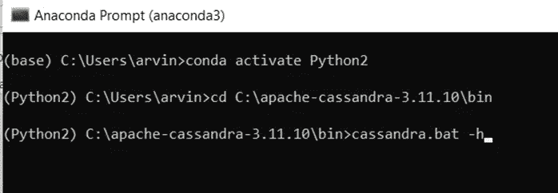

在执行“cassandra.bat -h”时，我们应该得到如下所示的消息，启动完成。

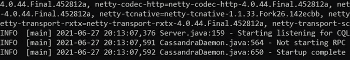

一旦完成，保持这个提示符打开并启动一个新的提示符，重复这些步骤将目录更改为 bin。这一次，执行“cqlsh”。

这正是我们如何进入 CQL，卡珊德拉查询语言。成功执行后，提示符应该是这样的。

CQL Setup in Local System Complete

祝贺您，只要您注意到 cqlsh >, Cassandra 就已经在您的本地系统中成功启动并运行了

> 很长，不是吗，真的很费时间而且很复杂？

让我们走云之路，立刻到达这里。

# **卡珊德拉通过数据税**

DataStax，Inc .是一家位于加利福尼亚州圣克拉拉的数据管理公司。其产品基于 Apache Cassandra 提供商业支持、软件和云数据库即服务。DataStax 还提供事件流支持和基于 Apache Pulsar 的云服务。

我们可以创建一个免费账户，每月免费使用他们价值 25 美元的服务。为了在本文范围内理解 Cassandra-Python 集成，免费版的 DataStax 已经足够了。

我们需要做的就是，通过[链接](https://auth.cloud.datastax.com/auth/realms/CloudUsers/protocol/openid-connect/auth?client_id=auth-proxy&redirect_uri=https%3A%2F%2Fgatekeeper.auth.cloud.datastax.com%2Fcallback&response_type=code&scope=openid+profile+email&state=DCjl128Yg5gwCOgOIgkuNEyfoR8%3D)创建一个账户。

一旦登录，这就是我们将会看到的。

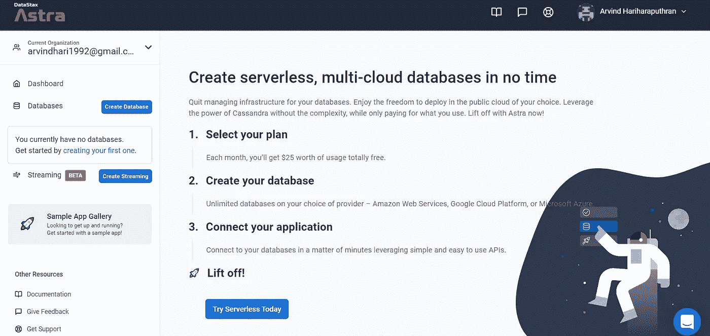

单击创建数据库选项继续操作。明智点，用免费版。我再次强调，免费版本已经足够完成我们的工作了。

点击“立即免费开始”下的开始按钮

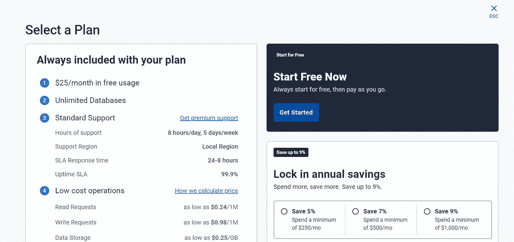

现在有趣的部分来了，Cassandra 的架构与其他数据库略有不同。表不是直接存储在数据库中，而是存储在键空间中。换句话说，表存储在一个存储在数据库中的键空间中。要了解什么是键空间，它与表有何不同，请点击[链接](https://docs.datastax.com/en/astra/docs/db-glossary.html#_keyspace)。

选择你感兴趣的云和地区，这真的不重要，这只是一个运气的问题，我们能多快创建我们的数据库。由于我们是通过免费帐户使用共享服务，这需要一些重要的时间(几分钟)来创建数据库，初始化和提供访问。

重要的是，确保密钥空间名称完全是**小写**。

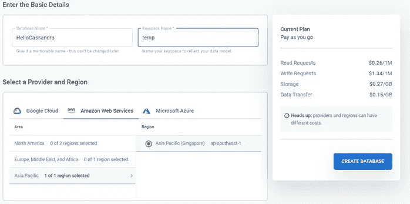

好啊，我们新的卡珊德拉数据库已经准备好了。等到连接按钮被激活。这需要几分钟时间，因为我们正在通过共享服务器工作。

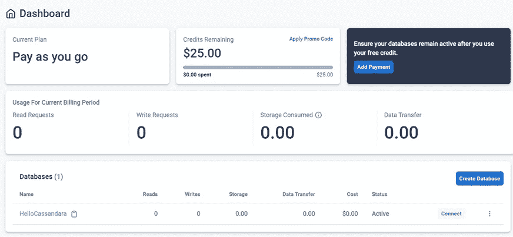

最后，是时候通过 Python 访问和玩 Cassandra 数据库了。

# CASSANDRA-PYTHON 集成

我们将从讨论将云版本与 Python 集成开始，等等，接下来是几个步骤。欢呼吧，因为这是每个数据库的一次性活动。

当我们单击新数据库并进入 Connect 选项卡时，我们会看到如下所示的窗口。当我们试图将 Cassandra 与 Python 联系起来时，请从左侧的标签列表中选择 Python。然后从下载包选项下载包。只需下载这个，不要做其他事情。

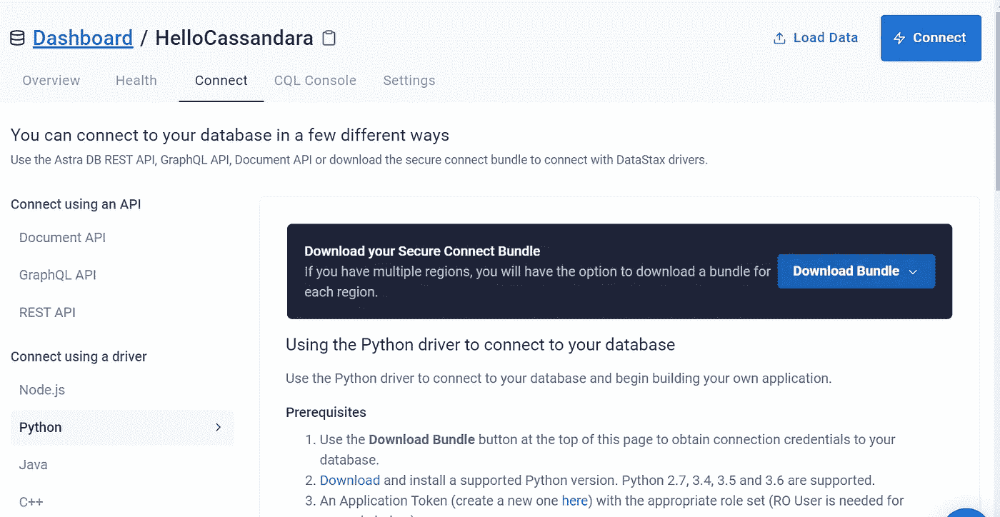

向下滚动页面，找到项目符号 4，它的代码片段如下所示。这一堆代码是连接 Cassandra 和 Python 的关键。我们试图开发的云版本 Cassandra 的每一个程序都需要这段代码。对于我们创建的每一个新数据库，都有一段相似的代码可用。

我们需要做的是:

**使用导入 CASSANDRA 驱动程序！pip 安装 cassandra-driver**

将<替换为下载压缩包的文件夹位置。不要忘记在文件夹路径的末尾加上反斜杠(/)。

用令牌管理选项中的相应令牌替换客户端 ID 和客户端密码。只需将 ID 和密码复制粘贴到代码中。

> 在执行代码时，应该不会遇到任何错误，特别是，它不应该返回“发生了错误”如果是的话恭喜你，我们已经成功建立了云版 Cassandra 和 Python 的连接。

我们只需要将 Cassandra 查询放在 execute()中。

要将 Cassandra 的本地版本与 Python 集成，我们不需要任何授权。因此，只需忽略与 cloud_config 和 auth_provider 相关的行。只需调用集群(<no args="">)并创建一个会话。</no>

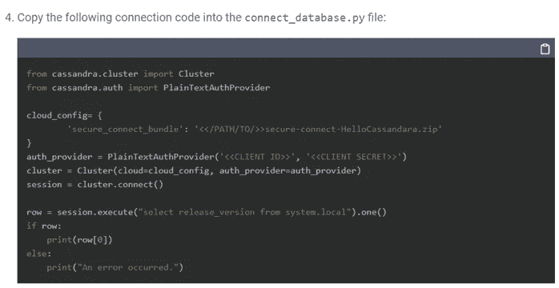

> ***祝贺 CASSANDRA-PYTHON 整合***

更多关于将 Python 连接到 [MySQL](/geekculture/an-introduction-to-data-persistance-with-python-6c9b0364c4c9) 和 [MongoDB](/geekculture/nosql-database-handling-349176dc7be7) 的相关文章

请关注我的 LinkedIn 和 GitHub，了解更多关于 Python 和数据科学的信息。