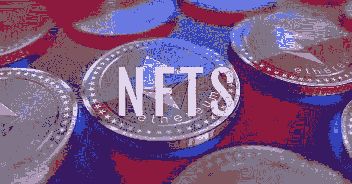
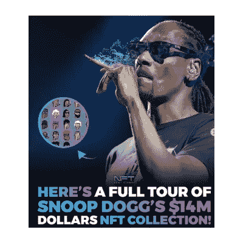
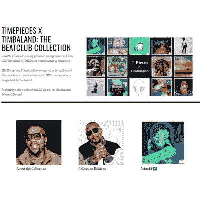
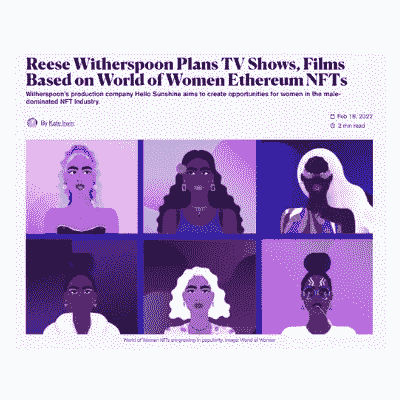
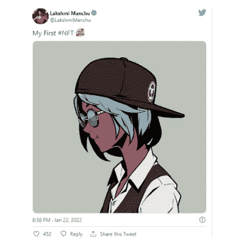
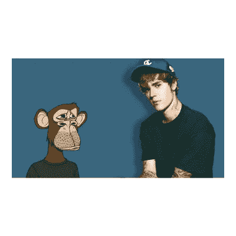

# 参加 NFT 市场的著名名人目录！

> 原文：<https://medium.com/geekculture/catalog-of-notable-celebrities-partaking-in-the-nft-marketplace-e6f4a071f3?source=collection_archive---------16----------------------->

**Top Celebrities — NFT Marketplace**

2018 年以后，你一定听说过数字资产、加密货币、NFT 等名词。随着新的人参与进来，带来新的想法和项目，这个术语变得越来越流行。随着 NFT 和其他数字资产的出现，数字市场正在发生革命性的变化。虽然一些人对最近的变化感到兴奋，并热烈欢迎它，但也有一些人以强烈的批评反对分权的想法。甚至名人也开始用他们的作品参与不断扩大的非功能性翻译市场。质量绩效 [**NFT 市场**](https://www.cryptocurrencyexchangescript.com/nft-marketplace-development?utm_source=medium&utm_medium=guestblog&utm_campaign=vigneshraju) 业务与时俱进。

# 为什么名人正在成为 NFT 世界的一部分？

2021 年改变了数字资产的世界，NFTs 占据了中心舞台，并成为市场上所有买家、卖家和交易商的巨大利润。由于其巨大的潜力和不断上升的市场价值，名人开始参与其中。他们开辟了一条新的途径，通过 NFTs 直接接触他们的粉丝，不需要中介。

**NFTS**

# NFTs 和 NFT 市场的发展对名人有什么好处？

许多艺术家不得不依靠第三方向观众出售他们的创作作品。这给了粉丝和创作者之间的中间人一部分控制权。NFT 就像新工具；它们甚至可以被认为是全世界艺术家和创作者的最佳作品。

# 有益于 NFT 和 NFT 市场创建者的因素:

**完全控制** —创作者对自己的创作拥有完全的控制权，对其成果没有任何限制。

**直接交流** —艺术家直接与他们的粉丝交流，为他们的粉丝创造新的设计或艺术，而不需要中间人。

**更高的利润** —因为 NFTs 消除了对中间环节的需求，销售利润完全归创作者所有，他们可以享受更高的回报。

**自动版税** —当创作者创作的非物质文化遗产在市场上出售时，创作者会自动收到他们在 NFT 市场创作的版税。

**全球观众** —创作者拥有庞大的观众群。他们可以把自己的艺术作品卖给世界上的任何人，而不局限于某一特定地区的观众。

# 顶级名人 NFT 的购物令世界震惊

名人已经购买了 NFT，并且他们正在授予对事件、产品或服务的独家访问权。许多名人已经开始标记他们的音乐、图像、视频等。一些人推出了他们的名人 NFT 市场，成为 NFT 世界的一部分，并从中获利。

**史努比狗狗**

**SNOOP DOGG — NFT COLLECTIONS**

史努比·道格是一位全球明星，他发行了超过 19 张专辑，全球销量超过 4000 万张。他获得了超过格莱美提名。**S**[noop Dogg 拥有价值超过 1700 万美元的 NFTs](https://crypto.com/nft/drops-event/80b2e021d4cbfbc43789db5377ecf1ed) ，包括 Cryptopunks、ten Meebits 等。Snoop Dogg 在区块链以太坊收藏的 NFT 是最有价值的 NFT 收藏。

**提姆巴兰**

**TIMBA — NFT BEAT CLUB COLLECTION**

提姆巴兰是制作人、词曲作者和歌手。他赢得了多项格莱美奖。他为一些流行艺术家的音乐专辑撰稿。 [**提姆巴兰买下了 Bored Ape #590，并获得了一张独家海湾俱乐部的入场券**](https://timbaland.com/) 。他在出售时以 74.69 ETH 的价格购买了 NFT 资产，即 220000 美元。

瑞茜·威瑟斯彭

**瑞茜·威瑟斯彭——以太坊 NFTs**

瑞茜·威瑟斯彭通过她的公司 Hello Sunshine 与女性世界合作。WoW 是 Yam Karaki 推出的 NFT 系列，特别是为了增加 NFT 世界女性的参与。瑞茜·威瑟斯彭还以 2.8 ETH 或 9000 美元 购买了一件 NFT 女性世界#8072。

**拉克希米满语**

**拉克希米满族——第一个 NFT**

拉克什米·满族是一名演员和制片人，曾在泰卢固语和美国电视台工作。这位女演员向志那都红豆购买了她的第一批货。 [**拉克什米满族用 3.3 ETH 或 1 万美元**](https://timesofindia.indiatimes.com/entertainment/telugu/movies/news/lakshmi-manchu-ventures-into-metaverse-buys-azuki-nft/articleshow/89091993.cms) 购买了志那都红豆 NFT #4272。

**贾斯汀比伯**

**贾斯汀比伯——无聊猿集**

贾斯汀比伯是一名歌手兼词曲作者。他是 NFT 世界著名的投资者。这位歌手以 2 ETH 的价格购买了外国人 NFT。而且他一进货，异形 Frens 的价格就迅速蹿到 3 ETH。 [**贾斯汀比伯目前总共拥有 2000 家 NFT，包括 BAYC，Clone X，MAYC，以及世界女性**](https://www.mansworldindia.com/finance/crypto/justin-bieber-buys-bored-ape-nft-for-over-a-million-dollars/) 。

# 这与未来和不断增长的市场有什么关系？

NFT 已经将其边界扩展到几乎所有的商业模式，如数据存储、金融、房地产等。NFTs 的价值与日俱增，市场上的活跃用户数量也呈上升趋势。对新市场的需求正在上升。 [**为日益增长的需求开发一个 NFT 市场将在未来对你有所帮助和益处**](https://www.cryptocurrencyexchangescript.com/nft-marketplace-development?utm_source=medium&utm_medium=guestblog&utm_campaign=vigneshraju) 。对于市场的创造者和参与者来说，它有一个光明的未来。NFT 市场开发公司指导并提供所有必要的工具和技术来启动一个平台。