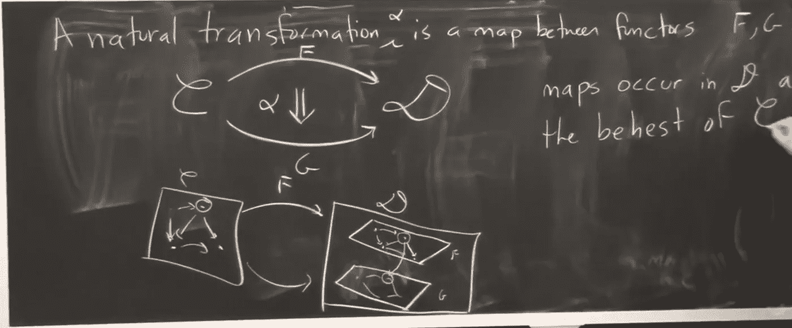
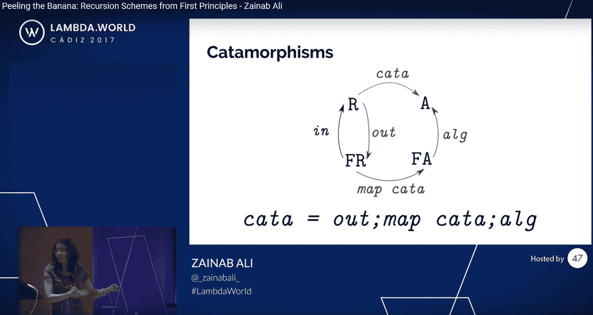

# 范畴理论和 Haskell

> 原文：<https://medium.com/geekculture/category-theory-and-haskell-a6bd624f510?source=collection_archive---------1----------------------->

我推荐看看麻省理工学院的讲座“分类编程”，有 Brendan Fong，Bartosz Milewski 和 David Spivak。



[https://www.youtube.com/playlist?list = plh GQ-bqyz 7i 7m tghurozy 3 boicnvixets](https://www.youtube.com/playlist?list=PLhgq-BqyZ7i7MTGhUROZy3BOICnVixETS)

## 动机

引用巴托什·米列夫斯基的话(强调是我的):

> ***范畴理论*** *是极其有用的* ***编程思想*** *。****Haskell****程序员挖掘这种资源已经很久了，思想也在慢慢渗透到其他语言中，但是这个过程太慢了。我们需要加快速度…*
> 
> 构图是范畴理论的基础——它是范畴本身定义的一部分。并且我会强烈主张 ***作文是编程的精髓*** *。在某个伟大的工程师提出子程序的想法之前，我们一直在编写东西。不久前，结构化编程的原则彻底改变了编程，因为它们使得代码块可组合。然后是面向对象的编程，这完全是关于组成对象的。* ***函数式编程不仅仅是组合函数和代数数据结构——它使得*并发性*可组合——这在其他编程范例中几乎是不可能的。***

[https://bartoszmilewski . com/2014/10/28/category-theory-for-programmers-the-前言/](https://bartoszmilewski.com/2014/10/28/category-theory-for-programmers-the-preface/)

你也可以在这里[https://www.youtube.com/watch?v=oScqdMBk8Q8](https://www.youtube.com/watch?v=oScqdMBk8Q8)查看为什么程序员学习范畴理论是个好主意的扩展版本

# 课程描述

> ***我们将代表学生*** *假设没有背景知识，无论是编程还是数学都从零开始。*(传单)

[http://brendanfong.com/programmingcats.html](http://brendanfong.com/programmingcats.html)—课程官方页面。

你可以在这里找到教学大纲。

还有这里[http://Brendan fong . com/programming cats _ files/cats 4 progs-draft . pdf](http://brendanfong.com/programmingcats_files/cats4progs-DRAFT.pdf)你可以看到课程笔记。

*   这是**应用**数学和编程的课程。例如，集合论是非常非正式的使用(见下面其他课程的链接)。
*   这门课集中在**直觉上。**例如，你可以在上图中看到关于*自然转化的直觉描述。*
*   这门课**没有**为你提供**复杂的数学例子**(例如*没有拓扑空间* s)，它集中在简单的数学例子或对范畴理论本身重要的例子(如集合、偏序集)。
*   最主要的例子就是 **Haskell** 编程语言。你在学习它的同时，也在学习直接应用其思想的分类理论。这是本课程中*范畴理论应用*的一个主要例子。

## 我认为下面的注释会对你有用:

## 关于数学:

1.  数学有许多“不精确的”/“应用的”用法(特别是在处理集合论时，尤其是[罗素悖论](https://en.wikipedia.org/wiki/Russell%27s_paradox)被忽略了；`[Cat](https://en.wikipedia.org/wiki/Category_of_small_categories)` [是大类中的小类](https://en.wikipedia.org/wiki/Category_of_small_categories))。你应该做好忽略它们的准备(你可以看到[https://www.youtube.com/watch?v=p54Hd7AmVFU](https://www.youtube.com/watch?v=p54Hd7AmVFU)和[https://www.youtube.com/watch?v=O2lZkr-aAqk](https://www.youtube.com/watch?v=O2lZkr-aAqk)和[https://www.youtube.com/watch?v=NcT7CGPICzo](https://www.youtube.com/watch?v=NcT7CGPICzo)用更严谨的数学，虽然它缺乏证明，但数学。语句本身是正确的)。
2.  简单地说，对于范畴论 2 来说，如果它们是*同构的*，那么它们就是“相同的”。特别是，如果两个“实体”的*等于*，它们被认为是“相同的”。但是，I**f ^ 2“实体”是*同构的*它们被认为“在所有预期目的上是平等的”**。还有由附加定义“弱同构”，见下文。

*   图中的**虚线表示*同构*对象**(实际上从未解释过为什么使用虚线)。例如，当我们构造*范畴积*(你可以想到编程语言中的`pair`或者集合中的笛卡尔积)时，我们正在构造同构的*态射对。*
*   *`**Preorder**` **和**`**Order**`T23*从分类角度看几乎相同*。两者的区别在于`Order`具有加法反犹太性:若 a≤b 且 b≤a 则 a=b .但在`Preorder`中若 a≤b 且 b≤a 则 *a 同构于 b* (因为合成导致`Id_a`或`Id_b`)。“非预期的”差异将是在`Order`的图形表示中没有“向后”的边，并且顶点的数量将减少(在`Preorder`中有前后边的 2 个顶点被替换为`Order).`中的 1 个顶点)*

*3. [**事物范畴**](https://en.wikipedia.org/wiki/Posetal_category) **是其*集*各包含至多一个态射**(本课程不提供此定义)**的范畴。**它提供了这样一个范畴的例子，其中态射是等态射，但是没有“逆”态射(存在态射比具有“逆”态射“少得多”;这在`Set`的函数类别中并不成立)。详见下文附录。*

# *关于编程:*

1.  *函数式编程的知识从来都不是假定的，但是你最好事先对[和](https://en.wikipedia.org/wiki/Currying#Lambda_calculi)有所了解(在课程中解释之前会用到)。*
2.  *[底型](https://en.wikipedia.org/wiki/Bottom_type) (⊥)存在被忽略(虽然被简略提及)。这使得 **Haskel 类型并不严格等同于** `Set` 中设置的函数类别。例如，将模拟设置为`()`类型(单元类型)是单例设置。据说在 Haskell 中 unit-type 有`single`值(记为`()`)。这应该是`Hask` 中的`initial object`带类型，`Set`带功能。但是，从技术上讲 **⊥也是** `**()**` **型**的成员。所以，从技术上讲，他们有两个值。实际上，buttom 是 Haskel 中任何类型的成员，这是被忽略的。这就导致了，`Hask` 中的函数实际上是`partial`(因为底部)。**我们在** `**Hask**` **中对函数进行推理，作为它们所在的** `**total**` (对域中的每一个值进行定义)。你可以在这里阅读为什么“快速和宽松的推理在道德上是正确的”的理由*
3.  *这里隐含了面向对象概念的使用，例如[参数多态性](https://en.wikipedia.org/wiki/Parametric_polymorphism)。你可以想到 Java 或 C++模板中的泛型。讲座中有非常简短的解释(但是，假设你知道什么是“常规”多态性)。*
4.  *假设你知道什么是[模式匹配](https://www.haskell.org/tutorial/goodies.html)(参见 Haskell 中`length`函数的定义或者参见下面的 Scala 例子)。比如最新的 Java 15 还是没有模式匹配(Java 14 中只有的 instance of*模式匹配作为预览语言特性，详见我的帖子[这里](/swlh/keeping-pace-with-whats-new-in-java-14-5fc6232defab))。**
5.  *我不知道该如何强调这一点:*

## *在 Haskell 中，`self` / `this`作为最后一个参数传递，而不是第一个。*

*我不明白为什么这一点在 Haskell 教程中也被忽略了，如果我以前知道这一点，它会让我的生活更容易。*

*请考虑标准库中的简化版本:*

*基于 [http://hackage . haskell . org/package/base-4 . 5 . 1 . 0/docs/src/GHC-base . html](http://hackage.haskell.org/package/base-4.5.1.0/docs/src/GHC-Base.html)*

*[http://hackage . haskell . org/package/base-4 . 5 . 1 . 0/docs/src/Data-maybe . html](http://hackage.haskell.org/package/base-4.5.1.0/docs/src/Data-Maybe.html)*

*让我们大致看看`Functor Mayber,` 中的`fmap` 签名吧*

*`fmap::(a->b)->Maybe a-> Maybe b`*

*或者(使用固化)用 f 代替 a->b*

*`fmap::(f, Maybe a)-> Maybe b`*

***注:**这里的`self”`就是`Maybe a.`*

*让我们看看 Python 中的简化实现:*

*基于*

*[https://github . com/dbrattli/OS lash/blob/f 7283d 92 a 379 ca 86 EBA 2 cf 7109 ef 68 a 7 BC 27 DC 3c/OS lash/typing/functor . py](https://github.com/dbrattli/OSlash/blob/f7283d92a379ca86eba2cf7109ef68a7bc27dc3c/oslash/typing/functor.py)*

*[https://github . com/dbrattli/OS lash/blob/f 7283d 92 a 379 ca 86 EBA 2 cf 7109 ef 68 a 7 BC 27 DC 3c/OS lash/maybe . py](https://github.com/dbrattli/OSlash/blob/f7283d92a379ca86eba2cf7109ef68a7bc27dc3c/oslash/maybe.py)*

*让我们看看`Maybe(Functor),`中的`fmap` 签名是:*

*`def fmap(self, f)`*

*其中`self`是`Maybe,` f 是函数。*

***注:***

1.  *为了清楚起见，我删除了 Python 类型提示。参见下面的 Scala 示例来恢复细节。*
2.  *`Just`和`Maybe`应该是真正的“密封类”。例如，参见可选的 Scala 实现:*

*基于[https://github . com/hme mcpy/milewski-ctfp-pdf/releases/download/bca9cf 5/category-theory-for-programmers-Scala . pdf](https://github.com/hmemcpy/milewski-ctfp-pdf/releases/download/bca9cf5/category-theory-for-programmers-scala.pdf)*

***注:***

1.  *Maybe 定义中的加号表示 Maybe 是协变的，即如果 X <:a is="" subtype="" of="" a="" x="" than="" maybe="" you="" can="" read="" my="" separate="" class="ae jr" rel="noopener" href="/@alex_ber/introduction-to-variance-in-java-2c0291a1388e">表示方差。这意味着在范畴论中可能是协变函子。*
2.  *这里`f`是隐式传递的。*
3.  *Scala 中的`Nothing`与 Haskell 中的`Void`是类比的(也就是**不是** `**void**` Java **！**)。*
4.  *`None`被定义为单例对象。对于每个`Maybe[B]`,它可以被用作值。*
5.  *Case(模式匹配)在类型为`Maybe[A].` 的`this`上完成，如果是单例`None`类型，则返回`None` 值。如果是`Just[A]`类型，则使用主构造函数解构该类型，`x`与`Just.this.a` 值绑定，并在以后用于计算`f(x)`。*

*JVM 看到的 fmap 方法的签名大致如下:*

```
*public static scala.Function1<Maybe, Maybe> fmap(**Maybe this**, scala.Function1<java.lang.Object, java.lang.Object> f)*
```

***注:***

1.  *第一个`java.lang.Object` 是从`A`擦除的类型，第二个`java.lang.Object`是从`B`擦除的类型。*
2.  *第一个`Maybe`事件是从`Maybe[A]`删除的类型，第二个`Maybe`事件是从`Maybe[B]`删除的类型。*

*这里我想说明的一点是，`**this**` **引用作为第一个参数传递，而不是像 Haskell** 中那样作为最后一个参数传递。*

*有几个话题我必须去别的地方看看，然后回去再看一遍，以便了解正在发生的事情。*

*6.附加条款
https://www.youtube.com/playlist?list=PL54B49729E5102248&pbj = 1*

*附加语有两个等价的定义，实际上最好从单位η和单位ε开始，而不是从麻省理工学院课堂上使用的那个开始。*

*如果两个类别有附加成分，则它们“非常相似”或“弱同源”。*

*7.递归方案，F-代数，同态，Lambek 引理，不动点函子*

*   *对于任何常数函子都存在一个不动点
    你可以想想正则 f(x)=5 的函数，很明显，f(5)=5，5 是不动点。你可以很容易地找到它，从任意 x_0 f(x_0)=5 开始。然后用 x_1=5 作为新起点:f(x_1)=f(5)=5。注意，实际上，我们做的是 f(f(x_0)=5，进一步应用 f 不会改变结果。*
*   *考虑函数 f(x)=x，很明显 f(0)=0，即 0 是不动点(实际上 1 是另一个不动点)。我们可以从(-1，1)中的任何一点开始。让我们取 x=1/2。
    f(1/2)=1/4。
    f(1/4)=1/16
    …
    我们会得到下面的序列
    {1/2，1/4,1/16…1/2^n…| f 的 n 次应用数}
    这个过程会收敛于 0(上面序列的极限为 0)。
    (见[牛顿法](http://Newton's method)，讲座中其实也有提到)。*
*   *此时，你可能想看看*剥香蕉:来自第一原理的递归方案——扎伊娜卜·阿里*[https://www.youtube.com/watch?v=XZ9nPZbaYfE](https://www.youtube.com/watch?v=XZ9nPZbaYfE)
    它非常不完整，但有工作代码(Scala)和下面的图表，帮助我理解正在发生的事情:*

**

*A —是载体对象(`Int`举例)。我们希望`evaluate`我们的数据结构是一个`Int.`*

*R —是递归数据结构，“完全成熟的树”。*

*FR——是作为函子的数据结构,“近似”r 的“生长树”。*

*FA-是保存“提升”载体对象类型的“提升”答案的数据结构作为函子。*

*alg:从数据结构作为函子到载体类型的函数，又名`evaluator`或`structure map function`。类型为`alg:: FA->A.`例如`sum:: ExprF Int->Int.`*

*in:从数据结构作为函子(“生长树”)到递归数据结构(“成熟树”)的同构。首先手动实现，然后使用来自 [Lambek 引理](https://ncatlab.org/nlab/show/initial+algebra+of+an+endofunctor)的`Fix`构造函数(详见下文，视频中未提供)。*

*out:从递归数据结构(“完全成熟的树”)到数据结构作为函子(“生长的树”)的同构。首先手动实现，然后使用来自 [Lambek 引理](https://ncatlab.org/nlab/show/initial+algebra+of+an+endofunctor)的`unFix`构造函数(详见下文，视频中未提供)。*

*cata:(catamorpish 的快捷方式)是`List`的`fold`函数的推广，它是知道如何“行走”递归数据结构的高阶函数。它将我们想要应用的“动作”作为参数。这些“动作”也有`accumulator` 作为 cata 将提供的先前结果的占位符。*

*`fmap cata` 是“解除”cata 功能。*

*`cata`可以被构造为*

*`alg ∘ fmap cata ∘ unFix` = `alg(fmap(cata(alg)unFix(r))`其中`r`是递归数据结构，比如树。*

*让我们浏览一下`cata.`r-is 递归数据结构的公式，“完全成熟的树”，首先通过调用`unFix`我们将它转换为 data-structure-as-a functor。然后我们递归地(`cata`)将`alg` 应用到“生长的树”中，我们“下推”(`fmap` ) `alg`到我们的数据结构中。当它命中“leaves”(例如，`ConstF` term)时，它不接受任何`alg`参数，所以这是递归的基本情况。根据`alg,`在 leaves 上应用`alg`会“改变它的状态”，而不是“向上移动”(我们正在退出递归调用)和“更新”数据结构状态。当我们完成`fmap cata`时，我们处于`FA`状态，我们的数据结构作为函子保存了答案。再应用`alg`一次将从数据结构作为函子中提取答案来回答`A`。*

*注意:现在，我要回到麻省理工学院的讲座。*

*   *上面的过程类似于使用`ExprF`仿函数的“生长树”，在迭代`n`中，我们可以有树**直到** `depth` `n`。我们在范畴论中使用的是[有向共限](https://en.wikipedia.org/wiki/Direct_limit)而不是正则极限，参见[阿德梅克定理](https://ncatlab.org/nlab/show/initial+algebra+of+an+endofunctor)。注意，在讲座中，只提供了*代数对象*的直接极限的定义，而不是针对*任意类别*的定义*。* 使用 colimits 帮助我们从不同的迭代中识别出“相同的”树。(例如，我们在每一次迭代中都有叶子，除了第一次迭代，我们在每一次迭代中都有深度=1 的树，等等)。*
*   *[Adámek 定理](https://ncatlab.org/nlab/show/initial+algebra+of+an+endofunctor)说在某种条件下存在初始 F-代数(并且它可以被构造为ω-链的余极限)。 [Lambek 引理](https://ncatlab.org/nlab/show/initial+algebra+of+an+endofunctor)说，*如果函子 f(“树”)有初始代数α:F(X)→X 那么 x 通过α同构于 F(X)，*换句话说在初始代数 F(X) ≅ X 或者换句话说*函子 f(“树”)的初始代数是 F* 的不动点(讲座中有证明不依赖于[阿德梅克定理](https://ncatlab.org/nlab/show/initial+algebra+of+an+endofunctor))。
    这意味着，实际上，依靠 [Lambek 引理](https://ncatlab.org/nlab/show/initial+algebra+of+an+endofunctor)找到函子 F 的`Fix f` — *不动点(*并希望不再有不动点……)就足以构造初始代数。讲座中提供了 Haskell 代码。 [Lambek 引理](https://ncatlab.org/nlab/show/initial+algebra+of+an+endofunctor)的同构由`newtype`实现(Haskell 中任意`newtype`定义同构；使用`pattern match`和`case class,`可以达到同样的效果(参见上面视频中的 Scala 代码)。*

# *替代课程*

*还可以在这里看到更多《纯数学》和 ***扩展*** 版本的本次讲座(西雅图，2016 年夏季):*

***注:本课程需要*一些关于朴素集合论***的知识(大量使用了许多性质，但没有解释它们为什么成立)，最起码需要*笛卡尔积、* [*集合的判别并*](https://en.wikipedia.org/wiki/Disjoint_union)*、*关系(自反性、反对称、传递性)*集合间关于*函数*的所有性质，关于函数合成的性质，包括[康托尔-伯恩斯坦定理](https://en.wikipedia.org/wiki/Schr%C3%B6der%E2%80%93Bernstein_theorem)是**而不是**所要求的，尽管如此。:-)(你不需要知道[这个](http://www.cs.cornell.edu/courses/cs2800/2017fa/lectures/lec14-cantor.html)或者[这个](http://www.math.jhu.edu/~js/Math415/bernstein_schroeder_theorem.pdf))。**

**[https://www.youtube.com/watch?v=I8LbkfSSR58&list = PLbgaMIhjbmEnaH _ ltk xli 7 fma 2 hsnawm _](https://www.youtube.com/watch?v=I8LbkfSSR58&list=PLbgaMIhjbmEnaH_LTkxLI7FMa2HsnawM_)**

**[https://www.youtube.com/watch?v=3XTQSx1A3x8&list = plbgamihjbmelia 1eceznvscfef 9 m0d m](https://www.youtube.com/watch?v=3XTQSx1A3x8&list=PLbgaMIhjbmElia1eCEZNvsVscFef9m0dm)**

**[https://www.youtube.com/watch?v=F5uEpKwHqdk&list = plbgamihjbmen 64 wvx 4 b 08 B4 H2 rotuewil](https://www.youtube.com/watch?v=F5uEpKwHqdk&list=PLbgaMIhjbmEn64WVX4B08B4h2rOtueWIL)**

**你也可以在这里找到*巴托兹·米莱斯基的《程序员分类理论》非官方 PDF 和乳胶来源*https://github.com/hmemcpy/milewski-ctfp-pdf/**

****注:****

**[底式](https://en.wikipedia.org/wiki/Bottom_type) (⊥)的存在被认可并在一些细节中被讨论(没有提供任何证据)。您可以在这里[阅读关于“快速和宽松的推理在道德上是正确的”的理由](http://www.cse.chalmers.se/~nad/publications/danielsson-et-al-popl2006.html)**

## **`*Appendix: Thing category*`**

***通过观察发现* `*Thing category*` *和* `*Preorder*` *之间的对应关系是:对于每个顶点 x，y hom(x，y) = {(x，y)}如果 x ≤ y(否则为空集)}和(y，z)∘ (x，y) = (x，z)。*还要注意≤ as `Preorder`的关联性意味着事物类别中成分的关联性(反之亦然，因为如果态射存在，我们只有一个对应于≤的态射)。所以，从另一个角度来看，就是说`**Preorder**` 足以创造范畴**没有不是被范畴强加的额外结构**。从这个意义上说`Preorder`是订单的“精髓”(与*部分* `order`和总订单相比——两者都有额外的要求)。**

****注意:**在物类中，每一个态射都是史诗，每一个态射都是单态的(我们在 2 个元素 a，b 之间最多有 1 个态射)。如果我们有*偏* `order`比每一个态射`f:a->b` 都是*同形，那么*就没有“逆”态射`g:b->a`(所以，对于每一个`f`都没有 g 这样的`f ∘ g = Id_b`和`g ∘ f = Id_a`)(因为根本就没有“逆”态射)。**

****注:**在 Set 范畴中，函数是*内射的*和*外射的*if 存在“逆”函数，但这不适用于任何范畴。**