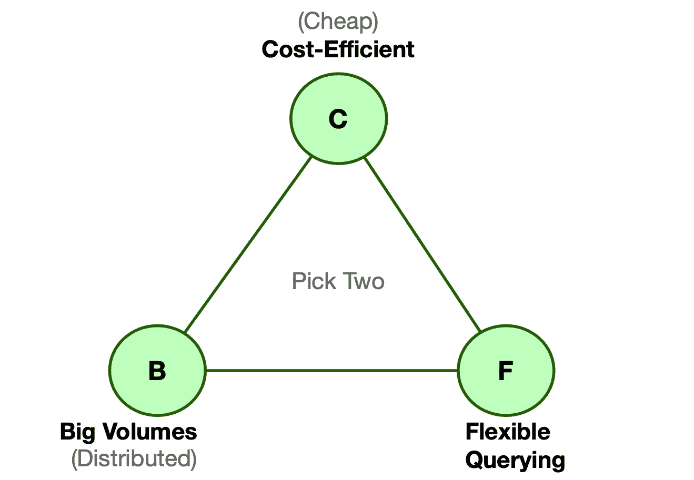

# CBF 数据存储定理

> 原文：<https://medium.com/geekculture/cbf-data-storage-theorem-1b70b13f5f87?source=collection_archive---------14----------------------->

## 一级权衡，选择适合您需求的存储

# 介绍

每当你开始一个新的项目时，问题就出现了:选择哪个数据平台和数据存储？有各种各样的储物空间可供选择。每个选项都有不同的特点、优点和缺点。纠结取舍真的很费时间…