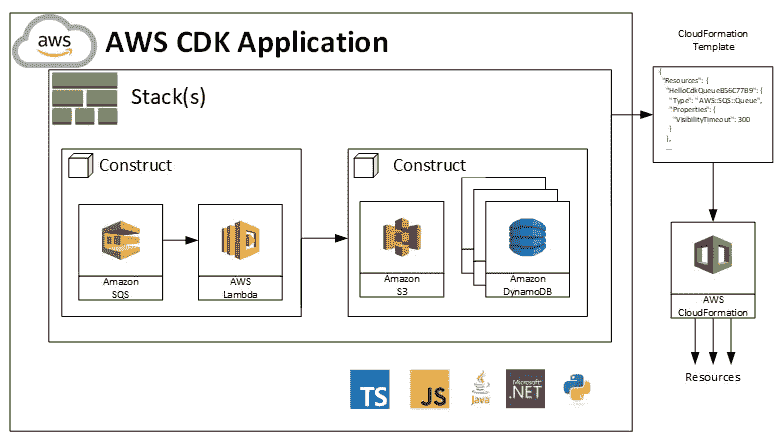
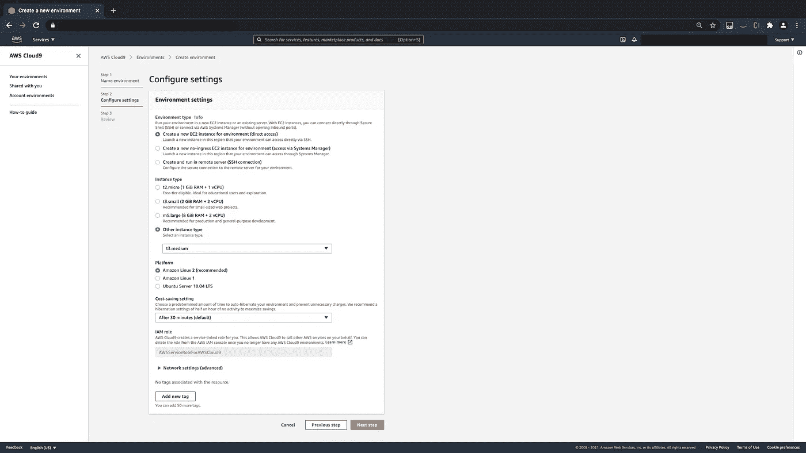

# C++ Lambda 部署的 CDK 管道+ API 网关

> 原文：<https://medium.com/geekculture/cdk-pipeline-for-c-lambda-deployment-api-gateway-418cb81a054c?source=collection_archive---------10----------------------->

*本文参考 AWS CDK 文档* [*此处*](https://docs.aws.amazon.com/cdk/latest/guide/home.html) *而建。请随意参考 AWS CDK 官方文档的网站。而对于 C++在 lambda 上引用的* [*这里的*](https://aws.amazon.com/blogs/compute/introducing-the-c-lambda-runtime/) *。*



Source: [https://docs.aws.amazon.com/cdk/latest/guide/home.html](https://docs.aws.amazon.com/cdk/latest/guide/home.html)

在本实验中，我们将重点关注两个核心理念。一个是自定义运行时 C++到 lambda 的部署过程，另一个是我们如何在这个想法的基础上构建 CI/CD 管道，以及如何通过 AWS CDK 来实现。

*   **第 1 部分:** C++ Lambda
*   **第 2 部分:** AWS CDK 管道

现在，如果你像我一样回到 2019 年，在我科技职业生涯的早期，还在大学时第一次学习云，当 CDK 在 2019 年 7 月发布时，你没有注意到。不要误解我的意思，炒作是存在的，从文章到我自己的经理都强烈建议我学习它。然而，在尝试学习云基础知识的过程中，我错过了机会，直到几周前。

如果你只能从这个实验室得到一样东西，请记住这些话，**去学习 AWS CDK。**CDK 是一个如此强大的工具，它建立在 cloudformation 之上，只需几个命令就能轻松部署完整的管道基础设施。毫不夸张地说，基础设施就是代码，使它成为一个如此强大的工具，我可以预见自己在不久的将来会使用它。

# Lambda 上的 C++

因为 lambda 是我的最终目标，所以我选择使用本机 AWS IDE 服务 Cloud9，作为手动部署到 lambda 的主要开发环境。其原因包括:

*   自动生成 AWS 凭据，以便您的 IDE 可以本机使用全套 AWS 资源。
*   如果你打破了 IDE，你可以简单地旋转一个全新的。
*   一致性，遵循此实验应该是一致的，因为 Cloud9 的默认映像将带有我在运行实验时使用的相同系统配置。

## 设置您的 Cloud9 IDE

登录你的 AWS 账户，导航到 cloud9 服务。

从服务>**创建环境**并给你的 IDE 命名。



在“配置设置”页面上，唯一需要更改的是确保将实例类型设置为 **t3.medium.** 这将有助于平衡计算负载，因为微处理器可能会冻结。

然后单击**下一步** > **创建环境**，然后您应该会被重定向到您新创建的 IDE。

**添加内存**

我们要做的最后一件事是向我们的 cloud9 添加内存，这样它就不会耗尽空间，我们可以通过创建一个 resize.sh 文件来实现这一点。

```
cd ~/environment
touch resize.sh
```

这将在您的 cloud9 中创建一个 resize.sh 文件，然后您可以将下面的代码复制到该文件中，该文件来自[这里的](https://docs.aws.amazon.com/cloud9/latest/user-guide/move-environment.html)。

```
#!/bin/bash# Specify the desired volume size in GiB as a command line argument. If not specified, default to 20 GiB.
SIZE=${1:-20}# Get the ID of the environment host Amazon EC2 instance.
INSTANCEID=$(curl [http://169.254.169.254/latest/meta-data/instance-id)](http://169.254.169.254/latest/meta-data/instance-id))# Get the ID of the Amazon EBS volume associated with the instance.
VOLUMEID=$(aws ec2 describe-instances \
  --instance-id $INSTANCEID \
  --query "Reservations[0].Instances[0].BlockDeviceMappings[0].Ebs.VolumeId" \
  --output text)# Resize the EBS volume.
aws ec2 modify-volume --volume-id $VOLUMEID --size $SIZE# Wait for the resize to finish.
while [ \
  "$(aws ec2 describe-volumes-modifications \
    --volume-id $VOLUMEID \
    --filters Name=modification-state,Values="optimizing","completed" \
    --query "length(VolumesModifications)"\
    --output text)" != "1" ]; do
sleep 1
done#Check if we're on an NVMe filesystem
if [ $(readlink -f /dev/xvda) = "/dev/xvda" ]
then
  # Rewrite the partition table so that the partition takes up all the space that it can.
  sudo growpart /dev/xvda 1
  # Expand the size of the file system.
  # Check if we are on AL2
  STR=$(cat /etc/os-release)
  SUB="VERSION_ID=\"2\""
  if [[ "$STR" == *"$SUB"* ]]
  then
    sudo xfs_growfs -d /
  else
    sudo resize2fs /dev/xvda1
  fielse
  # Rewrite the partition table so that the partition takes up all the space that it can.
  sudo growpart /dev/nvme0n1 1
  # Expand the size of the file system.
  # Check if we're on AL2
  STR=$(cat /etc/os-release)
  SUB="VERSION_ID=\"2\""
  if [[ "$STR" == *"$SUB"* ]]
  then
    sudo xfs_growfs -d /
  else
    sudo resize2fs /dev/nvme0n1p1
  fi
fi
```

该文件将通过 cli 为您自动调整大小。要运行它，请运行以下命令。

```
bash resize.sh 20
```

## 安装依赖项

为了部署到 lambda，我们必须将代码打包成 lambda 可以理解的 zip 文件。为此，我们需要以下两个库:

*   aws-sdk-cpp
*   aws-lambda-cpp

首先，让我们用以下命令在您的终端中安装 cmake3 和必要的包

```
sudo yum install libcurl-devel cmake3 -y
```

然后我们将安装 AWS C++ SDK。

```
cd ~/environment
git clone --recurse-submodules [https://github.com/aws/aws-sdk-cpp](https://github.com/aws/aws-sdk-cpp)
cd aws-sdk-cpp
mkdir build
cd build
cmake3 .. -DBUILD_ONLY=s3 -DBUILD_SHARED_LIBS=OFF -DENABLE_UNITY_BUILD=ON -DCMAKE_BUILD_TYPE=Release -DCMAKE_INSTALL_PREFIX=~/environment/out
make && make install
```

这将只构建我们计划在部署到 lambda 时使用的 S3 库。

接下来我们需要下载 c++运行时并编译它

```
cd ~/environment
git clone [https://github.com/awslabs/aws-lambda-cpp.git](https://github.com/awslabs/aws-lambda-cpp.git)
cd aws-lambda-cpp
mkdir build
cd build
cmake3 .. -DCMAKE_BUILD_TYPE=Release -DBUILD_SHARED_LIBS=OFF -DCMAKE_INSTALL_PREFIX=~/environment/out
make && make install
```

这将编译必要的静态库，并将它们存储在~/environment/out 文件夹中。

太棒了，你现在应该有了构建 lambda 所需的所有依赖项。

## 部署 Lambda(手动)

在这一节中，我将向您展示如何将一个测试函数手动部署到 lambda。

首先克隆示例项目。

```
cd ~/environment
git clone [https://github.com/oconpa/s3-cpp-read.git](https://github.com/oconpa/s3-cpp-read.git)
cd s3-cpp-read
```

一旦你进入这个文件夹，我们可以用下面的命令来构建这个包。

```
mkdir build && cd build
cmake3 .. -DCMAKE_BUILD_TYPE=Release -DCMAKE_PREFIX_PATH=~/environment/s3-cpp-read/out
make
make aws-lambda-package-s3Read
```

如果一切顺利，您现在应该看到在 **s3-cpp-read/build** 中生成的压缩文件，这就是您将上传到 lambda 的内容。随意参考[这个](https://docs.aws.amazon.com/lambda/latest/dg/gettingstarted-package.html)手动做，否则下面的 CDK 部分将做所有和更多。

# CDK 管道(CI/CD)

所以你有你的 lambda 工作，现在准备把它放到一个管道中。为此，我们将使用自动气象站 CDK。通过对终端的几个命令，您的管道应该已经启动并运行了。

从你的 cloud9 中，由于 cdk 是预装的，你需要提取 cdk 管道代码。

```
cd ~/environment
git clone [https://github.com/oconpa/cdk-pipeline-cpp-lambda.git](https://github.com/oconpa/cdk-pipeline-cpp-lambda.git)
cd [cdk-pipeline-cpp-lambda](https://github.com/oconpa/cdk-pipeline-cpp-lambda.git)
```

从这里开始，您应该能够运行以下命令，并让您的整个基础设施在云中运行。

> 如果您在运行下面的 cdk bootstrap 命令时收到有关缺少模块的任何错误，请再次运行 npm install，因为第一次可能没有安装该模块。

```
npm install
cdk bootstrap
cdk deploy
```

上面的命令将下载相关的依赖项，引导你的 cdk 帐户，将你的代码合成到 cloudformation 模板中，并将其部署到云中。

如果你看一下 lib/pipeline-stack.ts 文件，你会看到一切是如何相互联系的。

```
import * as cdk from '@aws-cdk/core';
import * as codecommit from '@aws-cdk/aws-codecommit';
import * as codebuild from '@aws-cdk/aws-codebuild';
import * as codepipeline from '@aws-cdk/aws-codepipeline';
import * as codepipeline_actions from '@aws-cdk/aws-codepipeline-actions';
import * as s3 from '@aws-cdk/aws-s3';
import * as lambda from '@aws-cdk/aws-lambda';
import * as apigw from '@aws-cdk/aws-apigateway';
import * as iam from '@aws-cdk/aws-iam';export class PipelineStack extends cdk.Stack {
   constructor(scope: cdk.Construct, id: string, props?: cdk.StackProps) {
   super(scope, id, props);
   const bucket = new s3.Bucket(this, 'C++ Bucket');

   const func = new lambda.Function(this, 'MyFunction', {
     runtime: lambda.Runtime.PROVIDED,
     handler: 's3Read',
     code: lambda.Code.fromAsset('./lambda/s3Read.zip'),
     environment: {
       'Bucket': bucket.bucketName
     }
   });

   bucket.grantReadWrite(func); new apigw.LambdaRestApi(this, 'Endpoint', {
     handler: func
   }); const repository = new codecommit.Repository(this, 'CppOnLambdaRepo', {
     repositoryName: "CppOnLambdaRepo",
     description: 'Where you will store your CDK for C++ Lambda'
   });

   const project = new codebuild.PipelineProject(this, 'CppOnLambda', {
       projectName: 'CppOnLambda',
       cache: codebuild.Cache.bucket(new s3.Bucket(this, 'Bucket')),
       environment: {
         buildImage: codebuild.LinuxBuildImage.AMAZON_LINUX_2_3
       },
       buildSpec: codebuild.BuildSpec.fromObject({
       version: '0.2',
       phases: {
       install: {
         commands: [
           'echo Entered the install phase...',
           'yum install -y cmake3',
           'cmake3 --version'
         ]
       },
       build: {
         commands: [
           'echo Entered the build phase...',
           'mkdir build && cd build',
           'cmake3 .. -DCMAKE_BUILD_TYPE=Release -DCMAKE_PREFIX_PATH=out',
           'make',
           'make aws-lambda-package-s3Read'
         ]
       },
       post_build: {
         commands: [
           'echo Publishing code at `date`',
           'aws lambda update-function-code --function-name ' + func.functionName + ' --zip-file fileb://s3Read.zip'
         ]
       }
     }
   })
})project.addToRolePolicy(new iam.PolicyStatement({
   resources: [func.functionArn],
   actions: ['lambda:UpdateFunctionCode']
   }));const sourceOutput = new codepipeline.Artifact();
const sourceAction = new codepipeline_actions.CodeCommitSourceAction({
   actionName: 'CodeCommit',
   repository,
   output: sourceOutput,
});const buildAction = new codepipeline_actions.CodeBuildAction({
   actionName: 'CodeBuild',
   project,
   input: sourceOutput
});new codepipeline.Pipeline(this, 'MyPipeline', {
   stages: [
     {
       stageName: 'Source',
       actions: [sourceAction],
     },
     {
       stageName: 'Build',
       actions: [buildAction],
     }
   ],
});}}
```

要查看部署是否成功，请导航到您的 AWS 帐户以查看以下服务:

*   CodeCommit :你应该看到一个新的 cpp repo，它在创建时应该是空的，但是这是你上传代码的地方。如果您将我们在上面克隆的 repo S3-CPP-read 上传到 repo 中，这将触发部署。
*   **CodePipeline** :在 CodePipeline 中，您应该会看到一个链接到刚刚创建的 repo 的新管道。它首先会失败，因为回购中还没有代码，但一旦你上传，它就会构建并部署到 lambda。
*   **Lambda** :运行您的 c++定制运行时的代码将会存在，为了说明它的工作原理，请导航到函数>测试页面，并使用以下参数进行调用:

```
{
   "s3bucket": "Name of a bucket in your account",
   "s3key": "Name of a text file or image in that bucket"
}
```

如果用它来调用，应该会收到文件内容。

*   **API 网关**:最后但并非最不重要的是，一个 API 也将被创建链接到 lambda 函数。

该文件设置为运行该 ci/cd 管道所需的所有基础设施。CDK 是一个非常强大的工具，当它涉及到更多的 DevOps 方面的事情。真正欣赏它的唯一方法是在你自己的项目中使用它，所以一旦你完成并看了这个项目，我会鼓励你把你学到的东西应用到你的个人项目中。