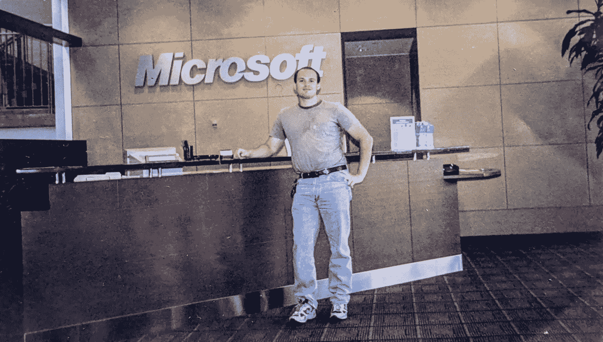
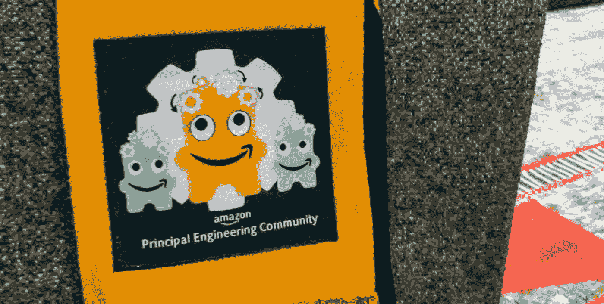

# 庆祝别人的胜利！

> 原文：<https://medium.com/geekculture/celebrate-other-peoples-victories-18aea3a4c261?source=collection_archive---------1----------------------->

## 珍惜他们的成就如何加速了我自己的职业发展

**“为什么*那个*笨蛋升职了而我没有？？?"告诉我你从未想过。我相信在你职业生涯的某个阶段。我已经想过很多次了。它是如此有毒。最终我明白了，当你开始真诚地庆祝他人的成就，而不是嫉妒他们时，这会开阔你的眼界，你会从别人身上学到更多。**

你可能会因为看别人(不值得)而被烧伤？)个人升职超过你，所以你可能会带着一些愤世嫉俗的态度看待我今天的故事。毕竟,[彼得法则](https://www.investopedia.com/terms/p/peter-principle.asp#:~:text=The%20Peter%20Principle%20is%20an,a%20level%20of%20respective%20incompetence.)可能是真实的(员工不断提升，直到他们达到各自*不胜任*的水平)。但是在我 25 年的行业生涯中(11 年在微软，11 年在亚马逊，2 年在谷歌)，从长远来看，这个系统确实倾向于做正确的事情。在这三家公司中，我们在促销方面做了大量的尽职调查。所以这些天我选择关注积极的一面。

我达到这种心态的旅程并不美好，我也不为沿途的一些步骤感到自豪。但是我为我今天的地位感到骄傲。这就是那次旅行的故事。

# 开场白:一场高中乐队音乐会

我 14 岁的儿子已经在学校乐队演奏长号很长时间了。在过去的几年里，在疫情期间聚在一起演奏乐器是很困难的，但孩子们以积极的态度和独创性克服了这一困难，在 Zoom 上演奏了好几个月。然后，当他们能够亲自聚在一起时，他们戴着为他们的特定乐器量身定制的特殊面具，我敢肯定这很糟糕。最近，随着 covid 限制的放松，他们能够举办面对面的音乐会。我无法想象整个过程有多艰难。他们的坚韧和精神让我肃然起敬。他们的音乐会棒极了，我骄傲地参加了每一场。

在本学年的最后一次音乐会上，老师将要颁奖。我必须坦率地告诉你，坐一个小时礼貌地为别人的孩子(我从未见过)鼓掌的前景听起来很可怕。我甚至想，也许我可以在仪式进行的时候，把我的笔记本电脑调暗，悄悄地完成一些工作。当我妻子看到我慢慢拿出我的 Mac 电脑时，她不赞成的表情足以扼杀这些计划。所以我强颜欢笑，长叹一声，开始了长达一个小时的假装礼貌。

然而令人惊奇的事情发生了。老师宣布了获得一等奖的孩子的名字，他的同学们欢呼雀跃。我怀疑地环顾了一下礼堂。这不是勉强的礼貌。这是对孩子成就的真正的快乐和真诚的庆祝。我感到困惑和好奇。这些青少年实际上为彼此感到骄傲！

随着仪式的进行，这种情况继续下去，我心甘情愿地成为一个积极的参与者。不是每个人都得了奖，但是得了奖和没得奖的人都同样兴奋地庆祝所有的成就。我以前从未见过这样的事情！真是令人耳目一新。

作为成年人，什么时候我们会失去真诚庆祝他人成就的能力？在我们开车回家的路上，我心想。

因为这是真的。我们长大了，我们太关注自己的成就，当我们没有得到我们认为应该得到的东西(比如升职)时，我们会感到沮丧，这阻碍了我们庆祝他人成就的能力。那有毒。

# 1993 年:希望别人不要成功…出于需要

作为一名移民，[我在整个高中和大学期间都生活在贫困线以下。在任何时候，我的存款可能都不超过几百美元，所以我只能靠奖学金读完大学。但由于我是外国人，而且大多数奖学金只提供给美国公民或永久居民，所以我只有资格获得少数几个非常有竞争力的奖学金。我需要保持 4.0 的平均绩点才能拿到它们。大学教授按曲线评分，所以其他人得 a 降低了我自己得 a 的机会，这降低了我自己保留奖学金的机会，这降低了我自己完成大学学业的机会。我天生不是特别好胜，但我开始希望其他人不会仅仅出于需要而成功。这只是零和世界中务实的自我保护需要。](https://link.medium.com/pDZytGgTBib)

# 1997 年至 2009 年:微软:嫉妒渗透进来

21-yr old, fresh out of college, and first job at Microsoft!

1997 年大学毕业后，我作为一名软件工程师加入了微软。当时，目录上没有这些级别。谈论你的水平就像谈论你的实际工资一样是禁忌。这被认为是非常隐私的信息。你不知道你旁边的人是初级工程师还是首席工程师。

我不知道这是不是作为一种均衡器，这样更多的高级工程师就不会利用职权来影响谈话，或者只是为了隐藏这样一个事实，即许多晋升都是政治交换。90 年代的微软有许多类似的违规行为。例如，有一个人开始与她的经理的经理(已婚)发生暧昧关系。这是相当可耻的，他们不是特别微妙。那个人连续四年每年都得到提升，却没有明显的成绩，甚至连工作所需的基本资格都没有。

在不知道系统奖励了哪些人的情况下，我不知道我应该效仿哪些行为。我从我的经理那里得到的成长指导很少。我没有导师或榜样。我最初几年的职业发展非常黑暗，所以我在入门级别徘徊，向墙壁扔东西，看看什么会粘在墙上。我认为努力工作和奉献最终会得到回报。

大约在 2002 年的一天，公司决定在目录上提供这些级别。一段时间以来，我一直在积极争取晋升为高级工程师。我[创造了一些很酷的技术，为微软节省了数百万美元](https://link.medium.com/SeNroHB5Wgb)，甚至[为了比尔盖茨的关键演示](https://link.medium.com/4CAMIrvF8gb)熬了一个通宵，然而连续两次尝试都没有得到提升，所以我已经带着一些挫败感了。然而，那天早上，当我翻阅目录，看谁是高级工程师时，我感到非常厌恶。如果说我因为未能获得晋升而耿耿于怀，那一天它变成了一块巨石，因为我看到了一次又一次我认为是不公正的事情。

这个制度不公平吗？很可能，至少在某些情况下。但是今天，当我回想起那个时候，我有了更多的洞察力，我想也许那些人中的一些人做了我不知道的事情，或者也许如果我用一个更客观的镜头更多地关注他们的行为，我会看到我没有看到的事情。如果来自 2022 年的年长睿智的卡洛斯可以穿越到 2002 年，我会抓住年轻急躁的卡洛斯，对他说:*“伙计，停下。你正在对你的事业造成极大的损害。多一些谦卑，把感情放在一边，睁大眼睛。你可以从你鄙视的人身上学到很多东西。”*

但是，时间旅行还不存在，所以没有这种指导，年轻的我陷入了沮丧、怨恨和普遍糟糕的工作态度的漩涡，这使我离我一直追求的晋升越来越远。事实上，我惹了很多麻烦，差点被解雇。

公平地说，不仅仅是我有毒。总体而言，鲍尔默的微软确实是一个有毒的地方。比尔·盖茨的微软令人惊叹；塞特亚·纳德拉的微软让我充满希望，但史蒂夫·鲍尔默的微软被称为“失落的十年”是有原因的随着公司从平庸走向湮没，我亲眼目睹了持续不断的政治斗争和暗箭伤人。终于在 2009 年，我受够了:[离开微软](https://carloarg02.medium.com/the-day-i-lost-my-job-at-microsoft-anatomy-of-stasis-f0e2cd653e3a)，[加入亚马逊](https://link.medium.com/F2EMdnWdRkb)。

# 2009 年:亚马逊:一个新的开始！

我意识到自己陷入了恶性循环，所以我决定有一个新的开始，在加入亚马逊时，我故意将许多先入为主的观念抛在脑后。

亚马逊在很多方面都很特别，其中之一就是首席工程师的[崇拜。亚马逊的首席工程师被捧上了神坛，他们的话举足轻重。比在微软或谷歌更是如此。这也意味着在任何时候他们都有一个巨大的聚光灯。最负盛名的内部讲座系列是亚马逊(POA)的负责人讲座。对于任何一个亚马逊人来说，获得一个主要的设计评审是一个必经之路。当你对一个项目的发展方向有疑问时，经常会听到“去和校长谈谈这个问题”。还有一种强烈的期望，作为一名首席工程师，你是一个清晰可见的榜样，并投资帮助你周围的人成长。在早期，主要的提升过程也非常繁重，社区成员一轮又一轮地审查候选人的代码、设计文档和行为，并以杰出工程师的集中小组达成一致意见而结束。](https://link.medium.com/vZvS6ogMBlb)

突然之间，我身边有了非常公众的榜样。我有一颗清晰的北极星。我遇到的每一个亚马逊校长都很棒。负责人只占亚马逊总人口的 3%,所以不是每个团队都能轻易找到负责人。我开始珍惜我接触他们的一点一滴。这些都是我尊敬的人。在每一次会议中，我开始越来越多地睁开眼睛，经常发现自己在想“哇，当我长大时，我想成为那个人！”

事实上，这就是我如何找到我的第一个真正的导师。我的团队报名参加了一个主要的设计评审，这个我不认识的家伙不停地问一些非常难的问题，显示了他巨大的洞察力和判断力。他在隆冬穿着鲜红色的短裤，我觉得这很古怪，也很有趣。我甚至不知道他是谁，但会后我径直走向他，请他做我的导师。他原来是一名高级负责人，独自设计了 AWS 的一系列关键部分。原来他只穿短裤上班，而且他只有 5 条，每条都是不同的颜色，代表一周中不同的一天。他是我多年的导师，在许多积极的方面影响了我(但我在严冬不穿短裤——嗨，jasso！).

这群人让我深受鼓舞，我想:我想让 T1 成为这个社区的一员。成为这个社区的一员，我会为*感到骄傲*。身边的人都升任校长了。我自己也想升职，但第一次没有成功。我没有羡慕*的晋升，而是庆祝他们。我找到他们，想知道他们是怎么做的。我在会议期间听他们谈话。我看过他们的设计文件。最终，[我也在 2014 年被提升为首席工程师](https://link.medium.com/ibz3Dcc2Nnb)。我认为态度上的改变有很大关系。*

# 离别的思绪

我在一个组织中，副总裁会在每个促销季后发一封电子邮件，列出被促销的个人，并附上一点点关于他们为什么被促销的简介。他们不再那样做了，“因为这伤害了那次没有得到提升的人的感情。”

不，不，不。我想知道谁会被提升，为什么，即使我在那个周期被提升，我很失望我没有得到我的。我必须谦逊地理解他们可能做了一些我没有做的特殊事情，我应该从中吸取教训。每当我看到有人取得成就，我就把它视为一个机会，去剖析那个人为了达到那个目标所付出的努力。每当一个级别比我高的人说话时，我都把它视为一个审视那个人表现出的行为的机会。我在微软、亚马逊和谷歌度过了 25 年的职业生涯，让我接触到了一些非凡的人，所以我会尽我所能，成为一名更好的工程师和一个更好的人。