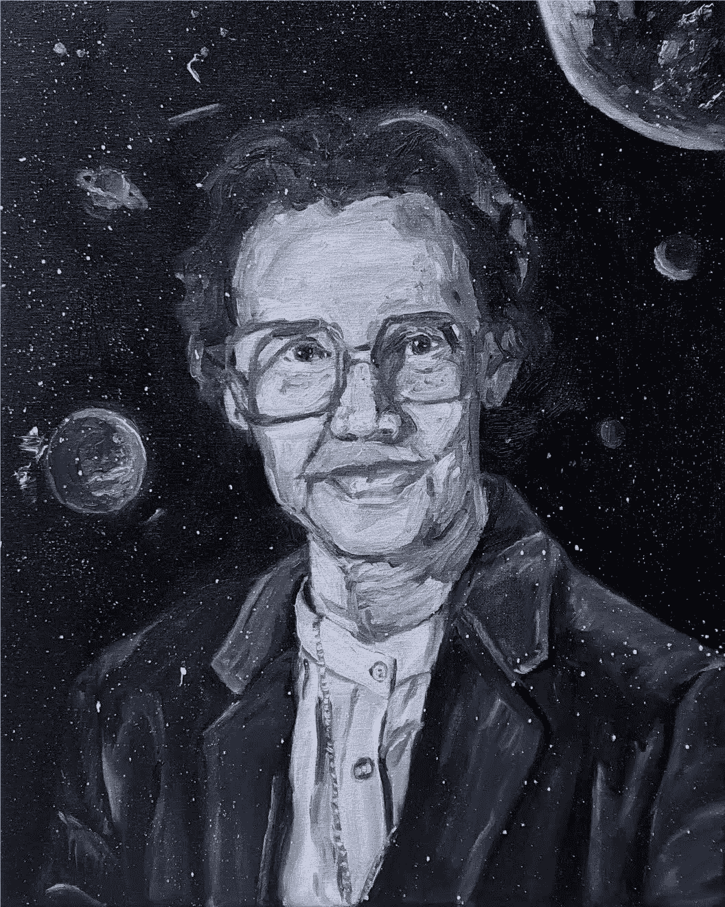
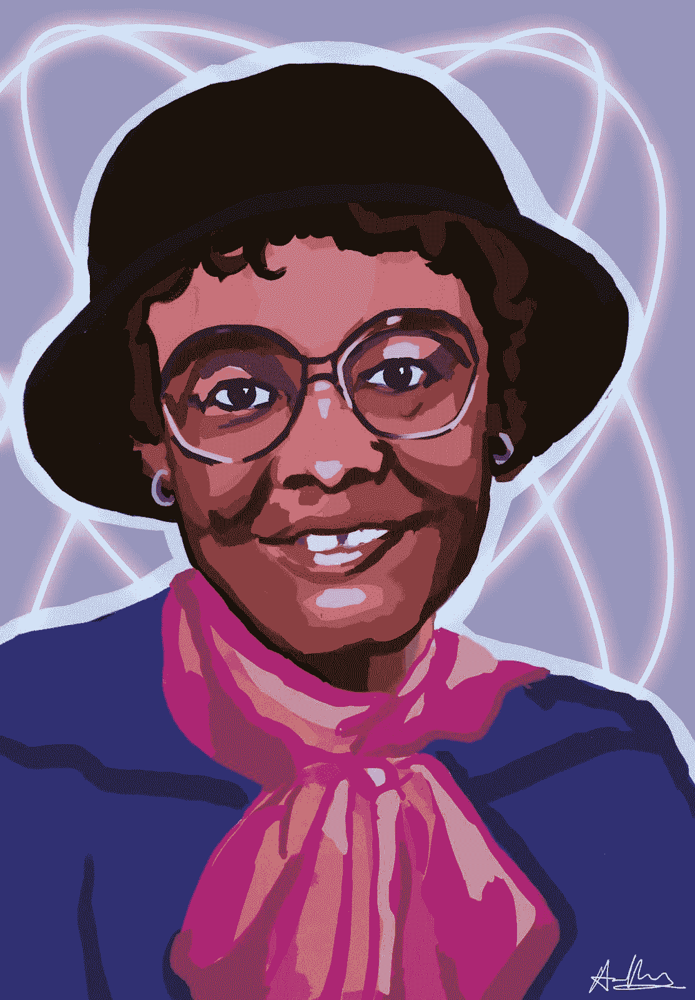
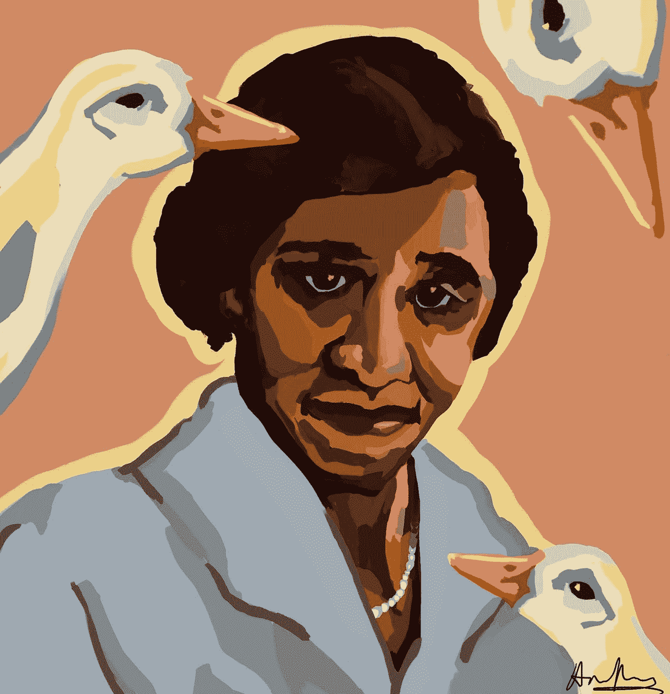
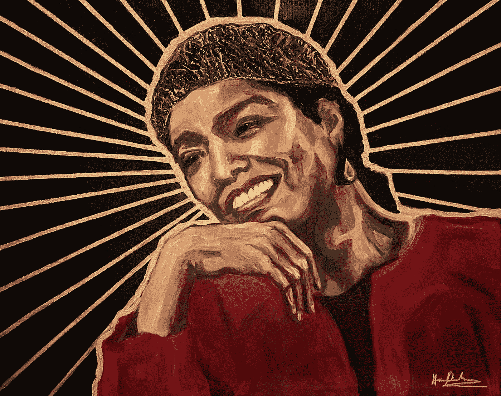

# 在 STEM 庆祝黑人女性(+国际妇女节惊喜)

> 原文：<https://medium.com/geekculture/celebrating-black-women-in-stem-an-international-womens-day-surprise-9987a731e43b?source=collection_archive---------16----------------------->

## STEM 中的宝石:多样化的角色模型

2022 女性历史月快乐！如你所知，二月是黑人历史月。为了纪念它，每年二月的星期五我都会分享我的艺术作品，这些历史性的、大胆的、鼓舞人心的黑人人物为我们现在所知道的世界和社会铺平了道路。(我也将在女性历史月继续这一活动！)

青年偏见的最大因素之一是缺乏他们所知道的多样化的榜样，这就是为什么黑人历史月和妇女历史月如此重要。你知道阿尔伯特·爱因斯坦这个名字有多久了？还是艾萨克·牛顿？这些是“主食”茎数字。但是被认为是第一个计算机程序员的阿达·洛芙莱斯呢？你什么时候听到玛丽·居里这个名字的？或者凯瑟琳·约翰逊？STEM 数字知识中的这些显著的性别和多样性差距延续了这些领域是男人的想法。榜样的缺乏不是因为他们不存在，而是因为他们不被谈论和教导。

在本专栏中，我想重点介绍 STEM 历史上三位黑人女性的非凡人生和成就:凯瑟琳·约翰逊(Katherine Johnson)、格拉迪斯·韦斯特(Gladys West)博士和杰西·伊莎贝尔·普莱斯(Jessie Isabelle Price)博士，上个月我分享了她们的肖像和故事。

# 凯瑟琳·约翰逊

“不是每天你醒来时脑子里都有一个使命，但我有一个使命，而且我决心完成它。”凯瑟琳·约翰逊

凯瑟琳·约翰逊是第一位担任美国国家航空航天局科学家的非洲裔美国女性之一，她对美国首次载人航天飞行的成功做出了贡献。她的计算和无与伦比的数学能力将永远是一个历史里程碑，重新定义了作为一名“火箭科学家”意味着什么，也是一个美妙的提醒，即 STEM 是而且应该永远是每个人的。

在 2020 年的国际妇女节，我拍卖了凯瑟琳·约翰逊的这幅肖像，最终为 BEAM 筹集了 1000 美元，这是一个针对 STEM 中代表性不足的少数族裔的夏季项目。

# **格拉迪斯博士西**

“我将成为黑我和韦斯特的榜样，尽我所能做好我的工作。”

见见 Gladys West 博士，你每天使用的 GPS 背后的女人。

West 博士是一名数学家和程序员，他在开发卫星大地测量模型方面的令人难以置信的工作成为了 GPS 的基础，改变了我们生活的世界。她还因在模拟地球形状时的精确计算而闻名。在她的职业生涯中，由于针对非洲裔美国人的种族歧视盛行，她经常得不到应有的认可，但她坚持做她热爱的工作。从赢得上大学的奖学金到尽管患有中风却在 70 岁时获得博士学位，Gladys West 博士一直是一位开拓者，她的工作将继续激励未来几代的年轻女孩。

# **杰西·伊莎贝尔·普莱斯博士**

认识一下 Jessie Isabelle Price 博士，她是一位兽医微生物学家，为威胁生命的鸭(和其他水禽)疾病开发了几种疫苗。

随着年龄的增长，普莱斯博士的经济状况很困难，并且经常是班上唯一的黑人学生，但她总是坚持不懈，动力来自她对科学的浓厚兴趣。她的母亲特雷莎·普莱斯非常重视教育，独自抚养她长大，并鼓励她的学术才华。普莱斯博士的研究集中于研究微生物疾病，希望降低鸭子的死亡率。不用说，她非常成功地实现了她的目标——她发明了不止一种，而是两种疫苗！她的工作极大地促进了对如何控制禽类疾病的理解。

Jessie Isabelle Price 博士是一名兽医开拓者，她的故事和成功将永远是我们所有希望用我们的激情改变世界的人的不可思议的灵感。

现在，为了惊喜！

# 22 年国际妇女节:玛娅·安杰洛崛起

> “每当一个女人为自己挺身而出时，她可能并不知道，也不要求，她是为所有女人挺身而出。”—玛娅·安杰洛

国际妇女节快乐！为了纪念今年的这一天，我画了一幅玛娅·安杰洛的肖像，以庆祝她对故事和社会的深远影响。

Maya Angelou Rises (2022)

她不仅是一名活动家和著名作家，她还是一名演员、编剧、舞蹈家、作曲家，第一位黑人女导演。她是 IWD 的完美典范:女性的韧性、多才多艺和赋权。在她的一生中，玛娅·安杰洛表现出了难以置信的力量和毅力，每个人都可以从她身上找到内在的力量。她激励我们所有人在我们所做的事情上要有勇气，要像他们应该被讲述的那样讲述我们的故事，并成为我们希望看到的改变。

此次拍卖的 100%资金，不包括运输和拍卖费用，将捐给**新乌克兰人道主义援助基金**，为乌克兰战区的难民和公民提供援助和紧急护理。

除了拍卖，你还可以通过在我的 Redbubble 商店购买印有我肖像[的印刷品、画布、手机壳、贴纸和其他产品进行捐赠！](https://www.redbubble.com/shop/ap/104079426)

访问[apoorvaartgallery.com/iwd](https://www.apoorvaartgallery.com/iwd)了解更多关于如何参加拍卖的信息，并看看我过去为 IWD 工作！

**更新:我们最终为 Nova Ukraine 筹集了 7000 美元！敬请关注 3 月份的 2023 国际妇女节拍卖会。**

请记住，不仅仅是这个月，而是全年，我们都应该庆祝并了解黑人历史和妇女历史，因为**这是历史。**

下次见！如果你觉得这很有趣，请务必关注我，了解下一期的最新消息。

与此同时，请点击 查看我专栏 [**中的其他文章！如果你有任何问题或意见，请发电子邮件到 apoorvapwrites@gmail.com 给我。**](https://apoorvapanidapu.medium.com/list/gems-in-stem-e5f24767d315)

*要成为第一个听到我所有新文章、最近事件和最新项目的人，请务必订阅我的简讯:* [**信？我几乎不认识她！**](http://apoorvapanidapu.substack.com/)

*提醒一下:这个专栏，*[*STEM 中的宝石*](https://apoorvapanidapu.medium.com/list/gems-in-stem-e5f24767d315) *，是一个了解各种 STEM 主题的地方，我发现这些主题很令人兴奋，我希望也会让你兴奋！未来的专栏可能包括 STEM 中的社会问题，它与其他学科的交叉，以及这些领域中突出的各种其他主题。感谢阅读！*