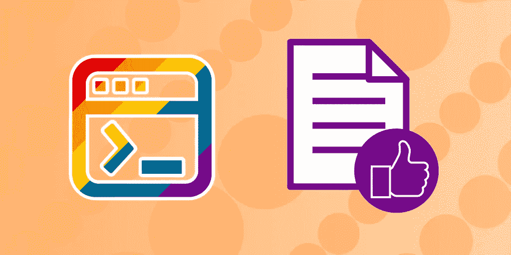
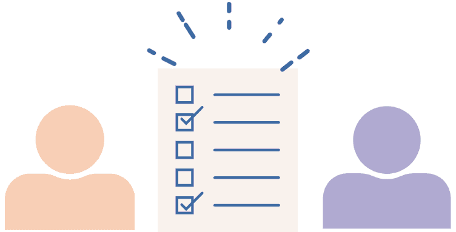

# 庆祝骄傲:如何编写性别中立的编码教程

> 原文：<https://medium.com/geekculture/celebrating-pride-how-to-write-gender-neutral-coding-tutorials-56a7f50659a6?source=collection_archive---------22----------------------->

Image Source: Author

骄傲月是一年一度的庆祝活动，在六月举行，致力于庆祝女同性恋、男同性恋、双性恋、跨性别者、酷儿和文化。这也是一个重申支持 LGBTQ+群体继续为社会中的平等权利和待遇而斗争的时刻。

第一次骄傲庆祝活动于 1970 年在纽约举行，以纪念 1969 年石墙起义，这是一次反对仇恨引发的警察突袭石墙同性恋俱乐部的示威活动。许多历史学家将这次和接下来的骄傲庆典视为美国同性恋解放运动的转折点**。**

Educative 致力于为 LGBTQ+人群构建一个更美好、更包容的未来，无论是在开发者社区还是在整个世界。我们都可以做到这一点的一个方法是批判性地思考**我们如何编写编码教程**和例子。

今天，我们将探讨如何让你的教育内容更容易被同性恋和非男性读者接受，同时提高内容的性能！

## 再也不会错过教育内容

注册我们的免费双月简讯，在您的收件箱中接收最新的技术新闻和趋势。

[**了解更多关于我们的简讯**](https://www.educative.io/blog/blog-newsletter-annoucement)

# 性别语言如何伤害内容

很多网上的编码教程**默认为男性代词**。最常见的例子是在讨论功能或提供一个假设的例子时。虽然作者可能无意冒犯，但这种性别化的语言可能会让非男性读者在开发者空间中感到不受欢迎。

例如，常见的文章是这样写的:

> *“开发者可以使用数组来存储整数。这将允许* him *在将来访问这些整数。”*

在这里，我们可以看到作者以一个中性词“开发者”开始，但随后加入了一个男性代词“他”。因此，作者暗示，也许是无意的，**开发人员天生就是男性**。

同样，许多作者会默认只使用男性代词来写假设的例子。这在讨论管理或行政职位的例子中尤其常见。

例如，教程可能包括以下部分:

> *“假设我们有一个产品经理，他想把他的应用程序连接到数据库。*他知道数据库使用 NoSQL 模式。”

和第一个例子一样，这个假设的例子暗示产品经理天生是男性，因为这是一个不言而喻的假设。

大多数男性读者可能不会注意到这一点，因为这符合他们的经历；他们是男性开发人员，所以开发人员被称为男性似乎很自然。然而，这种暗示对于非男性读者来说是非常令人沮丧的，因为这会让他们觉得自己是开发者社区中的弃儿或例外。

虽然性别化语言的单一实例不会伤害读者在社区中的归属感，但随着时间的推移，这些个别实例最终会逐渐削弱非男性开发人员作为社区成员的舒适感。

我们应该避免这种情况，因为它基于天生的特征将某些群体排除在社区和职业之外。

从内容作者的角度来看，你的内容的成功依赖于读者对这个职业的热情和社区内的舒适程度。在社区中感觉不受欢迎或作为开发人员感觉格格不入的读者不会阅读社区制作的编码教程内容。这些都是有价值的读者，已经失去了，但可以很容易地保留下来，只需对我们作为一个社区如何编写教程做一些改变。

Image Source: Author

# 简单的改变使教程更具包容性

我们可以很容易地避免这些问题，只要注意性别化语言的含义，并用中性语言代替它。

用性别语言写作是一个很难打破的习惯，所以**不要担心，如果你刚开始时必须先写，然后再修改**。仅仅是一点一点地做这些小改变，对非男性读者来说，就会有很大的不同。

# 功能解释

不管用户的性别如何，编码概念的功能都是相同的**。**

**因此，在解释概念时，我们不必指定性别，可以简单地使用非人称的、中性的语言，如“开发人员”或“开发人员”。我们也可以用“他们/他们的”代替任何代词，这是中性的，可以用作单复数代词。**

**我们可以将前面的例子改为:**

> ***“开发者可以使用数组来存储整数。这将允许* them *在未来访问这些整数。***

**讨论多人时，用他们的头衔代替代词，以避免混淆:**

> **开发者*设计这款应用是为了从*用户的*应用内行为中学习。*用户*可以限制应用程序跟踪的数据类型。***

**在这里，最好用“用户”而不是“他们”，因为这样更清楚我们指的是两个既定人物中的哪一个。**

**这两个例子都让开发人员像一块白板一样解释主题，并允许各种类型的读者与主题交互。**

# **假设的例子**

**假设的例子比抽象概念的解释更加具体和人性化。因此，更重要的是使用中性语言，以避免做出含蓄的声明。**

**让我们回头看看我们最初的假设示例，并对其进行改进:**

> ***“想象一下，我们有一个产品经理，他想把*他们的*应用程序连接到一个数据库。*他们*知道数据库使用 NoSQL 模式。”***

**我们可以用中性代词代替所有的男性代词，以避免对产品经理的性别做出假设。因为在这个例子中没有第二人称，我们不会因为只使用代词而混淆读者。**

****

**Image Source: Author**

# **“他/她”的问题**

**很多教程会用“他/她”和“他/她”代替代词，试图包含所有读者。**

**例如，我们经常会看到这样的句子:**

> ***“开发者可以使用 Azure 服务访问云存储。*他/她*将立即获得数千兆字节的空间，并可以在任何有互联网连接的地方访问*他/她的*数据。”***

**虽然这来自一个好地方，无意中使用这些非此即彼代词**排除了非二进制读者**。**

**与“他”类似，“他/她”意味着只有认同传统性别二元结构的人在社区中受欢迎。这种格式有被用于跨性别和酷儿守门的历史，可能会冒犯非二进制读者。**

**相反，**最好用“他们”、“他们”，或者只是称谓**。这样做不仅可以吸引更多的读者参与到你的内容中，还可以通过减少句子中的斜线来减少视觉混乱。**

# **包扎**

**虽然很难打破使用性别语言的习惯，但这对于非男性观众来说有很大的不同，并让他们参与到你的内容中。养成考虑性别的写作习惯可能很棘手，但你不必一下子就做出彻底的改变。**

**最后，重要的是你正在尽最大努力欢迎各种各样的开发者加入社区，并且一篇一篇地提高你的社区参与技能。**

# **继续阅读科技中的社会公正**

*   **[8 名科技创新者纪念黑人历史月](https://www.educative.io/blog/tech-innovators-black-history-month)**
*   **[科技的多样性和包容性:我们将何去何从？](https://www.educative.io/blog/diversity-inclusion-tech-industry)**
*   **[理解机器学习算法中的种族偏见](https://www.educative.io/blog/racial-bias-machine-learning-algorithms)**