# 名人和秘密:灾难的秘诀

> 原文：<https://medium.com/geekculture/celebrities-and-crypto-a-recipe-for-disaster-e0ab5b59a99d?source=collection_archive---------70----------------------->

[Pixabay](https://pixabay.com/illustrations/social-media-interaction-woman-1233873/)

名人是加密市场炒作的最后阶段。从[说唱歌手](https://news.bitcoin.com/hip-hop-star-nas-calls-himself-cryptocurrency-scarface-mentions-coinbase-investment-in-new-video/)到[摇滚歌手](https://www.loudersound.com/news/gene-simmons-is-the-self-proclaimed-god-of-cryptocurrency-dogecoin)的音乐人、演员、流行人物，甚至[色情明星](https://twitter.com/MemberSee/status/1401521504031055874)在价格大幅上涨后立即出现，推销各种无用甚至可疑的秘密项目。

当我们发现他们在讨论比特币时，我们不得不更加怀疑并考虑他们的动机。历史证明，名人总是会在泡沫顶部宣传加密货币，这可能是付费推广的一部分，以影响他们的粉丝群做出金融决策。

总是涉及到自身利益。它们所代表的资产的价格可能会暂时上涨，这取决于许多变量，但最终，任何在名人推特后投资加密货币的人都很可能在一个糟糕的时间进行投资。

让我们找出一些认可加密货币的名人，这些加密货币是什么，以及它们迄今为止的表现如何。

# 莱昂内尔·梅西——Sirin 实验室(SRN)

利奥·梅西于 2017 年 12 月成为 Sirin Labs 的品牌大使。Sirin Labs 正在开发它所谓的“区块链手机”。该移动设备的名称是芬尼，它于 2018 年发布，是一个彻底的失败。

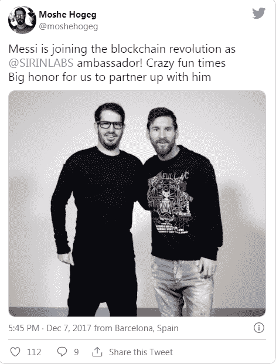

Moshe Hogeg (Sirin Labs) and Leo Messi, Twitter

梅西与加密货币项目 Sirin Labs 签约，推广了数月。他似乎在用许多推文支持这家公司，Sirin Labs 变得非常受欢迎。

$SRN 是 Sirin Labs 发行的令牌，可能根本不需要。但一切都是为了这个令牌。一款名叫芬尼的手机的诞生，这款手机被认为是高科技的，由区块链技术驱动，价格低廉，并且有硬件钱包。它从来没有真正起飞，因为手机只是一个展示。生产了 10，000 部手机，之后该公司很快就消失了。

Sirin 团队的真正利润出现在 2017 年牛市的顶部，随后数月，团队持有的 SRN 令牌出现市场抛售。

**SRN 令牌性能:**

*Source:* [*Coinmarketcap*](https://coinmarketcap.com/currencies/sirin-labs-token/)

如果你投资了 Sirin Labs ICO，从技术上来说，你会损失所有的钱。

**投资回报率 98，25%** ，三年半之后。梅西在暂时“提升”这一资产的价格方面做得很好，并增加了它的知名度，以帮助 Sirin 背后的团队赚了数百万美元。

所有这些都是以梅西的追随者为代价的，他们相信他对一个项目的认可和支持，而这个项目遭到了密码界的很多不信任。

梅西在 ICO 期间被列为“赛林传道者”。2018 年的 altcoin 赛季即将开始，Sirin 的 ICO 价格与 ETH 挂钩，1SRN 等于 0.001 ETH。

以太坊在 2017 年 12 月期间的平均价格为 700 美元。

非常粗略估算的 ICO 价格为: **$0.70** 。在 2018 年(下个月)的 altcoin 赛季期间，达到峰值 **$3.80** 。

梅西几个月来一直在为 Sirin Labs 做广告，至少直到 2018 年 3 月 SRN price 已经跳水到低于 ICO 的价格。

目前，SRN 的价格为**【0.013 美元**。

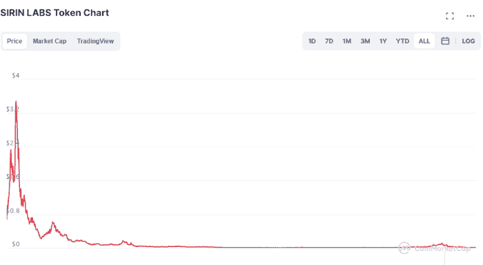

Source: Coinmarketcap

加密领域的新手可能从未听说过 Sirin Labs，尽管这个加密货币项目得到了顶级名人之一莱昂内尔·梅西的支持。

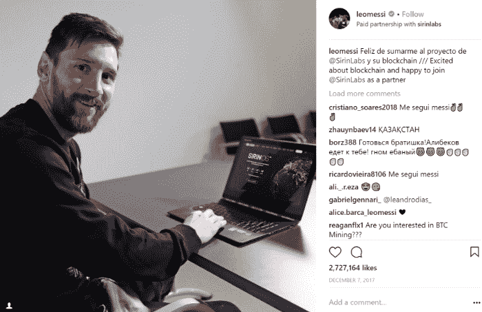

*Source:* [*Medium*](/@TokenStars/25-celebrities-who-are-into-cryptocurrency-for-real-187ff89d83a7)*, @Tokenstars*

Moshe Hogeg (Sirin Labs 首席执行官)去年因其公司 Sirin Labs 的未付账单而被起诉。([来源](https://coingeek.com/sirin-labs-founder-in-hot-water-over-blockchain-phones-unpaid-bills/))。整个芬尼电话计划一直是一个骗局，可悲的是，它使用了比特币最早的预言家之一哈尔·芬尼的名字来获得更多的人气。

据报道，Sirin Labs 从其 ICO ( [来源](https://venturebeat.com/2017/12/27/sirin-labs-raises-157-8m-in-ico-to-accelerate-development-of-its-finney-blockchain-phones-and-pcs/))筹集了 1.58 亿美元，然而，与 2016-2018 年的几乎所有 ICO 一样，存在许多违规行为，而且 ICO 诉讼往往比官方宣布的低得多。

# 弗洛伊德·梅威瑟和 DJ Khaled-Centra(CTR)

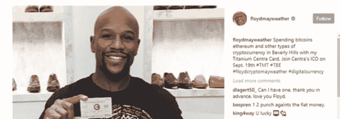

*Source:* [*Twitter*](https://twitter.com/darrenrovell/status/1068489910238289921/photo/1)

职业拳击手弗洛伊德·梅威瑟出现在“畏缩”比特币迈阿密 2021 大会上。然而，弗洛伊德·梅威瑟并不是在 2021 年才发现密码。2018 年，他参与了一个名为 **Centra** 的骗局加密货币项目的推广工作。

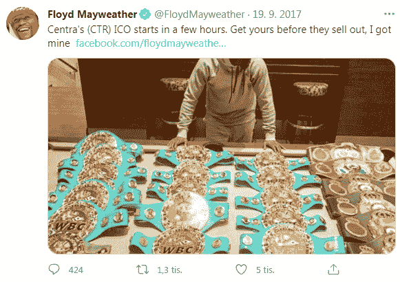

Not financial advice? (Source:Twitter)

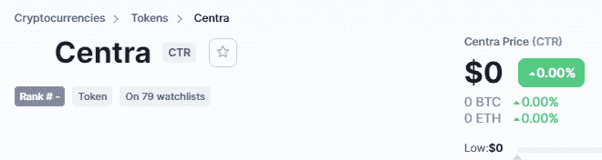

*Source: Coinmarketcap*

弗洛伊德·梅威瑟和 DJ 卡丽德的粉丝遵循了这个财务建议，失去了他们所有的钱。

Centra 是一个骗局。从字面上看，不仅仅是因为它的价格下降了很多。Centra 的投资回报率为-100%。

这是一个明显的骗局-ICO 和弗洛伊德·梅威瑟以及 DJ Khaled 目前被美国证券交易委员会指控安全欺诈，正在等待审判。Centra 的创始人已经承认从投资者那里骗取了 2500 万美元

由于 Covid 和封锁，此案的审判于 2020 年推迟。

在比特币迈阿密 2021 大会上，可能没有人关心/知道，然而，当 BTC·马克斯讨论创造另一种市值将达到数十亿美元并挑战 BTC 的加密货币的个人计划时，他只是嘘了弗洛伊德一声。他还推销自己的 NFT，并要求观众购买。([来源](https://www.youtube.com/watch?v=Lwq4qCoNLko))。

弗洛伊德·梅威瑟还认可了另一个可能的骗局加密，以太坊最大。在比特币迈阿密会议上，他穿着一件 token 的 t 恤，据说是用来购买即将到来的拳击比赛门票的。

# 金·卡戴珊——以太坊 MAX

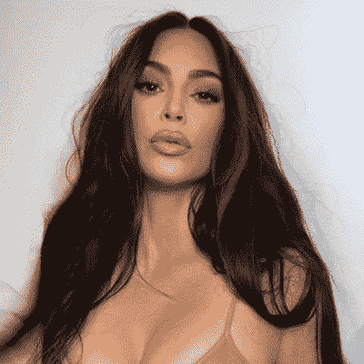

*Source:* [*Kim Kardashian’s Twitter Profile Pic*](https://twitter.com/kimkardashian)

这是一个有趣的案例。金·卡戴珊在 Instagram 上有超过两亿的粉丝。我怀疑他们中的任何人曾经关心学习如何投资或使用加密货币，但这对那些将跟随这种金融支持的人来说是非常危险的。

以太坊最大值是一个 ERC20 令牌，被加密社区的许多人认为是一个骗局。([来源](https://bitcoinist.com/kim-kardashain-promotes-crypto-scam-big-hack-in-play/)

甚至有人猜测她的 Instagram 账户遭到黑客攻击，并发表了支持这一令牌的言论。

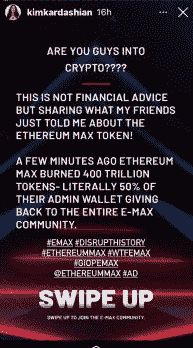

Instagram

这看起来不太好，只有时间会证明，然而，这是明确的财务建议。这条信息不是金·卡戴珊写的，但可能是管理她的账户的人写的。由于不会对她的形象产生任何影响，所以如果她的几千名粉丝因投资一种可疑的加密货币而损失了一些资金，也没关系。大概这就是管理她账户的人的想法。

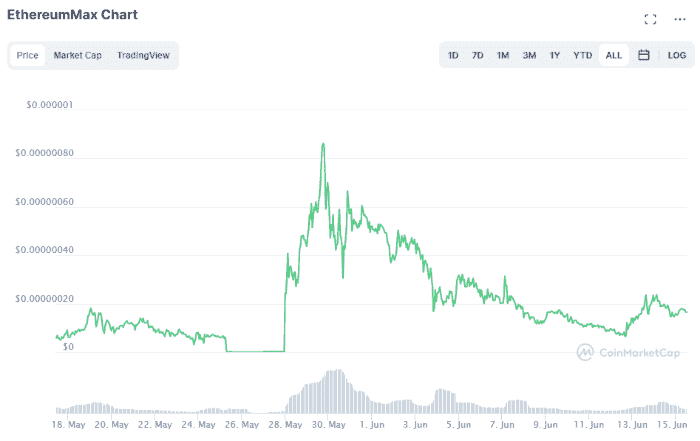

Source: Coinmarketcap

这是这种代币的图表，没有任何意义，除了可能提供价格操纵的明确证据，以及团队持有的代币炒作和倾销的巨大泵。(总供应量:2 万亿代币)。

以太坊 Max 是一种 Uniswap ERC20 代币，不建议投资或交易，因为其代币经济学和背景似乎非常可疑。

# 路易斯·苏亚雷斯-斯托克(STC)

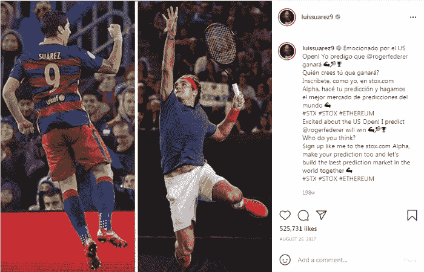

[Instagram](https://www.instagram.com/p/BYNd19wAeBD/?hl=en&taken-by=luissuarez9)

Luiz Suarez 在 2018 年为 STOX 预测市场做广告，并在 [Instagram](https://www.instagram.com/p/BYNd19wAeBD/?hl=en&taken-by=luissuarez9) 上支持 STOX token。STOX 团队在 2018 年宣布，ICO 吸引了近 3000 万美元。

所有投资斯托克的人都赔光了钱:

Coinmarketcap

我在 2018 年测试了 STOX 平台，发现很浪费时间。它看起来像一个骗局，它的预测市场被窃听，在最终比分上出现了许多错误，为已经结束的比赛的预测付费，当然，我没有设法退出。我也没有存款，但是给了我代币来测试这个平台，代币应该是可以提取的。

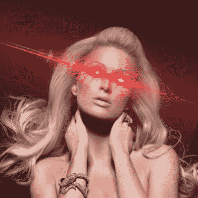

*Source:* [*Paris Hilton’s Twitter*](https://twitter.com/ParisHilton/status/1378055896996093954)

我对名人和他们的经理人的贪婪感到惊讶。一个受欢迎的个人如何能在没有首先履行尽职调查的情况下接受资金来推广一个产品或公司？

当市场看跌时，几乎没有名人对加密货币感兴趣，它们只会出现在非常接近顶部的地方，并且就在大规模抛售开始之前，它们的社交媒体帖子会增加。

在这波牛市中，出现了更多名人来支持 BTC 或其他加密货币，并增加了炒作。从约翰·列侬的儿子到通常的嫌疑人爱德华·斯诺登，他们先是增加了对资产的头寸，然后骗过了 BTC。

甚至被遗忘的名人帕丽斯·希尔顿也决定成为炒作的一部分，并哄骗 BTC 接近最近的榜首。尽管她可能正在寻找一个在狂热阶段消失前在 NFT 捞一把的人。

名人在加密是一个计数器指标，这不会改变一段时间。他们获得报酬或有个人兴趣来宣传和推广加密货币。对技术或投资的长期潜力不感兴趣。当市场“下跌”时，你不会读到它们。

当顶级名人影响他们的粉丝群并推动可疑的投资计划时，没有什么是诚实的。

名人是营销的完美工具，因为他们的追随者崇拜他们，并试图模仿他们的行为和习惯。然而，这是一个非常不诚实的做法，可能会严重损害他们的形象。

当人们接受说唱歌手、拳击手或足球运动员的理财建议时，他们是自作自受，可能不值得口袋里有这么多钱。

但更重要的是，**当一个顶级的先锋和企业家**负责加油和倾倒，那么这就变成了一个完全不同的鲁莽和不负责任的故事。

【ElectroWow.net】导语图片来源:

**原发布于*[*https://read . cash*](https://read.cash/@Pantera/celebrities-and-crypto-a-recipe-for-disaster-leo-messi-kim-kardashian-and-more-5d7ae9ad)*。**