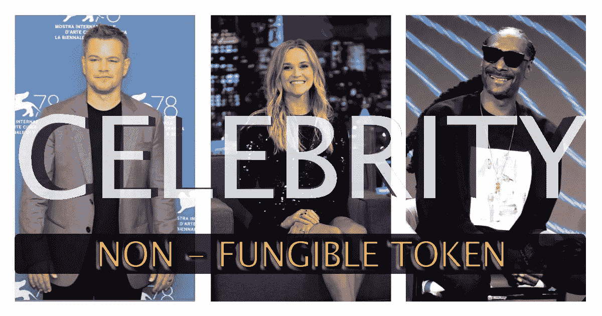
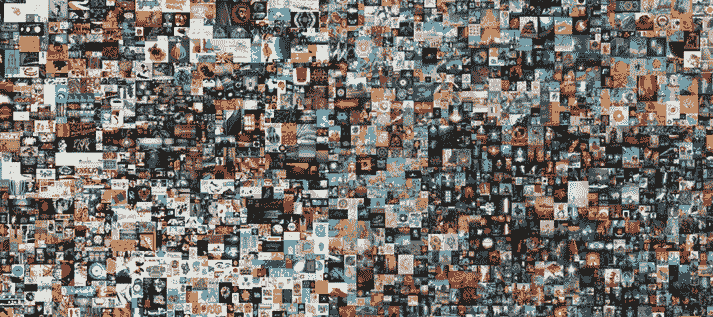
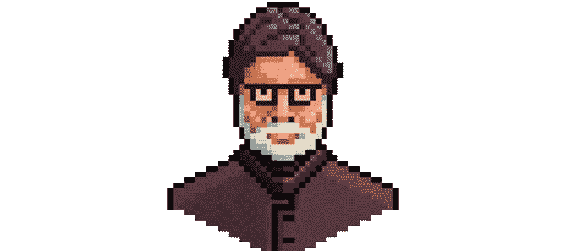
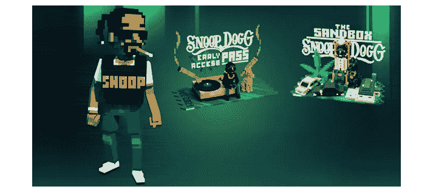
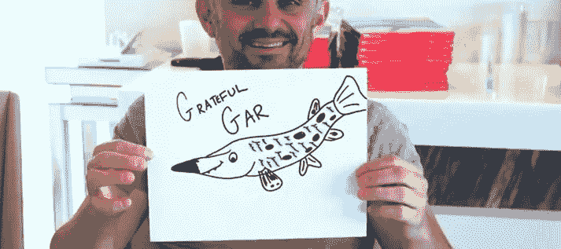
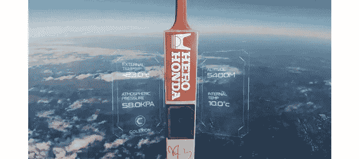
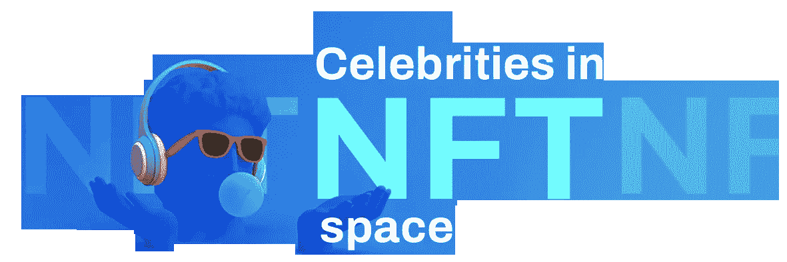

# 名人和他们的 NFT 冒险——一个俯瞰

> 原文：<https://medium.com/geekculture/celebrities-and-their-nft-ventures-an-overlook-50574d3b127c?source=collection_archive---------12----------------------->

自从不可替代代币出现以来，它们已经成为不同阶层的创作者赚取被动收入和获得认可的重要途径。许多名人也在 2021 年末开始的 NFT 繁荣中发挥了作用。名人以不同的方式成为 NFT 世界的一部分，名人 NFT 市场就是其中之一。一个 [**名人 NFT 市场**](https://www.blockchainappfactory.com/celebrity-nft-marketplace-development?utm_source=Medium+&utm_medium=Publication-+18%2F04%2F2022&utm_campaign=vignesh) 是一个平台，名人可以在这里向粉丝独家出售他们的 NFTs(数字/实体)，这样他们就可以获得被动收入。在这个博客中，我们将会看到更多关于名人拥有的 NFT 独家市场的信息。

## 人民—我们新

[迈克·温克尔曼](https://en.wikipedia.org/wiki/Mike_Winkelmann)，更广为人知的名字是毕普，是一位美国数字艺术家，他的作品是当代最卖座的非艺术电影之一。这位艺术家现在开始了自己的 NFT 市场，名为 WENEW，粉丝们可以在这里竞拍标志性时刻的艺术品。该平台的第一次合作是与 2013 年温布尔登大满贯冠军安迪·穆雷合作。在这里，粉丝可以在 NFT 上以二十包、五十包、一百包和五百包的形式出价。该平台有助于增加历史时刻的价值，因为 NFTs 将在未来提供一些实用工具。

## 阿米特巴·巴强——超越生活

印度著名明星阿米特巴·巴强通过一个名为 BeyondLife 的市场平台发布了以他的生活为主题的 NFTs。该系列展示了这位偶像的早期电影海报、诗歌朗诵以及被称为 BigB Punks 的像素化艺术作品。这个市场是由无代码市场创建公司 GuardianLink 开发的。

## 史努比狗狗

美国说唱歌手 Snoop Dogg 在 NFT 著名的艺术家市场平台 SuperRare 上推出了 NFTs。自第一次爆炸以来，他一直倡导 NFTs，并为许多 NFT 主题的歌词提供了声音，这些歌词与数字收藏品一起播放。其中一个著名的 NFT 包括“分散的眼睛狗狗”，这是与混合媒体艺术家 Coldie 的合作。NFT 艺术是一幅拼贴画，由史努比·道格不同时期的 10 张照片拼接而成。

## 加里·维纳查克—官方

加里·维纳查克是一名白俄罗斯裔美国企业家，对 NFT 的资产有着浓厚的兴趣。在他的风险投资 VeeFriends 之后，GaryVee 推出了 ArtOfficial，一个给独立艺术家展示他们技能的平台。意大利当代艺术家弗朗西斯科·克莱门特(Francesco Clemente)的作品率先在该平台上出售。

## 尤夫拉杰·辛格

前印度板球运动员 [Yuvraj Singh](https://www.livemint.com/technology/yuvraj-singh-bat-flies-to-space-becomes-first-minted-nft-ever-to-sent-in-orbit-11640488202179.html) 与 NFT 开发公司 Colexion 合作推出了 NFT 系列。该公司以其为不同领域的名人推出 NFT 的能力而闻名。NFT 收藏了这位板球偶像职业生涯中的一些最佳时刻，可以在他和他的粉丝之间建立更紧密的联系。

## 罗纳尔迪尼奥

前巴西足球明星罗纳尔迪尼奥在 Influxo 上推出了一系列 NFT，这是一个由知名投资者支持的市场平台。NFTs 由六幅数字增强的传奇足球运动员油画和另一张空投卡片组成。一位成功竞拍全部藏品的收藏家将赢得一次迪拜体验或一件由“丁霍”本人亲笔签名的有形收藏品。

## 帕丽斯·希尔顿

企业家和多面人格帕丽斯·希尔顿长期以来一直是 NFTs 的大力倡导者，甚至给她的两只狗取名为 Crypto Hilton 和 Ether Reum。她推出了她的 NFTs“标志性加密女王”、“元宇宙蜂鸟”和“传奇爱情”NFT 收藏品总共卖了 100 多万美元。

## 埃米纳姆

这位传奇的说唱歌手通过流行的 NFT 市场门户网站 Nifty Gateway 以“Shady Con NFT”在 NFT 空间首次亮相。这些收藏品包括漫画书、动作玩偶和原声带，售价近 200 万美元。这位说唱偶像还与索尼音乐娱乐公司一起向 marketplace 投资了 3000 万美元。

## 韦恩鲁尼

前英格兰足球前锋、现任德比主教练韦恩·鲁尼(Wayne Rooney)在 Blockasset 平台上推出了自己的 NFT 系列。据双方透露，NFT 收藏了这位足球明星的漫画，不久将会有更多更新。该系列是传奇世代 NFT 系列的一部分，预计会有一些用途。

## 肖恩·蒙德兹

流行音乐人肖恩·蒙德兹根据他与流行头像品牌 Genies 一起创作的专辑“Wonder”跃入了 NFTs 的世界，该专辑是他在流行市场 OpenSea 上发布的。这位明星还推出了可穿戴 NFT，包括背心、吉他和钥匙链等。Genies 的首席执行官表示，这些数字可穿戴设备的售价超过 60 万美元，整个系列在不到 10 分钟内筹集了 100 万美元。

## 这说明了什么？

虚拟世界里有无限可能。越来越多的明星也想作为收藏家或卖家尝试这一数字收藏品领域。虽然与名人合作需要你付出很大的努力，但最终这一切都是值得的，因为你可以比预期更快地获得急需的关注。因此， [**名人 NFT 市场**](https://www.blockchainappfactory.com/celebrity-nft-marketplace-development?utm_source=Medium+&utm_medium=Publication-+18%2F04%2F2022&utm_campaign=vignesh) 是可能的，并且随着世界对这些数字代币了解得更多，NFT 的专有子集只会越来越突出。