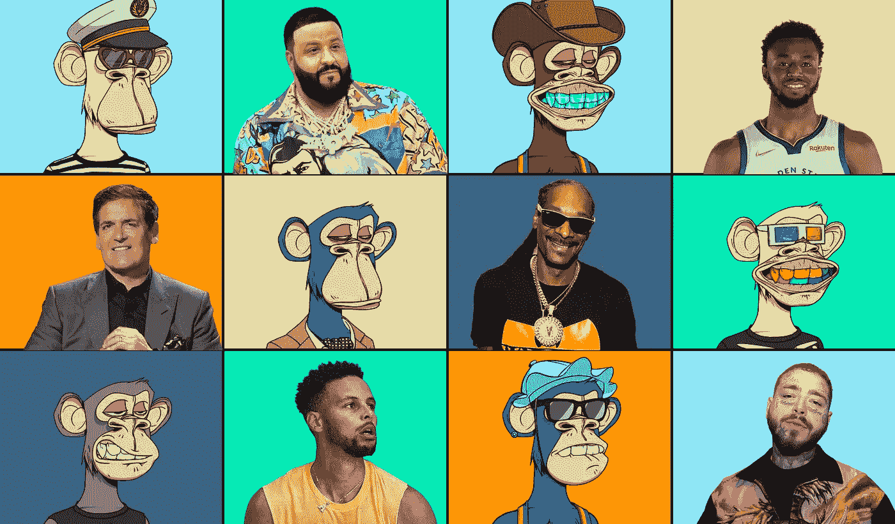
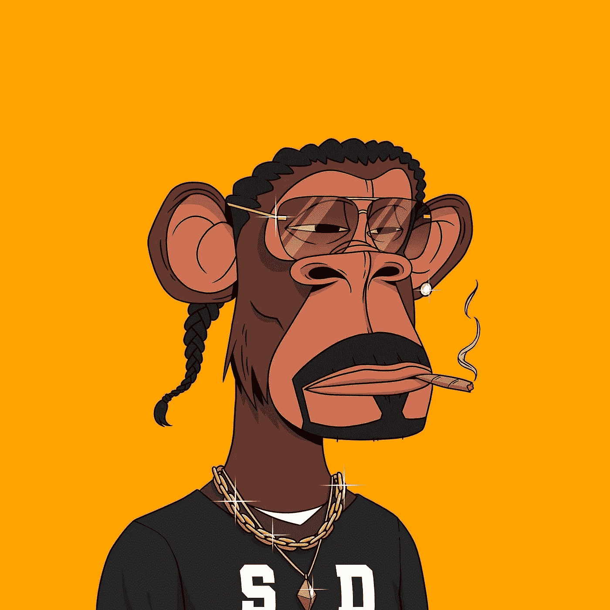
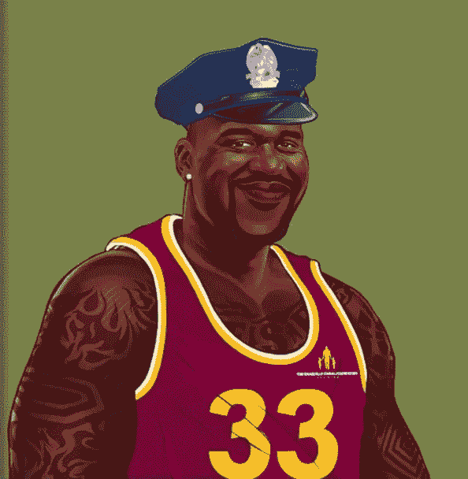

# 名人 NFT——名人和 NFT 的故事

> 原文：<https://medium.com/geekculture/celebrity-nfts-a-story-of-celebrities-and-nfts-9291f506a1e3?source=collection_archive---------13----------------------->

到目前为止，几乎每个人都听说过 NFTs。NFT 被应用在如此多的领域，以至于你不得不试着*不要*到*碰到任何新闻。无论是在游戏中使用，还是被品牌用作品牌和营销策略，NFT 已经渗透到几个市场和行业。以至于它们成了餐桌上讨论的话题。曾经被视为只有少数人买的东西，现在成了普通人的投资。这就是 NFTs 所产生的影响。*

那么，NFTs 的覆盖面究竟是如何在如此短的时间内大幅提高的呢？答案很简单。名人影响。品牌追求名人代言是有原因的。来自公众钦佩和信任的人的推荐对建立品牌的可信度大有帮助。同样的概念似乎也适用于 NFTs。虽然 NFT 确实起源于艺术界，但只有在一些大牌开始涉足 NFT 市场并在 NFT 市场推出他们的藏品后，它们的受欢迎程度才飙升。

# **什么是名人 NFT？**

名人 NFT 是由名人发起、代言或购买的。当这些 NFT 与名人联系在一起时，它们的价值就会上升。NFT 系列的意图各不相同。一些名人非常欣赏并相信 NFTs 的潜力，而其他人则希望通过粉丝代币的方式与他们的粉丝建立联系。尽管如此，其他人一直在使用 NFT 来筹集资金和支持高尚的事业。在这个博客中，我们将讨论名人对 NFTs 的影响，以及一些值得注意的名人 NFT 收藏。

# **名人如何影响非物质文化遗产**

模仿他人的行为是人类的天性。即使在正常的日常对话中，我们也倾向于有意或无意地模仿他人的动作和手势。即使在更大的范围内也是如此。当名人或处于某种权威地位的人以特定的方式行事或说特定的话时，我们就模仿它。例证:流行趋势源于时尚偶像。因此，当名人走上前去，对非功能性技术说些好话时，理所当然会对这项技术产生积极的印象。当他们从流行的非功能性食物中购买时更是如此。

名人影响 NFTs 的另一种方式是通过在名人 NFT 市场**推出他们自己的系列。对许多人来说，NFT 给了他们一种与粉丝更深层次联系的方式。例如，公用事业代币可以用来授予粉丝参加会员专属活动的权利，以及特殊商品或其他一些额外待遇。当然，对于狂热的粉丝来说，像签名海报这样的收藏品是物有所值的！让名人 NFTs 更特别的是，它的许多收入都捐给了慈善机构和其他值得关注的事业。通过这种方式，某些重要的问题得到了所需的资金。名人的影响力也提高了人们对关键问题的认识。**

**然而，即使是投下如此长阴影的人，归根结底也是人。鉴于此，重要的是要记住，一些名人代言的 NFT 系列可能是骗局。因此，最好是自己做研究，确保你投资的 NFT 市场是合法的。**

# ****优秀奖****

**有几件名人 NFT 收藏在业内掀起了波澜。以下是对其中脱颖而出者的综述。**

## ****1。史努比狗狗****

****

**Snoop Dogg NFT**

**当人们想到名人 NFTs 时，首先想到的名字之一是史努比·道格。这位笔名为 Cozomo de' Medici 的说唱歌手在几个月内购买了 Bored Ape 游艇俱乐部 NFTs，价值超过 1700 万美元。他也一直在试验他自己的 NFT。事实上，NFT 在沙盒上的虚拟地块旁边的一块土地是以 45 万美元的天价购得的。**

## ****2。沙奎尔·奥尼尔****

****

**Shaquille O’Neal NFT**

**娱乐业的人们并不是唯一使用 NFTs 的人。一些运动员和运动员也加入了对 NFT 的狂热。例如，沙奎尔·奥尼尔放弃了他的 NFT 系列，但这是有原因的。这位前 NBA 传奇人物的沙克基金会一直致力于帮助整个联合国的贫困青年。奥尼尔的名为“沙克回馈”的 NFT 收藏为慈善事业筹集了 200 万美元。**

## ****3。贾斯汀比伯****

****

**Justin Bieber NFT**

**事实证明，这位著名的歌手对 NFTs 情有独钟！比伯已经购买了几件 NFT 的藏品，更准确地说是 2000 多件，包括 BAYC，World of Women 和 Clone-X。然而，他购买的一件外国人 Fren NFT 是名人对非功能性 t 的影响的见证。比伯买了 2 ETH 的代币。紧接着，外星 Fren NFTs 的地板价跃升至 3 ETH。我们会让你做数学！**

## ****4。杰克·多西****

****

**Jack Dorsey NFT**

**除了数字艺术收藏品和实用工具，NFT 还允许你拥有一段历史。最好的例子之一是推特创始人杰克·多西的第一条推特。这条写着“正在设置我的 twttr”的推文，在发布 15 年后被铸造成了 NFT！价格呢？290 万美元！这笔交易的收益用于在非洲抗击新冠肺炎病毒。**

## ****结束语****

**从板球明星到 2000 年代的好莱坞女明星，名人出于无数的原因投入到 NFT 的世界中。但不管背后的原因是什么，名人一直在为 NFTs 做贡献。事实上，这些公众人物公开表示支持 NFTs，使得普通人更容易理解这项技术。随着 Web3 成为当今的口号和通向未来的大门，可以肯定地说， [**名人 NFT**](https://www.jump.trade/)进入 NFT 市场将大大推动元宇宙的到来。当然，有了这些收益，名人 NFT 正在让这个世界变得更加公平。**