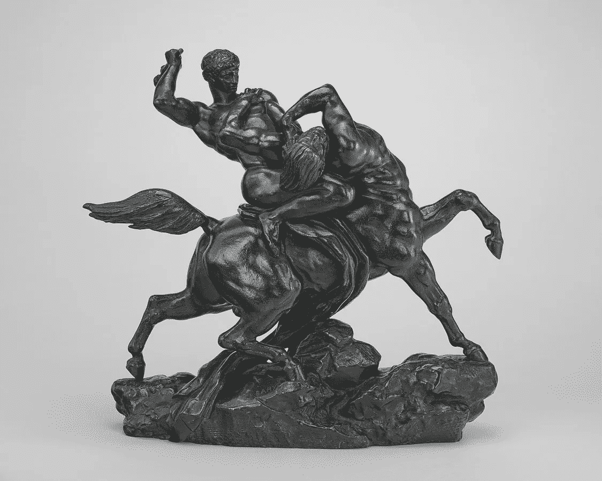

# “半人马”往往比电脑更强大

> 原文：<https://medium.com/geekculture/centaurs-are-often-more-powerful-than-computers-549f827130d9?source=collection_archive---------15----------------------->

## 关于人工智能，大卫·爱泼斯坦给了我们什么启示

“Theseus Fighting the Centaur Bianor,” by Antoine-Louis Barye. Image via [Wikimedia Commons](https://commons.wikimedia.org/wiki/File:Antoine-Louis_Barye,_Lapith_(Theseus)_Fighting_an_Centaur_(sketch),_model_c._1846-1848,_cast_by_1873,_NGA_178329.jpg) (public domain)

[*范围*](https://www.amazon.com/Range-Generalists-Triumph-Specialized-World/dp/0735214484) 是一本好书！而是像多面手而不是专家一样学习技能。

我们被教导要专门化。如果说我们真的从局外人和所有那些童年钢琴课中学到了什么，那就是你应该从孩提时代就开始掌握一项技能…