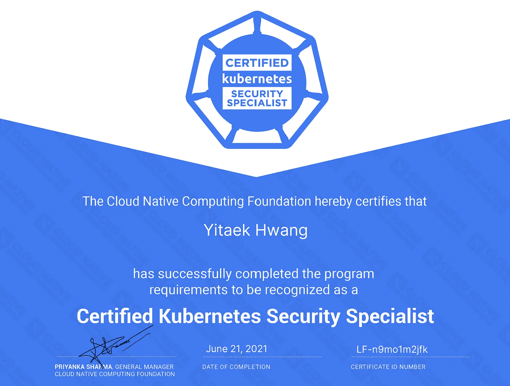

# 认证 Kubernetes 安全专家(CKS)学习指南

> 原文：<https://medium.com/geekculture/certified-kubernetes-security-specialist-cks-study-guide-6ef079b393a7?source=collection_archive---------15----------------------->

通过认证 Kubernetes 安全专家(CKS)考试的终极学习指南

# **什么是 CKS &为什么要获得认证？**

[认证的 Kubernetes 安全专家(CKS)](https://www.cncf.io/certification/cks/) 考试是由[云本地计算基金会(CNCF)](https://www.cncf.io/) 管理的 Kubernetes 认证的最新成员。CKS 专注于最佳…