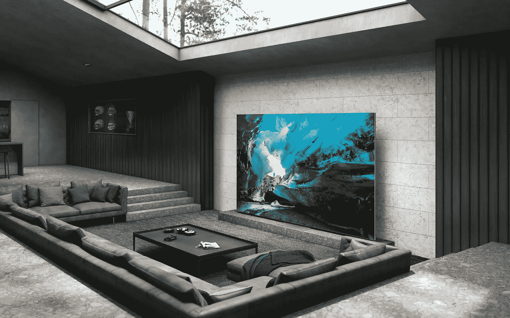

# CES 2022:三星专注于其 2022 智能电视的软件

> 原文：<https://medium.com/geekculture/ces-2022-samsung-focuses-on-software-for-its-2022-smart-tvs-9b259e60730d?source=collection_archive---------17----------------------->

## 新的 MicroLED 和 MiniLED 产品线，大量的新功能和一些惊喜…各种各样的

Samsung led its new 2022 TV sets announcement with the MicroLED models it’s bringing to the market, despite the extremely small number of people that can actually afford them. Oh, such a tease, those Koreans. (Image: Samsung)

**CES 2022 要到 1 月 5 日**才正式开幕，但许多制造商已经开始在其背景下发布公告，包括三星:韩国人透露(大部分？)…