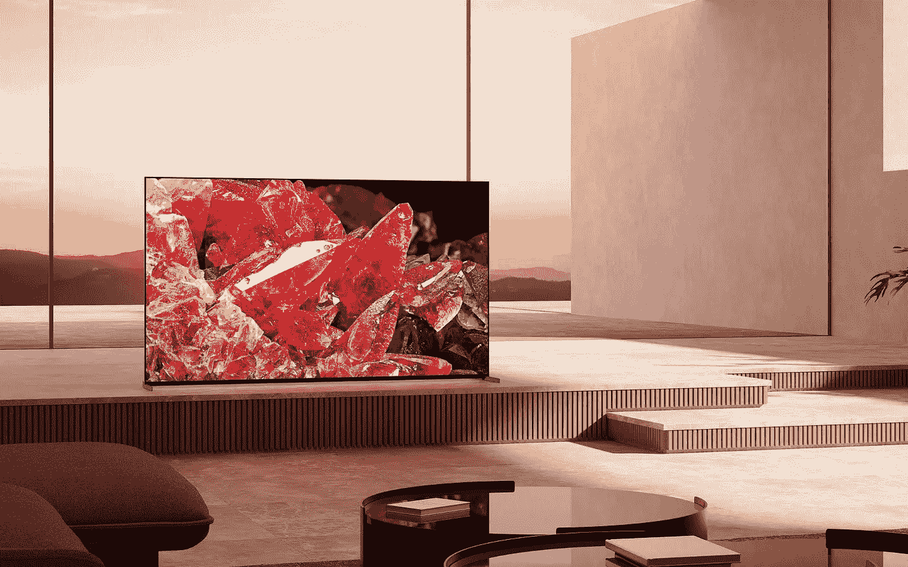

# CES 2022:索尼也进入迷你 LED 电视游戏

> 原文：<https://medium.com/geekculture/ces-2022-sony-gets-into-the-miniled-tv-game-too-8af8c372f6bc?source=collection_archive---------10----------------------->

## 日本今年将在各条战线上面对三星和 LG，包括 8K 和 4K 机型

Sony is bringing the performance and flexibility of MiniLED backlighting to its 4K LED/LCD TV lineup with the X95K. It will not be cheap, but it’s expected to be way, way better than the X95J and the X95H 4K flagships of previous years. (Image: Sony)

在 2022 年消费电子展期间，索尼的声明占据了大部分头条是关于第一台 QD-有机发光二极管电视**上市的——鉴于它们所拥有的承诺，这是完全可以理解的——但是该公司还有第二张王牌——那张照片…**