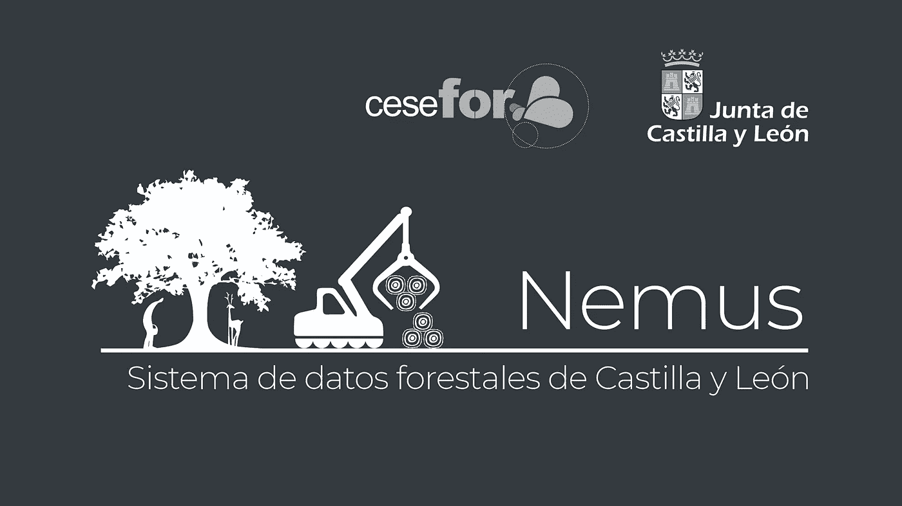
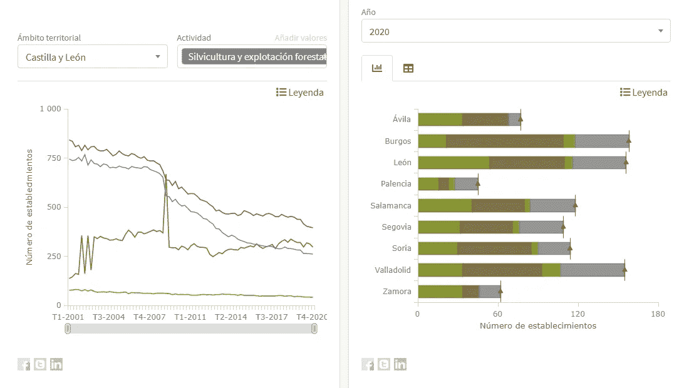
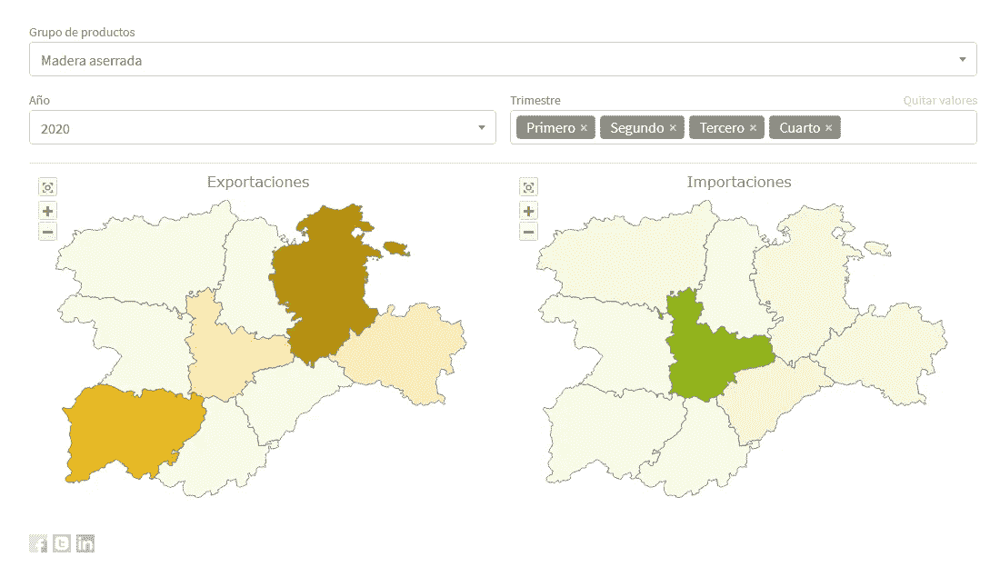
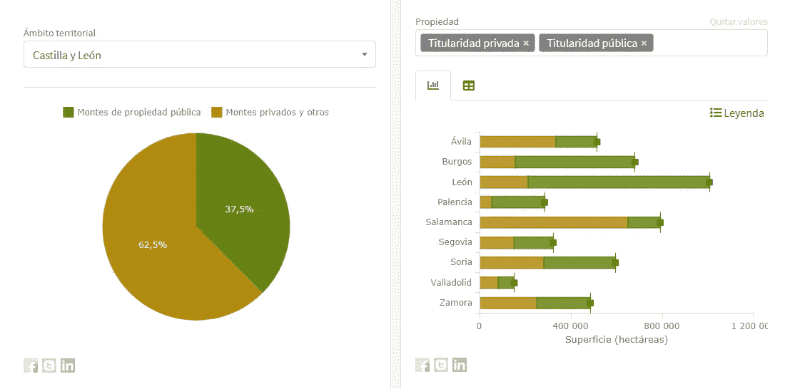
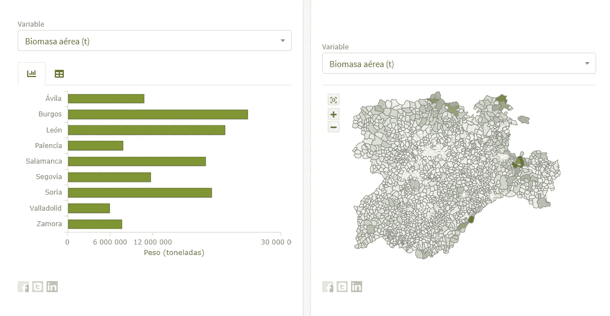
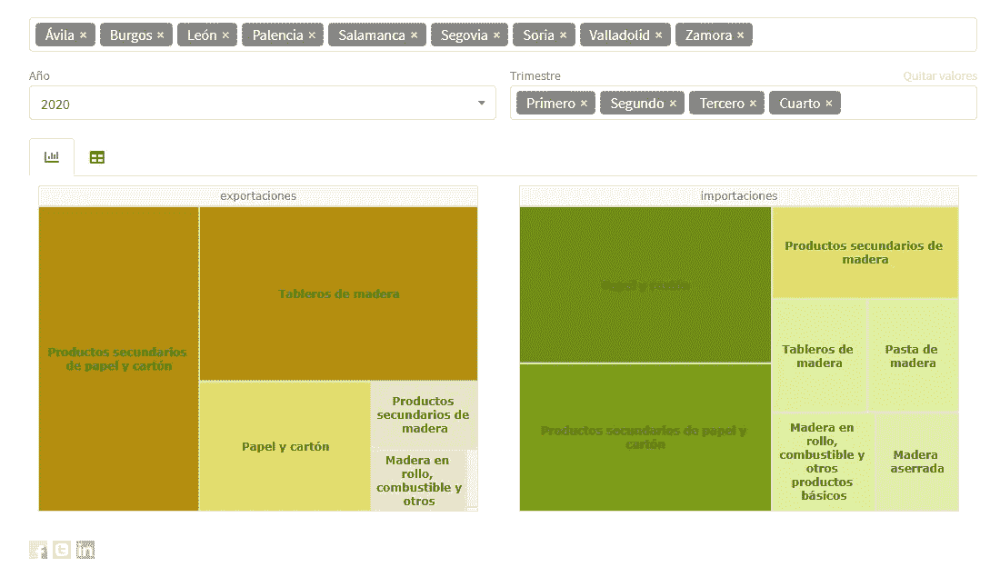

# Cesefor 使用 AnyChart 可视化 Nemus 系统中的林业数据

> 原文：<https://medium.com/geekculture/cesefor-visualizes-forestry-data-in-nemus-system-using-anychart-a6850fba070d?source=collection_archive---------46----------------------->

全球成千上万的开发人员使用我们的解决方案进行交互式数据可视化。因此，在这里或那里遇到一个由 [**AnyChart**](https://www.anychart.com) **驱动的图形就不足为奇了。然而，有些项目值得展示。这样一个新的有趣的例子展示了 AnyChart 的巨大用途，最近引起了我们的注意，我们很高兴让你知道它。**

西班牙非营利组织 [Cesefor](https://cesefor.com/) 使用我们的 JavaScript 图表库在大量不同的图表和地图中可视化西班牙卡斯蒂利亚和莱昂地区的林业数据，旨在使相关见解易于获取并可用于可持续发展。

这个项目叫做 [Nemus](https://datos.pfcyl.es/) 。嘘，它还在测试阶段，还没有正式推出。但 Cesefor 的 ICT 和知识管理部门主管罗德里戈·戈麦斯·科内霍允许我们让你进去，甚至给了我们一个简短的采访，披露了关于该系统的一些特殊细节以及 AnyChart 是如何使用的——请看下文。(堆栈:jQuery/Codeigniter/PostgreSQL。)

## 你好，罗德里戈！请简要介绍你的组织和你在那里做什么。

罗德里戈·戈麦斯·科内霍:你好！Cesefor 是一个非营利组织，成立于 2003 年。我们努力提高林业部门的竞争力和可持续发展。就我个人而言，我负责 Cesefor 的所有技术和数据方面的事情。

## **答:Nemus 是什么，你为什么要创建它？**

RGC: Nemus 是卡斯蒂利亚和莱昂的林业信息系统，这是西班牙西北部的一个自治区。卡斯蒂利亚和莱昂地区政府(Junta de Castilla y León)目前是我们的主要盟友，为我们开展的工作提供了巨大的支持，我们与该地区政府一起决定创建它，以更好地统一、组织和分发有关林业资源、行业和市场的各种数据，使其更容易、更方便地发现、监控和分析。

## A:它已经是一个完整的项目了吗？

RGC: Nemus 目前的状态是一个正在进行的大计划的一部分。我们希望创建多个仪表盘，以便深入了解我们地区的林业价值链。木材部门已经发展起来，有许多可视化数据分析工具。现在我们正在整合其他资源的信息，打算在不久的将来发布蘑菇、树脂、狩猎和捕鱼的仪表板。

## **答:** [**数据可视化**](https://www.anychart.com/blog/2018/11/20/data-visualization-definition-history-examples/) **在 Nemus 中起什么作用？有什么帮助？**

RGC:在林业部门，许多自然和经济过程没有很好地数字化，实时信息很难获得。我们的仪表盘集成了所有数据，并以直观的视觉形式呈现在单一位置。

## 你在那里如何使用海图？

RGC: AnyChart 让我们可以很容易地将林业信息以各种信息丰富的数据图形形象化。具体来说，我们用它建立了[条形图](https://www.anychart.com/chartopedia/chart-type/bar-chart/)、[堆积条形图](https://www.anychart.com/chartopedia/chart-type/stacked-bar-chart/)、[树形图](https://www.anychart.com/chartopedia/chart-type/treemap/)、[方框图](https://www.anychart.com/chartopedia/chart-type/box-chart/)、[饼图](https://www.anychart.com/chartopedia/chart-type/pie-chart/)、[线条图](https://www.anychart.com/chartopedia/chart-type/line-chart/)、[桑基图](https://www.anychart.com/chartopedia/chart-type/sankey-diagram/)，以及 [choropleth 图](https://www.anychart.com/chartopedia/chart-type/choropleth-map/)和[流程图](https://www.anychart.com/chartopedia/chart-type/flow-map/)。

对于负责创建和更新图表的团队，我们构建了一个特殊的图表编辑器，现在允许他们在没有开发人员的情况下工作。该编辑器有大约 100 个常规和特定于图形类型的选项，根据应用的过滤器提供对工具提示、颜色、系列操作、系列重命名、可变轴标签等的完全控制。

## 请多告诉我们一些技术方面的事情。Nemus 构建在什么技术堆栈之上？整合任何图表是否足够容易？

RGC:我们使用 Codeigniter 作为框架，PostgreSQL 作为数据库，jQuery 作为前端。在将 AnyChart 集成到我们的项目中时，我们没有遇到任何大的困难，一切都进行得相当顺利。

## **答:使用 AnyChart，您最喜欢我们图表库的哪一点？**

RGC: AnyChart 非常[有据可查](https://docs.anychart.com)和[易于集成](https://www.anychart.com/technical-integrations/)。

## **A:请告诉我们如何进一步改进。A:你认为它缺少什么？**

RGC:我认为 AnyChart 作为一个数据可视化解决方案确实非常完整。我希望在未来版本中看到的一个可能缺失的功能是跨多个图表的光标同步。

## 答:我们一定会调查此事！非常感谢你，祝你一切顺利！

***您在哪里以及如何使用 AnyChart？*** [***联系我们***](https://www.anychart.com/support/) ***分享你的故事！***

***查看更多***[***any chart 客户成功案例***](https://www.anychart.com/company/success_stories/) ***。***

*原载于 2021 年 8 月 31 日 https://www.anychart.com**[*。*](https://www.anychart.com/blog/2021/08/31/cesefor-forestry-data-visualization/)*