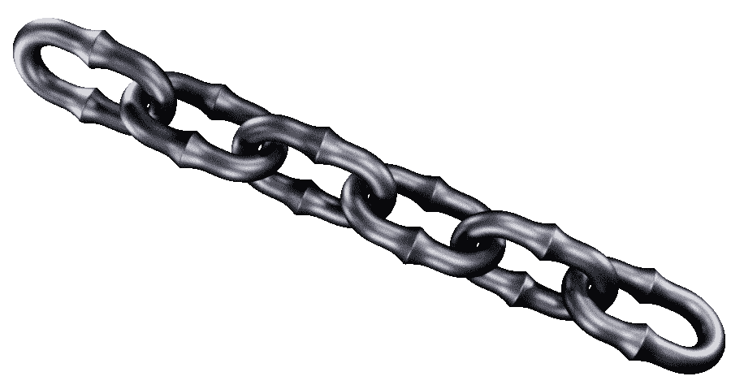
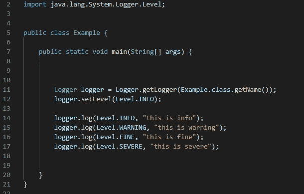
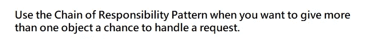
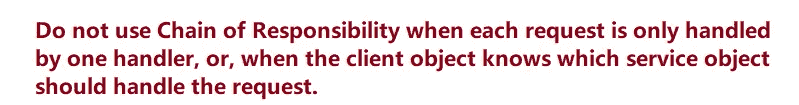
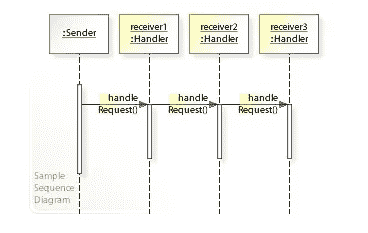
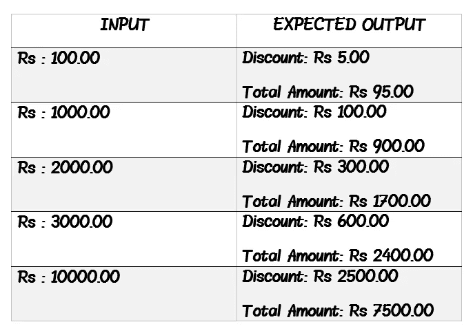
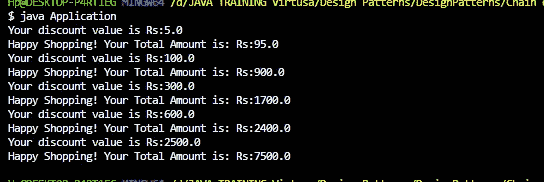
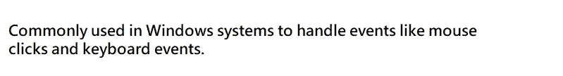

# 责任链设计模式✨😎

> 原文：<https://medium.com/geekculture/chain-of-responsibility-design-pattern-2e27bd751360?source=collection_archive---------32----------------------->

## 责任链设计模式的概述及其在真实场景中的实现！



📍责任链设计模式是一种行为设计模式。

📍责任链模式主要用于在当前对象无法处理时将责任传递给下一个对象。通过利用这种责任链设计模式，您可以实现松散耦合。

让我们通过下面的例子来理解这种设计模式:

> *假设你需要在用户层面控制一个菜单。那里有首席执行官、董事、经理和执行官。因此，他们每个人都有多种级别的权限。因此，如果您需要基于这些特定级别的权限实现某些东西，您可以使用这种设计模式。*

在实践层面实现的责任设计模式链的最好例子是 **Java API logger** 。



输出:

```
**INFO: this is info
WARNING: this is warning
SEVERE: this is severe**
```

因此，你可以看到这是在一个层次上进行的。(注意:如果没有找到一个特定级别处理程序，它就忽略它)

# 何时使用责任链？🙄

🔥当我们的程序用各种方法在不同类型的请求中寻找一个过程时，我们可以使用责任链设计模式，但是请求的确切类型&它们的顺序事先没有指定。

🔥如果想在运行时改变处理程序集和它们的顺序，可以使用这种模式。

🔥当我们希望以某种顺序执行一些处理程序时，我们可以使用这种模式。

这里最重要的事实是，这种设计模式鼓励松散耦合。

> 例:发送者不知道接收者是谁，接收者也不知道发送者是谁。此外，发送者可以在不知道谁将接收消息的情况下执行他们的工作，同时接收者可以在不知道发送者的情况下执行他们的工作。这意味着我们可以通过使用这种设计模式来分离发送方和接收方。



# 责任链设计模式的类图


Ref:[https://dzone.com/articles/using-chain-of-responsibility-design-pattern-in-ja](https://dzone.com/articles/using-chain-of-responsibility-design-pattern-in-ja)

# 责任链设计模式的序列图



> *这种设计模式的美妙之处在于你可以改变接收者和发送者的顺序，甚至不需要触及程序的核心实现*

让我们转到一个真实的场景来理解这种设计模式:

# 💥方案

> “Lipsy”是康提的一家女装店，他们给顾客一些折扣作为圣诞优惠。每一个优惠都有一个特别的名字，当你买衣服时，金额会从账单中扣除。
> 
> ✹黄金折扣—九五折(最高 500/=)
> ✹ AweOffers 折扣—九五折(500/=至 1500/=) &将获得黄金折扣
> ✹ DealDive 折扣—九五折(1500/=至 2500/=) &也将获得黄金、AweOffers 折扣
> ✹ Marvell 折扣—九五折(2500/=至 5000/=) &将获得黄金、AweOffers

因此，下表列出了一些预期的结果:



让我们转到这个场景的实现:

> *✨ DiscountHandler 类*

这是一个抽象类(如果需要，可以在这里使用一个接口)。这个类定义了请求的处理。

> *✨法案类*

> *✨黄金班*

这个类扩展了“DiscountHandler 类”。在第 6 行，它计算折扣金额。

**“if(bill . gettotalamount()<= 500)”**第 8 行是指检查账单金额是否小于等于 500 卢比。

**“return bill . get discount()”**第 9 行表示返回值，因为不需要计算任何其他的折扣金额。

**“return successor . apply discount(bill)”**第 12 行其实就是真正的连锁发生的地方。在这里，如果“如果”条件不为真，那么它将把它传递给后继者来计算其他折扣。

> *✨·阿韦弗类*

该类还扩展了“DiscountHandler”类。(我实现了与此相同的 DealDive、Marvell 和 HappyDaisy 类。您可以在 GitHub 资源库中看到完整的源代码)

> *✨折扣类*

这个类里面没有逻辑。只是将值传递给继任者。

> *✨应用类*

**“Golden Golden = new Golden()”**第 5 行是指从 Golden 创建一个对象。然后我也为所有其他折扣创建了对象(第 6 到 9 行)。

在第 10 行(**discount Discount = new Discount()**)，我创建了一个名为 Discount 的类，但该类中没有逻辑(这是在您将来需要更改“Discount”的名称时创建的，因此您需要将该名称保留在真正的逻辑之外)，并且我在链的开头使用了该类。

因为折扣是最低级别，所以我从折扣开始链(你可以从第 12 行看到)

输出:



单击下面的链接查看该场景的完整源代码:

[](https://github.com/Irushinie/Krish-LP-Training/tree/main/Chain%20of%20Responsibility) [## irushinie/Krish-LP-培训

### 在 GitHub 上创建一个帐户，为 Irushinie/Krish-LP-Training 的发展做出贡献。

github.com](https://github.com/Irushinie/Krish-LP-Training/tree/main/Chain%20of%20Responsibility) 

# 责任链设计模式的优缺点

## 优势:

🌱这种设计模式有助于分离请求的发送方和接收方。

🌱这种模式增强了将责任分配给特定对象或改变链顺序的灵活性。

🌱责任链设计模式为一组类提供了作为一个整体的能力。



## 缺点:

🌱有时很难观察到运行时特征并消除错误。

🌱有时候，这种责任链设计模式很容易被打破。

(例如:

✹如果一个处理程序调用下一个处理程序不成功，请求就会被丢弃。

✹如果一个处理程序调用了不正确的处理程序，它会损害整个链)

🌱这种设计模式有时会增加维护，因为处理程序之间会出现重复代码。

# 参考

[](https://www.tutorialspoint.com/design_pattern/chain_of_responsibility_pattern.htm) [## 责任链模式

### 顾名思义，责任链模式为一个请求创建一个接收者对象链。这个…

www.tutorialspoint.com](https://www.tutorialspoint.com/design_pattern/chain_of_responsibility_pattern.htm) 

《责任链模式》，*与沃尔夫冈一起编程，重点是 Azure K8s 和 DevOps* ，2021。【在线】。可用:[https://www . programmingwithwolfgang . com/chain-respons ibility-pattern/#:~:text = A % 20 real % 20 world % 20 example % 20 for，the % 20 report % 20 to % 20 his % 20 manager。](https://www.programmingwithwolfgang.com/chain-responsibility-pattern/#:~:text=A%20real%20world%20example%20for,the%20report%20to%20his%20manager.)

[](https://refactoring.guru/design-patterns/chain-of-responsibility/java/example) [## Java 中的责任链

### 责任链是一种行为设计模式，它允许沿着潜在处理程序链传递请求…

重构。领袖](https://refactoring.guru/design-patterns/chain-of-responsibility/java/example)