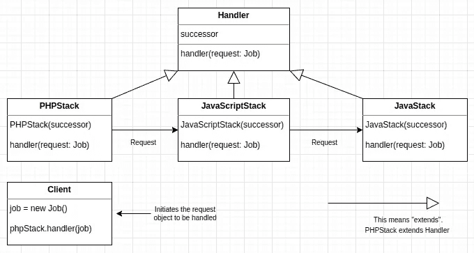

# 责任链模式——谁在承担责任？

> 原文：<https://medium.com/geekculture/chain-of-responsibility-pattern-who-are-taking-the-responsibility-70923b8219a2?source=collection_archive---------10----------------------->


P.C. [https://cutt.ly/52wVfxZ](https://cutt.ly/52wVfxZ)

## 一组物体如何合作完成一项单个物体无法单独完成的任务。

***注*** *:本出版物演示了打字稿中的责任链模式。参见其他代码示例:* [*PHP*](https://3v4l.org/hF35E#v8.2.3) *，*[*TypeScript*](https://www.typescriptlang.org/play?#code/MYGwhgzhAEBSD2AjaBvAUNaAHATgSwDcwAXAU2gBNTiw8QIAuaCY-AOwHM0Nph42WOAK7Bi8HAAoqNOo2as8nAJSoemYgAs8EAHTTa9aAF5K1AxB4BfbphykAjkLx2AtqTbEIEleky3qQjhs0JraemayANxWaNZooJAwAMo0wADWACLUpKLiqpgsJHjA0C4kwBoShelMgoocADSmMvS1CspMiPDwIKRgwb5+dsSBwfqyOopUAB4A8gBmValpKgB80AC0AIwxcWCIgmCivOBQ0AAS-RS9OPnYOPBkoqQUzCLApFDiTJds16Q4AA+Qj+pHmihe0UwPHm4gA7mAcBQACrwJLvT4QcQSABWSCYCEQSiYBHgeFeg0weHm0AkoV0EAxXxwSjUfnpOkZwA+zJ0GiuvVxSCUUOgcUw+0Ox35f0FeMQBOFTH6AE9onEEmcAArnLUpI5paCkaZkP4wX7-W6DPgCVgiMSSLk8rE4H4CgE+NmMrAA7yi9RaBlMl3GN7czHiUXi6Ay-5ChVwYV3Kk0iT69JZJ4OnRlYgVCQAch1WoLTXlOjsjmcpDcHi8SgbbMwAHpm9AAHKPakq6DF0wEUggeA+nAWPx+G1Y3o6IccQt99NpAsitmDiCkJshQM6WE4BFI1Ho8PM+MrzDWDWnGCwMBEJLAfBYYiLo0m9wUc3uq08Sd23KO4NvguL9PXHb1fTPdltydCNbhMGDmSjGwY3deNFSJZNoGpWlF0zHJs1zfMCxvO8HzwJ9S2gctKycVx3E8bxG3HFs207YhuzgW8wHvR9iH7QdhwBMdmMnHpSBneA52IriePIvjF2Xf0jXoDdmK3MJd33FE0UAyR5Ugi9uE1a8ZOWV9TQ-YDZQBO4f34QR7WxBCXTdayWUw8DJEggMwmcvJ4N0pCeFjOV8UTDDKSw1NcOyf8c3KSppKISjqIcWia3o+smOY1sOy7eYexIsB+KHEdhPHUTp1nQsiugBTvOU9dNw5TTEW0o9nWxfTdiMq9oAyeA2K0ThzPfT83LuELSDQ8LQL8XKBugNhHmGrgKvssSJKk5ENHIGjPj4pAcXwrCYBBKaKEUnq0FygBhflFGgeAaUJFCJqO-CLF-ShBpW+pQzYUg4X637Qk4P14nsvicVMg0AaBzi72WKRQdWldvph0jeJfExAeBorZKfRdcVh9J0ah7ANCwHGloR4ticx7iyKJ5YVxutsdr2tKDqexBjuOMRoEQcgLsh20qKQeH8aQeddUU6BcuRHAewqfoOH+zRyCIEAhHIQWtRVTR+CaAnmcO24iu4XL9RwTw3uuDXdvC3n+eINAsCpxc+VQ-TIiAA)*和*[*Java*](https://gist.github.com/unclexo/70348534f856362204ec4ed0d85b380e)*。*

## 目的

> 通过给多个对象一个处理请求的机会，避免将请求的发送方耦合到接收方。链接接收对象，并沿着链传递请求，直到有对象处理它。

## 一个场景

你知道吗？你是软件工程师/开发人员。您正在开发一个工作列表 web 应用程序。根据软件工程师/开发人员的**技术堆栈**，当发布新工作时，新要求将通过电子邮件发送给他们。以下生态系统会出现这种情况:PHP、JavaScript、Java 生态系统相关的工作应该分别去找 PHP、JavaScript、Java 开发者。其他工作不会发送给任何开发人员。

你会怎么做？

## 你的任务

假设您已经有了一个实现的算法来根据任务的需求确定任务的技术堆栈。现在，您需要做的就是创建一个可以使用堆栈检测器来处理新任务的设计。

## 责任链如何运作

当您使用责任链模式时，通常会创建一个对象链，并沿着这个对象链传递一个请求进行检查。每个对象依次检查请求，并尝试处理它，或者如果请求失败，传递给链中的下一个对象。

让我们想象一下责任链如何与我上面描述的**场景**一起工作。



The UML diagram of Chain of Responsibility

链中的每个对象都充当一个处理程序，并且有一个后继对象。如果它能够处理请求，它就会处理；否则，它会将请求转发给它的后继者。

## 参与者

现在，看看实现责任链模式所需的参与者。

**处理程序:** ( `Handler` —一个接口或抽象类)

*   定义处理请求的接口。
*   实现后续链接。(可选)

具体负责人——(`PHPStack`，`JavaScriptStack`)

*   处理它所负责的请求。
*   可以访问它的继任者。
*   如果`ConcreteHandler`能够处理请求，它就处理；否则，它会将请求转发给它的后继者。

**委托方**——(`Client`发起方)

*   向链上的一个`ConcreteHandler`对象发起请求。

## 调查

让我们把这个场景作为责任链模式的一个例子来研究。该模式具有以下属性:

*   将请求的发送方与其接收方对象分开。
*   给多个对象一个处理请求的机会。
*   沿着接收对象链传递请求，直到有对象处理它。

注意这里的`Job`是请求对象。`Client`是一个类/方法，它使用一个`Job`对象来传递处理程序对象，如`PHPStack`、`JavaScriptStack`等。

将请求的发送者和接收者对象分开。

看看 UML，`Client`是从请求处理程序对象如`PHPStack`、`JavaScriptStack`等中分离出来的。

给多个对象一个处理请求的机会。

由于`Job`对象正沿着`PHPStack`、`JavaScriptStack`和`JavaStack`的链传递，因此它得到了不止一次的处理机会。

沿着接收对象链传递请求，直到一个对象处理它。

`Job`对象沿着链传递，直到`PHPStack`、`JavaScriptStack`和`JavaStack`中的任何一个处理它。

## 履行

我们将从`Handler`抽象类开始，它定义了一个处理请求对象的接口(在本例中是`Job`，并实现了一个后继链接。

```
abstract class Handler {
  protected successor: Handler|undefined;

  forwardToSuccessor(job: Job): void {
    if (this.successor)
      this.successor.handle(job);
  }

  abstract handle(job: Job): any;
}
```

`handle()`方法是处理请求对象的接口，而`forwardToSuccessor()`是将请求转发给后继对象的方法。

我们有一个处理`Job`对象的接口。现在我们可以实现几个`ConcreteHandler`类来处理这个对象。

```
class PHPStack extends Handler {
  constructor(successor: Handler) {
    super();
    this.successor = successor;
  }

  handle(job: Job) {
    if (StackDetector.match('PHP', job.requirements()))
      // Notify PHP developers
      console.log('PHP Stack');
    else
      this.forwardToSuccessor(job);
  }
}
```

```
class JavaScriptStack extends Handler {
  constructor(successor: Handler) {
    super();
    this.successor = successor;
  }

  handle(job: Job) {
    if (StackDetector.match('JavaScript', job.requirements()))
      // Notify JavaScript developers
      console.log('JavaScript Stack');
    else
      this.forwardToSuccessor(job);
  }
}
```

这里如果`handle()`方法可以处理`Job`请求对象，那么它就会处理；否则，如果有后继对象，它将把`Job`对象转发给后继对象。

**注意**如果那些处理程序对象不能处理请求怎么办？在这种情况下，您可以保持请求对象不被处理，也可以提供默认实现。例如:

```
class DoNothing extends Handler {
  handle(job: Job) {
    // Do nothing
    console.log('The request object is unhandled');
  }
}
```

这里是`Job`请求对象:

```
class Job {
    private details: string

    constructor(details: string) {
      this.details = details
    }

    requirements() {
        return this.details;
    }
}

class StackDetector {
  static match(stack: string, details: string): boolean {
    return details.indexOf(stack) > -1
  }
}
```

现在是时候让`Client`向链上的`ConcreteHandler`对象发起请求对象了。

```
// Chain of Job handler objects
const doNothing = new DoNothing();
const javaScriptStack = new JavaScriptStack(doNothing);
const phpStack = new PHPStack(javaScriptStack);

// The request object to be handled
const job = new Job('JavaScript');

// Starts handling the Job object
phpStack.handle(job); // prints "JavaScript Stack"
```

在 [PHP](https://3v4l.org/hF35E#v8.2.3) 、 [TypeScript](https://www.typescriptlang.org/play?#code/MYGwhgzhAEBSD2AjaBvAUNaAHATgSwDcwAXAU2gBNTiw8QIAuaCY-AOwHM0Nph42WOAK7Bi8HAAoqNOo2as8nAJSoemYgAs8EAHTTa9aAF5K1AxB4BfbphykAjkLx2AtqTbEIEleky3qQjhs0JraemayANxWaNZooJAwAMo0wADWACLUpKLiqpgsJHjA0C4kwBoShelMgoocADSmMvS1CspMiPDwIKRgwb5+dsSBwfqyOopUAB4A8gBmValpKgB80AC0AIwxcWCIgmCivOBQ0AAS-RS9OPnYOPBkoqQUzCLApFDiTJds16Q4AA+Qj+pHmihe0UwPHm4gA7mAcBQACrwJLvT4QcQSABWSCYCEQSiYBHgeFeg0weHm0AkoV0EAxXxwSjUfnpOkZwA+zJ0GiuvVxSCUUOgcUw+0Ox35f0FeMQBOFTH6AE9onEEmcAArnLUpI5paCkaZkP4wX7-W6DPgCVgiMSSLk8rE4H4CgE+NmMrAA7yi9RaBlMl3GN7czHiUXi6Ay-5ChVwYV3Kk0iT69JZJ4OnRlYgVCQAch1WoLTXlOjsjmcpDcHi8SgbbMwAHpm9AAHKPakq6DF0wEUggeA+nAWPx+G1Y3o6IccQt99NpAsitmDiCkJshQM6WE4BFI1Ho8PM+MrzDWDWnGCwMBEJLAfBYYiLo0m9wUc3uq08Sd23KO4NvguL9PXHb1fTPdltydCNbhMGDmSjGwY3deNFSJZNoGpWlF0zHJs1zfMCxvO8HzwJ9S2gctKycVx3E8bxG3HFs207YhuzgW8wHvR9iH7QdhwBMdmMnHpSBneA52IriePIvjF2Xf0jXoDdmK3MJd33FE0UAyR5Ugi9uE1a8ZOWV9TQ-YDZQBO4f34QR7WxBCXTdayWUw8DJEggMwmcvJ4N0pCeFjOV8UTDDKSw1NcOyf8c3KSppKISjqIcWia3o+smOY1sOy7eYexIsB+KHEdhPHUTp1nQsiugBTvOU9dNw5TTEW0o9nWxfTdiMq9oAyeA2K0ThzPfT83LuELSDQ8LQL8XKBugNhHmGrgKvssSJKk5ENHIGjPj4pAcXwrCYBBKaKEUnq0FygBhflFGgeAaUJFCJqO-CLF-ShBpW+pQzYUg4X637Qk4P14nsvicVMg0AaBzi72WKRQdWldvph0jeJfExAeBorZKfRdcVh9J0ah7ANCwHGloR4ticx7iyKJ5YVxutsdr2tKDqexBjuOMRoEQcgLsh20qKQeH8aQeddUU6BcuRHAewqfoOH+zRyCIEAhHIQWtRVTR+CaAnmcO24iu4XL9RwTw3uuDXdvC3n+eINAsCpxc+VQ-TIiAA) 和 [Java](https://gist.github.com/unclexo/70348534f856362204ec4ed0d85b380e) 中的完整代码示例

## 跟我来:

中、 [Github](https://github.com/unclexo) 、 [Twitter](https://twitter.com/unclexo) 、 [LinkedIn](https://www.linkedin.com/in/unclexo) 。

## 参考资料:

1.  [头先设计图案](https://www.amazon.com/Head-First-Design-Patterns-Brain-Friendly-ebook/dp/B00AA36RZY)
2.  [设计模式:可重用面向对象软件的元素](https://www.amazon.com/Design-Patterns-Elements-Reusable-Object-Oriented/dp/0201633612)