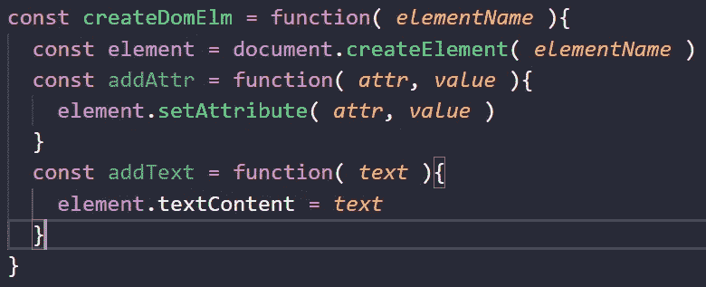
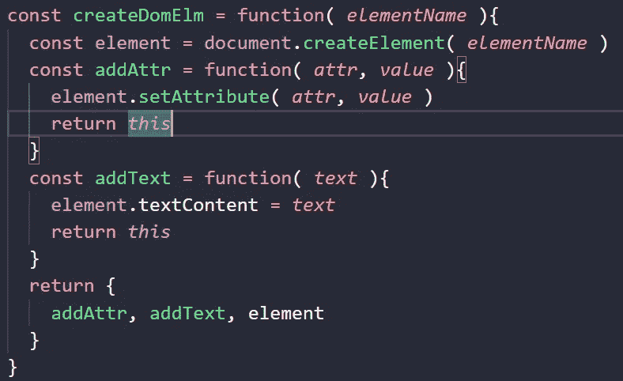
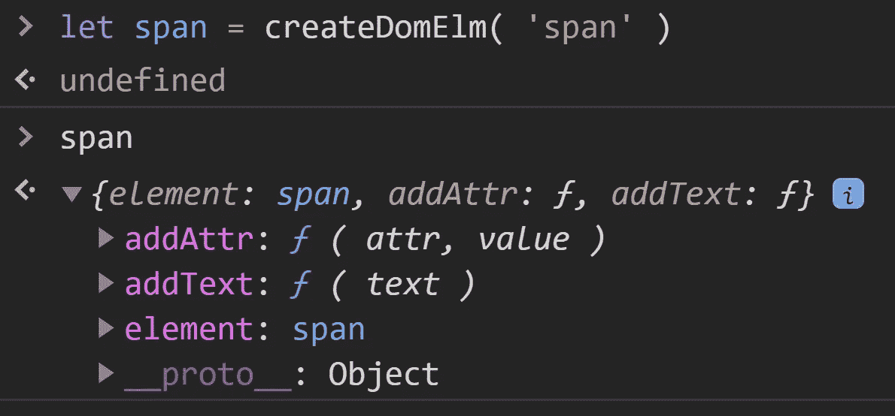
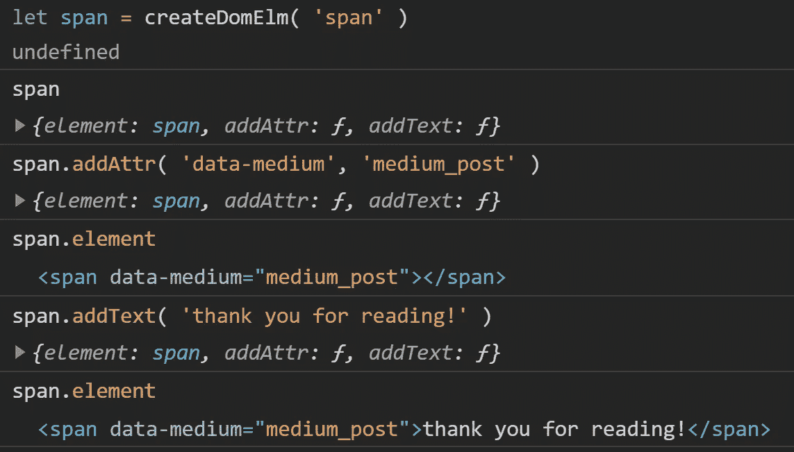
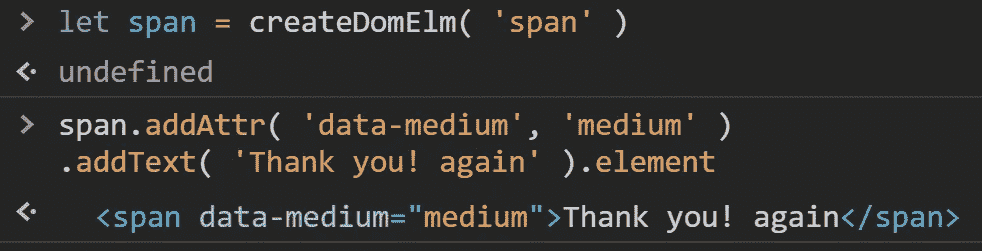

# JavaScript 中的链接方法

> 原文：<https://medium.com/geekculture/chaining-methods-in-javascript-4ca49c65fe9b?source=collection_archive---------28----------------------->

这在我们使用 classList、replace 或 filter 方法时很常见，但是我们可以创建自己的链接方法吗？

# 首先创建一个对象

我们将创建一个名为 createDomElm 的函数表达式来接收字符串参数(elementName ),然后在 createDomElm 中，我们需要用 createElement()方法创建新元素，并将其保存在一个名为 element 的变量中。之后，我们将创建两个函数，第一个是 addAttr，接收两个参数(属性和值),第二个是 addText，它只接收一个参数。

Example first step with chaining methods

# 第二加上退货和这个

返回私有函数和元素，在每个方法中返回这个，在这个例子中是 addAttr 和 addText。

Example adding return and this

# 第三检查方法

如果您调用 createDomElm 方法并传递一个 string 参数，它将为您提供一个包含它所拥有的方法和元素(在本例中是我们的新 span)的对象。

Example testing our new method

现在我们可以使用这个方法，像这样向新的 span 添加属性和文本

Testing our new span with addText and addAttr mehtods

# 最后是链接方法

在这种情况下，我们只需要像其他链接方法一样在一行中链接每个方法。

Example using chaning methods

# 结论

这真的很常见，这是一个非常基本的例子，但是如果你想在你的项目中使用私有和公共方法，并添加链接方法，这将是非常有用的。

# 来源

[这本书真的很神奇](https://www.amazon.com.mx/Object-Oriented-JavaScript-English-Stoyan-Stefanov-ebook/dp/B0057UNEJC/ref=sr_1_4?__mk_es_MX=%C3%85M%C3%85%C5%BD%C3%95%C3%91&crid=2H24IH4AYMEVM&dchild=1&keywords=object+oriented+javascript&qid=1615433095&sprefix=object+%2Caps%2C236&sr=8-4)
[完整代码](https://github.com/rodrigofigueroa/30jsch/blob/main/namescape/app.js)