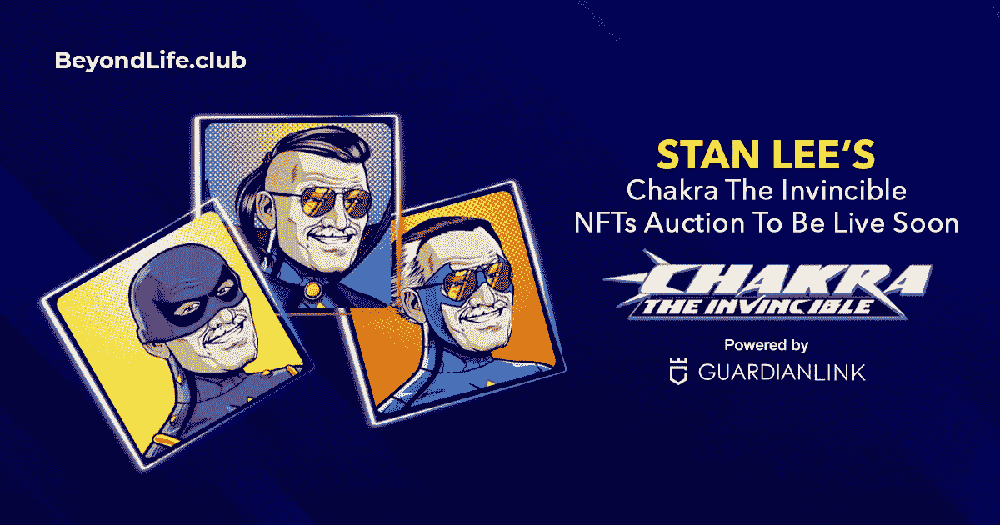
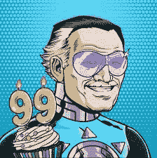
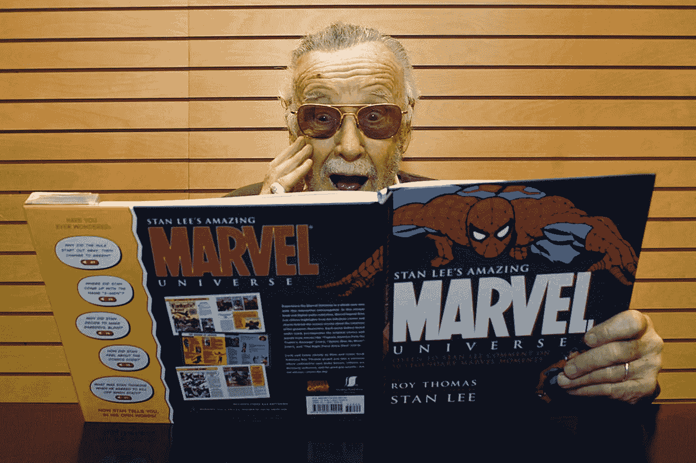

# 无敌查克拉:蜘蛛侠的创造者斯坦·李变成了 NFT

> 原文：<https://medium.com/geekculture/chakra-the-invincible-co-creation-of-spider-man-creator-stan-lee-turning-out-to-be-an-nft-987188b531fe?source=collection_archive---------19----------------------->

无敌查克拉是第一个印度漫画人物斯坦·李的创作之一。事实证明，Chakraverse NFT 系列的限量版将于 12 月 27 日由 BeyondLife.club(由 GuardianLink.io 提供支持)与 Orange Comet (NFT 制作和推广公司)合作推出。拍卖将于 2021 年 12 月 27 日直播，持续至 2021 年 12 月 30 日。这里是博客，它将简要地给你深入了解斯坦·李的查克拉无敌 NFTs 的信息。

# 谁是斯坦·李？

让我们从斯坦·李是谁以及他有史以来最好的作品开始这篇博客吧。他是一位传奇的美国漫画作家，也是一名编辑、出版商和制片人。他的作品很受欢迎，例如，共同创造了著名的超级英雄，如 x 战警，钢铁侠，绿巨人，黄蜂，蜘蛛侠，黑寡妇，斯嘉丽，超胆侠，神奇四侠医生等。这些超级英雄漫画人物遍布全球，见证了众多粉丝。

# **无敌查克拉是什么？**

在其他几个漫威角色中，他还想出了一个印度超级英雄角色——**[**查克拉无敌**](https://chakra.beyondlife.club/?fsz=home) 。这部小说于 2013 年在卡通频道播出。**

**剧情主要围绕住在孟买的年轻科技天才拉朱·拉伊展开。他在科学家“辛格博士”的陪同下，创造了一套技术套件，可以激活人体的能量脉轮。通过这个超级英雄，Raju Rai 如何保护孟买免受超级恶棍的攻击。**

# ****查克拉无敌 NFTs——介绍****

**当斯坦·李活着的时候，他想把《无敌查克拉》拍成电影。可悲的是，它并没有实现。考虑到，斯坦·李的无敌查克拉是一个 NFT，这是尚未公布。是的，漫威漫画的联合创作人斯坦·李的最后一个未出版的角色将被取消，成为可供拍卖的 NFTs。**

****

> **拍卖日期为 2021 年 12 月 27 日，将于 2021 年 12 月 30 日结束。除此之外，为了纪念已故传奇人物斯坦·李，他的 99 岁生日特别 NFT 系列将于 2021 年 12 月 28 日推出。**

# ****BeyondLife.club 掉落查克拉无敌 NFTs****

**想知道，谁会放弃无敌 NFTs 的脉轮？这是 BeyondLife.club，因其之前的推出而闻名，即阿米特巴·巴强的 NFTs drop。这些 NFT 以将近 966，000 美元的价格售出。7.18 亿)。**

**由 GuardianLink.io 提供动力的 BeyondLife.club 下一个项目是斯坦·李的查克拉无敌 NFTs drop。是的，与 Orange Comet (NFT 生产和推广公司)合作，将推出限量版独家 Chakraverse 系列。**

# ****Chakraverse NFT 系列的下跌推动了 NFT 市场****

**简而言之，NFT 或不可替换的令牌是可区分的，不可互换，不可复制。这可能是数字作品向资产的转化。**

**数字作品可以是任何东西。无论是艺术，音乐，运动时刻，视频游戏项目，迷因，视频，音频，漫画人物。购买 NFTs 的人将拥有所购买的具有相关许可证的 NFT 的所有权。**

**在过去的五年里，对 NFTs 的大肆宣传已经开始达到了天价。来到现在这个时代，可以很明显的说 NFTs 的热潮正在涌动。**

> **NFT 爱好者肯定会意识到阿米特巴·巴强的 NFTs 下降。他的收藏在 BeyondLife.club 举办的拍卖会上以 966，000 美元的价格售出。这是一个这样的范例，显著地显示了 NFTs 的热潮是如何令人振奋的。**

**随着时间的推移，NFT 的总价值会增加。值得注意的是，斯坦·李的查克拉无敌 NFTs 的推出显然将是当今时代的一个缩影。这将彻底改变漫画世界，也是斯坦·李粉丝进入蓬勃发展的 NFT 领域的好机会。**

****

# ****如何购买斯坦·李的查克拉无敌 NFTs？****

**圣李查克拉无敌 NFTs 的拍卖由 BeyondLife.club 主办，因此希望参加拍卖的人必须通过访问[**beyond life . club**](https://chakra.beyondlife.club/?fsz=home)进行预注册。此外，你可以获得新闻和公告，并了解更多关于斯坦·李的查克拉维 NFT 收集。这是查克拉维 NFT 的独家收藏清单，将于 2021 年 12 月 27 日下架。**

> **查克拉艺术朋克**
> 
> **动画生活漫画书封面**
> 
> **漫画书封面**
> 
> **七脉轮的力量**
> 
> **NFT 动画视频**

**此外，斯坦·李的 b'day 特殊 NFTs 将在他 99 岁生日，也就是 2021 年 12 月 28 日，被取消。**