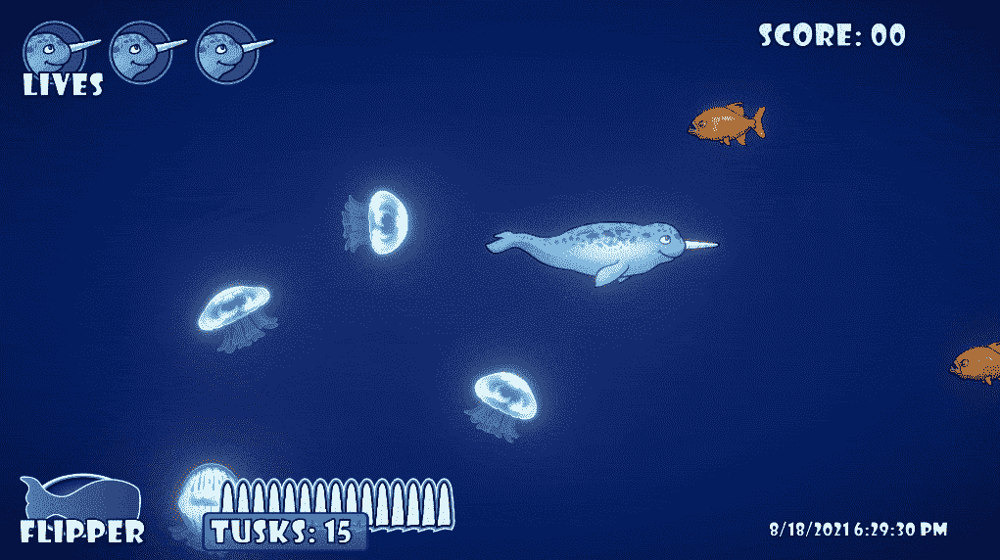

# 挑战:创造一个侵略性的敌人类型

> 原文：<https://medium.com/geekculture/challenge-create-an-aggressive-enemy-type-71dc4b2c34ad?source=collection_archive---------34----------------------->

我在这篇文章中的目标是制造一种敌人类型，如果他们彼此靠得太近，就会试图撞向玩家。新加入的水母敌人非常渴望承担这一责任。

为了让这只水母能够攻击，我需要一把**变量**放在**敌人职业**的顶端。我有三个浮点值来分配推力，将由…