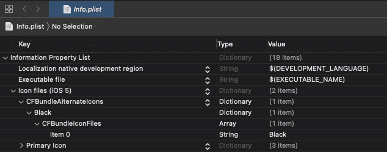
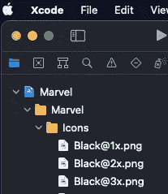
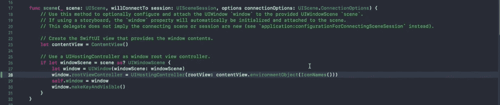
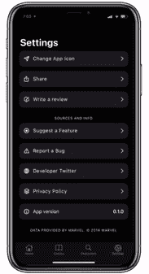

# 在 SwiftUI 中更改应用程序图标

> 原文：<https://medium.com/geekculture/change-app-icons-in-swiftui-11c7b5f2b2ed?source=collection_archive---------13----------------------->

SwiftUI 中的备用应用图标切换器

Image Credits: Alexander Shatov on Unsplash

替代应用图标功能已经存在一段时间了(从 iOS 10.3 开始)。Slack、Github、Telegram 等热门应用已经提供了这一功能。它实现起来相当简单，并为用户增加了一个很好的定制选项。

我们的目标

本文将向您展示如何在 SwiftUI 中构建一个替代的应用程序图标切换器。

请务必按照苹果的人机界面指南[准备好您的应用程序图标集](https://developer.apple.com/design/human-interface-guidelines/ios/icons-and-images/app-icon/)。

我们开始吧！

***第一步:***

头到`Info.plist`文件，`Add Row` &命名为`Icon files(iOS 5)`。一旦你这样做了，它会显示一个`Primary Icon`和一个 `Newsstand Icon`。

这样，我们将继续在图标文件(iOS 5)中创建一个名为`**CFBundleAlternateIcons**`的类型为`Dictionary`的新部分。

在我们的字典(`CFBundleAlternateIcons`)中，我们将创建另一个字典，并将其命名为`Black` **。**在这个字典中，我们将添加一个名为`**CFBundleIconFiles**` **的数组。我们将在这个数组中添加图标的名称。**

Info.plist

现在让我们将应用程序图标导入到我们的项目中。

> 注意:我们不会将这些图标添加到`**Assets.xcassets**`文件夹中(就像您可能已经为默认应用程序图标所做的那样)。

创建一个名为`**Icons**` 的群组，然后&在那里添加你的替代图标。我建议给这些图标图像集起个聪明的名字，因为你以后会用到它们。

The example project is called “Marvel”, you’ll create the folder “Icons” within the structure of your Xcode project.

在数组中，我们将添加第一个图标的名称`Black`，我刚刚在这里添加了一个替代图标，但您可以随意复制字典`Black`来获得您想要的任意多个图标，只需用您相应的图标名称替换`Black`即可。

我们已经完成了在项目中添加图标的初始设置。现在让我们看看如何在下一步访问这些图标。

***第二步:***

1.)创建一个符合`*ObservableObject*`的类`IconNames`。

2.)我们将`iconNames`设为可选，以防图标找不到时崩溃。

3.)现在声明另一个变量来跟踪我们所在的索引，并定义一个函数`*getAlternateIconNames()*`来访问图标名称，如下所示

***第三步:***

现在让我们开始设置`ContentView`，添加一个选择绑定到`iconSettings`的选择器，也就是说，当当前索引&图标名称改变时，它也会改变我们的选择器。

在`ForEach`中，我们将从 0 迭代到所有图标名称&获取索引的值，因为它是可选的，所以如果没有任何内容，我们将提供默认应用程序图标的值来后退。

对于图像，我们将再次获取当前索引的`*iconName*`，提供我们的默认 AppIcon 图像作为我们的后备选项&，如果一切都是`nil`，那么它将只显示一个空白图像。

现在，如果用户打开了选择器，但改变了主意，最终点击了默认的应用程序图标，会发生什么呢？我们不想在这种情况下做任何事情，因为该应用程序图标已经在使用中。这正是我们在`*onReceive*`实例方法中处理的，我们将检查是否选择了任何替代的应用程序图标名称，如果没有，那么我们将退回到默认的应用程序图标。但是，如果选择了替代图标，我们将更改应用程序图标。(参考上面显示的代码)

***第四步*** :

**对于 UIKit 应用生命周期:**

在`SceneDelegate.swift`中，确保编辑根视图，这样`ContentView`就有了`environmentObject` `IconNames()` &它所做的是用`IconNames`初始化我们的`ContentView`，这样当`ContentView`构建时，它就已经被信息填充了。

SceneDelegate.swift

**对于 SwiftUI 应用生命周期:**

因为它们没有`SceneDelegate`和`AppDelegate`文件，你可以将`IconNames()`作为`**“YourAppName"**App.swift`文件中的`environmentObject`或者在`ContentView`文件中传递，如果你是从另一个视图执行这个特性的话(例如:一个单独的`SettingsView`)。

## **结果:**

**参考文献** : [创建可互换的应用程序图标](https://www.youtube.com/watch?v=ZRg7JDnYAQ8)作者 Jared Davidson

感谢阅读！