# 使用 Debezium 更改数据捕获、用例及真实示例

> 原文：<https://medium.com/geekculture/change-data-capture-use-cases-and-real-world-example-using-debezium-fe4098579d49?source=collection_archive---------2----------------------->

这个故事重点讲述***【CDC】***的变化数据是什么？在哪里使用它，它解决了什么问题，最后是一个真实的示例代码。

# 什么是疾控中心？

CDC 是一组技术/流程，允许识别和捕获数据库中已更改的数据。以便您可以在稍后阶段对数据采取行动，或者在某个特定的上下文中定义业务用例。

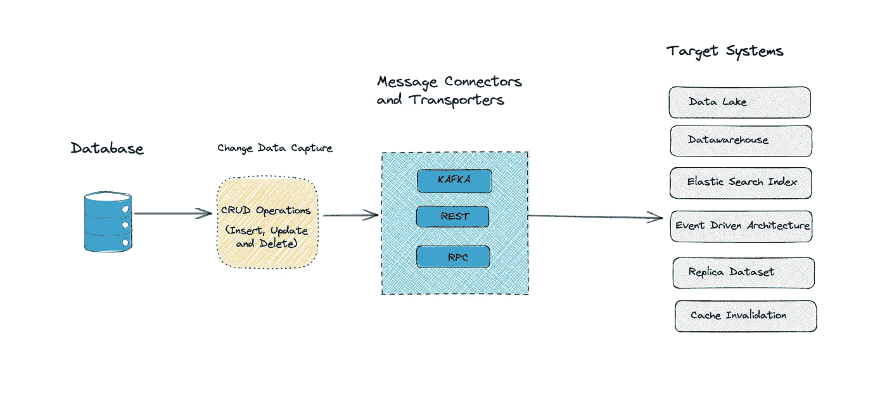

变更数据捕获是检测对数据库所做更改的过程。然后，这些更改可以被流式传输并与其他数据库和系统集成。换句话说:我们从数据库中接收一系列事件。

这允许我们基于数据(流处理和流 ETL)做出更快和更准确的决策。它不会像传统解决方案那样使系统和网络过载。通常这是升级遗留系统的唯一合理的解决方案。

变更数据捕获(CDC)通常是指一种用于捕获系统数据发生的所有变更的机制。对这样一个系统的需求不难想象——敏感信息的审计、跨多个数据库实例或数据中心的数据复制、将变更从事务性数据库转移到数据湖/OLAP 存储，等等。符合 ACID 的数据库中的事务管理本质上是 CDC。CDC 系统是对一个实体所做的每一次更改的记录以及该更改的元数据(更改者、更改时间等)。

CDC 是关于在系统的有限上下文中捕获数据变更，通常是在物理模型方面。系统记录对其自身数据的更改。即使我们有一个单独的服务或系统来存储这些变更(某种审计存储)，这种分离也是一个实现细节。在实际数据和对它的更改之间有一个领域建模的连续性，因此两者在逻辑上属于同一个边界。

让我们谈谈 CDC 可以解决某些问题的几个用例。有很多，但我打算谈几个。

## 将数据流式传输到数据湖或数据仓库

通常，这种流数据通过 ETL 或 ELT，这通常是实现数据的批量加载。这可以通过以下方式实现

*   后台进程定期从复杂查询中提取数据，这会增加主数据库的负载。
*   从主数据源汇集数据以获得增量变化。

上述方法的缺点是

*   数据使用量的峰值最终会降低性能(可以在低流量时发生)。
*   传输的大量数据会给网络带来压力，需要垂直扩展来处理大量数据。
*   由于我们按时间间隔汇集数据，这不是实时数据同步，可能会影响业务决策。

疾控中心如何解决上述问题

*   我们不定期进行任何高负载查询，以减少数据峰值。
*   传输的数据量要小得多，所以不会有网络压力。网络流量在这里均匀分布。
*   CDC 是实时数据同步，因此业务决策不会延迟。

**事件驱动架构**

最难完成的事情之一是在服务边界之间安全一致地交付数据。在 EDA 中，单个服务必须提交对其本地数据的任何更改，并且应该向底层排队系统发布消息，监听消息的消费者将相应地采取行动。这里的数据传输很棘手:

*   如果在数据库中提交数据，并且发布到事件流失败。
*   数据被发布到事件流，但在实际数据库中由于一些错误处理而触发了回滚。

这可以使用 [***发件箱模式***](https://microservices.io/patterns/data/transactional-outbox.html') ***来避免/修复。*** 我会在另一篇帖子中解释这一点。

也有几种方法可以实现 CDC 和行业的平衡。

# **实现变更数据捕获的方法**

***方法 1 —使用 Postgres 审计触发器***

基于触发器的方法包括在数据库上创建审计触发器，以捕获与插入、更新和删除方法相关的所有事件。这种方法的优点是一切都发生在 SQL 级别，开发人员只需要读取一个包含所有审计日志的单独的表。

要在 Postgres 表中创建触发器，请执行以下命令。

```
**SELECT audit.audit_table('target_table');**
```

该语句将由具有访问审计模式权限的用户角色执行。写入表的应用程序不得使用超级用户角色连接到数据库。

## 对 PostgreSQL CDC 使用 Postgres 审计触发器的限制

这种方法的缺点是触发器会影响数据库的性能。避免这种性能损失的常见做法是使用一个单独的表来跟踪主表，并在第二个表上使用触发器。主表和辅助表之间的同步可以使用 Postgres 逻辑复制特性来完成。

***方法二——使用 Postgres 逻辑解码***

逻辑解码使用预写日志的内容来创建数据库中发生的活动的日志。预写日志是在存储级别描述数据库更改的内部日志。这种方法的优点是它不会以任何方式影响数据库的性能。

这种方法基于输出插件的安装。要启用逻辑解码，需要在 Postgres 配置中设置以下参数。

```
**wal_level = logical
max_replication_slots = 10**
```

一旦设置了这些参数，执行下面的命令来创建一个逻辑解码槽。

```
**SELECT * FROM pg_create_logical_replication_slot('slot_repl', 'decode_test');**
```

【Postgres CDC 使用 Postgres 逻辑解码的限制

在这种情况下，开发人员也需要编写一个复杂的逻辑来处理这些事件，然后将它们转换成目标数据库的语句。根据您试图解决的用例，这可能会增加复杂性。

***方法 3 —使用时间戳列***

Postgres 引擎提供了上述两种方法来实现 CDC。如果您的表中有时间戳列的灵活性，还有一个稍微复杂的自定义方法。这意味着开发人员需要定期查询该表，并监控时间戳列的更改。当检测到更改时，脚本可以创建适当的数据库语句，将这些更改写入目标数据库。然而，这种方法是劳动密集型的，需要开发者花费大量的时间和精力。

简而言之，即使 Postgres 通过触发器、逻辑解码或自定义逻辑提供了对连续同步的支持， ***开发人员仍然需要捕获这些事件并将其转换到目标数据库*** 。这个逻辑需要根据用例为不同的目标数据库专门编写。另一种方法是使用基于云的服务，如 Hevo，它可以使用 Postgres CDC 将数据持续同步到大多数目的地。

以上三种方法各有利弊。我对疾控中心做了大量的研究，但几乎没有现成的解决方案。

*   [Hevo 数据](https://hevodata.com/)
*   [IBM Infosphere](https://www.ibm.com/in-en/analytics/information-server)
*   [Debezium](https://debezium.io/)
*   [Qlik](https://www.qlik.com/us/products/qlik-replicate)
*   [塔伦德](https://www.talend.com/)
*   [流集](https://streamsets.com/)

在上述可用的解决方案中，我探索了 Debezium，因为它是开源的。除了 Debezium Hevo 似乎很有前途。

# Debezium

> Debezium 是一个用于变更数据捕获的开源分布式平台。启动它，将它指向您的数据库，您的应用程序就可以开始响应其他应用程序提交到您的数据库的所有插入、更新和删除操作。Debezium 持久而快速，因此您的应用程序可以快速响应，即使出现问题也不会错过任何事件。

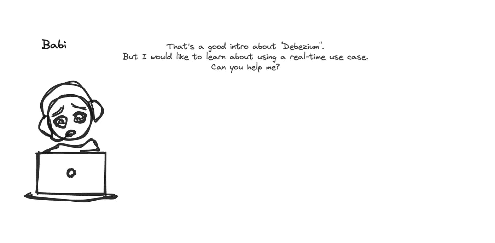

让我们考虑一个用例。假设您有一个类似于 IMDB 的应用程序，它有一个`movie-library`微服务，作为所有电影信息及其评级和用户实时记录的喜欢的单一来源。我们有一个`recommenation-engine`服务，将每半小时为用户列出以下功能(考虑一下)。

*   最喜欢电影的前 100 名。
*   最受欢迎的 100 部电影。
*   收视率最高的 100 部电影。
*   100 部广受好评的电影。
*   按流派排名的 100 部电影。

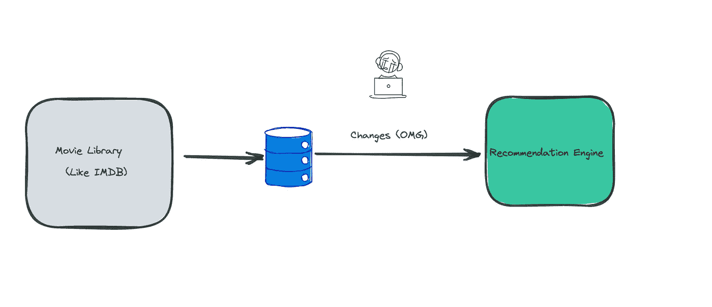

当有人看电影时，`movie-library`服务数据库被更新，观看次数被更新，同样喜欢不喜欢的和评级也被更新。`recommendation-service`需要这些真实的数据来预测给用户的最佳推荐，以获得更好的体验和个性化。*一种方法是直接查询主数据库，这在微服务生态系统中不是一个好的做法。*

考虑一下，如果主数据库将对它们的表所做的每一个更改都作为一个流推送到外部系统，会怎么样？这是个好主意，Babi 可能也会对此感到高兴。 ***Debezium*** 服务于此目的，它帮助将数据更改流式传输到订阅的外部子系统。

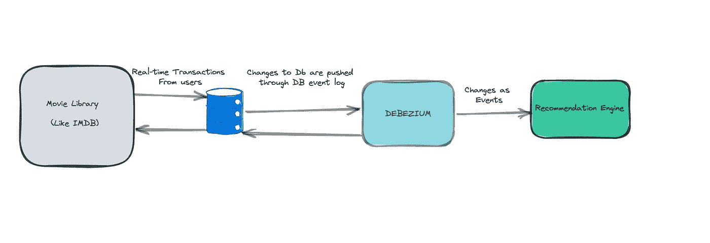

这应该是你了解 Debezium 的好时机。

**Debezium 如何工作？**

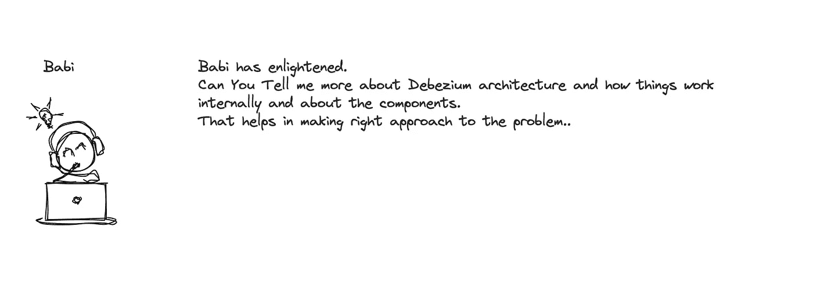

> Debezium 的目标是构建一个连接器库，它可以捕获各种数据库管理系统的变化，并产生具有非常相似结构的事件，使您的应用程序更容易使用和响应事件，而不管这些变化来自哪里。(**抄袭自原始资料**)

典型地 Debezium 架构围绕着 [***连接器***](https://debezium.io/documentation/reference/1.5/connectors/index.html) ***。*** 连接器有助于从源系统捕获流形式的数据更改，并将数据同步到目标系统。

Debezium 目前支持 [MySQL](https://debezium.io/documentation/reference/1.5/connectors/mysql.html) 、 [PostgreSQL](https://debezium.io/documentation/reference/1.5/connectors/postgresql.html) 、 [SQL Server](https://debezium.io/documentation/reference/1.5/connectors/sqlserver.html) 、 [Oracle](https://debezium.io/documentation/reference/1.5/connectors/oracle.html) 、 [Db2](https://debezium.io/documentation/reference/1.5/connectors/db2.html) 和 [MongoDB](https://debezium.io/documentation/reference/1.5/connectors/mongodb.html) 的连接器。

Debezium 提供了三种不同类型的部署方法。

***作为库嵌入到应用程序中***

这种方法的文档非常好。请在这里找到[。](https://debezium.io/documentation/reference/1.6/operations/embedded.html)

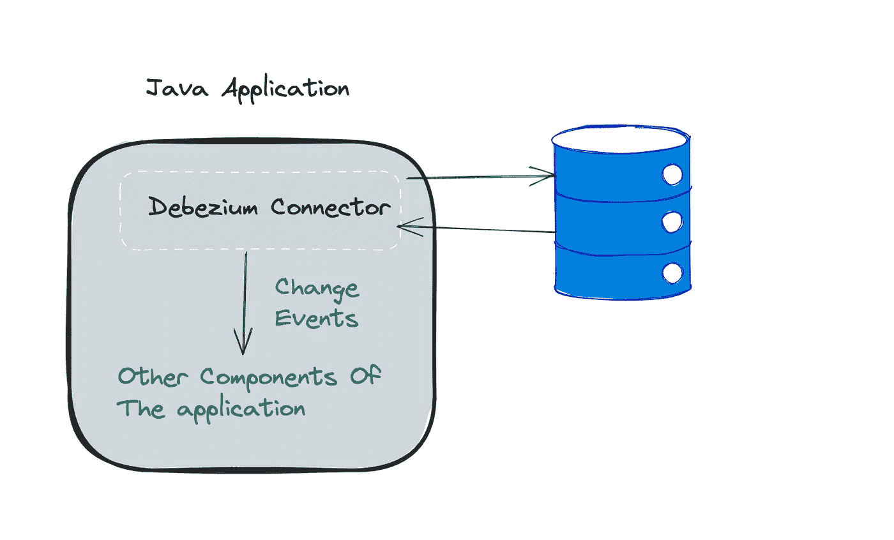

***作为独立服务器***

> 部署 Debezium 的另一种方式是使用 Debezium 服务器。Debezium 服务器是一个可配置的、随时可用的应用程序，它将变更事件从源数据库传输到各种消息传递基础设施。

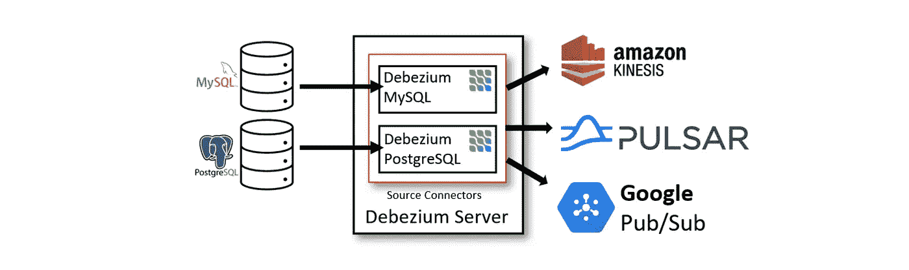

Standalone Server Architecture — [Source](https://debezium.io/documentation/reference/1.5/architecture.html)

Debezium 服务器被配置为使用其中一个 Debezium 源连接器来捕获源数据库中的更改。变更事件可以序列化为不同的格式，如 JSON 或 Apache Avro，然后发送到各种消息传递基础设施，如 Amazon Kinesis、Google Cloud Pub/Sub 或 Apache Pulsar。

***Apache Kafka Connect service 一种标准方法*** (我将演示这种方法，这通常用于企业用例)。

最常见的是，你通过 Apache [Kafka Connect](https://kafka.apache.org/documentation/#connect) 来部署 Debezium。Kafka Connect 是一个框架和运行时，用于实现和操作:

*   Debezium 等源连接器将记录发送到 Kafka。
*   将记录从 Kafka 主题传播到其他系统的接收器连接器。

下图显示了基于 Debezium 的变更数据捕获管道的架构:

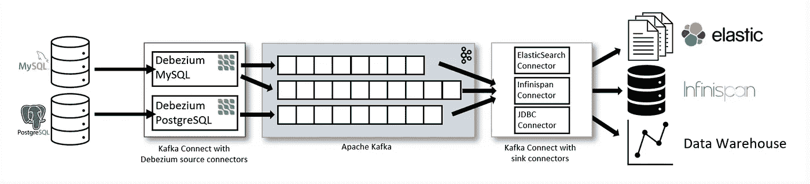

Kafka Connect Service Architecture — [Source](https://debezium.io/documentation/reference/1.5/architecture.html)

如图所示，部署了 MySQL 和 PostgresSQL 的 Debezium 连接器来捕获对这两种类型数据库的更改。每个 Debezium 连接器都与其源数据库建立连接:

*   MySQL 连接器使用客户端库来访问`binlog`。
*   PostgreSQL 连接器从逻辑复制流中读取。
*   Kafka Connect 是 Kafka broker 之外的一项独立服务。

默认情况下，来自一个数据库表的更改被写入一个 Kafka 主题，该主题的名称与表名相对应。如果需要，您可以通过配置 Debezium 的[主题路由转换](https://debezium.io/documentation/reference/1.5/configuration/topic-routing.html)来调整目标主题名称。例如，您可以:

*   将记录路由到名称不同于表名的主题。
*   将多个表的更改事件记录流式传输到单个主题中

变更事件记录保存在 Apache Kafka 中后，Kafka Connect 生态系统中的不同连接器可以将记录传输到其他系统和数据库，如 Elasticsearch、数据仓库和分析系统，或 Infinispan 等缓存。根据所选择的接收器连接器，您可能需要配置 Debezium 的[新记录状态提取](https://debezium.io/documentation/reference/1.5/configuration/event-flattening.html)转换。这个 Kafka Connect SMT 将`after`结构从 Debezium 的 change 事件传播到 sink 连接器。这取代了默认情况下传播的详细更改事件记录。

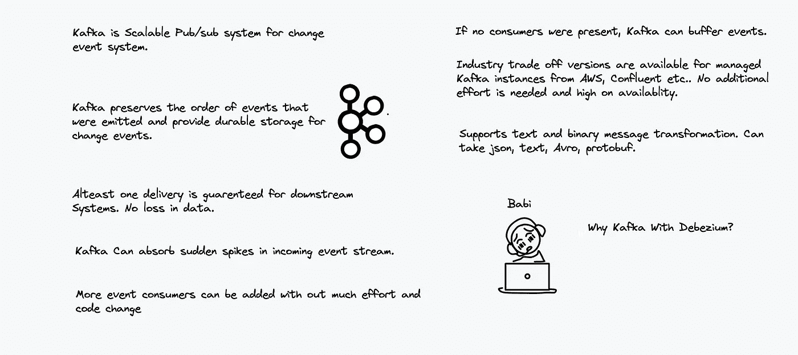

**用 Kafka 连接器实现一个用例**

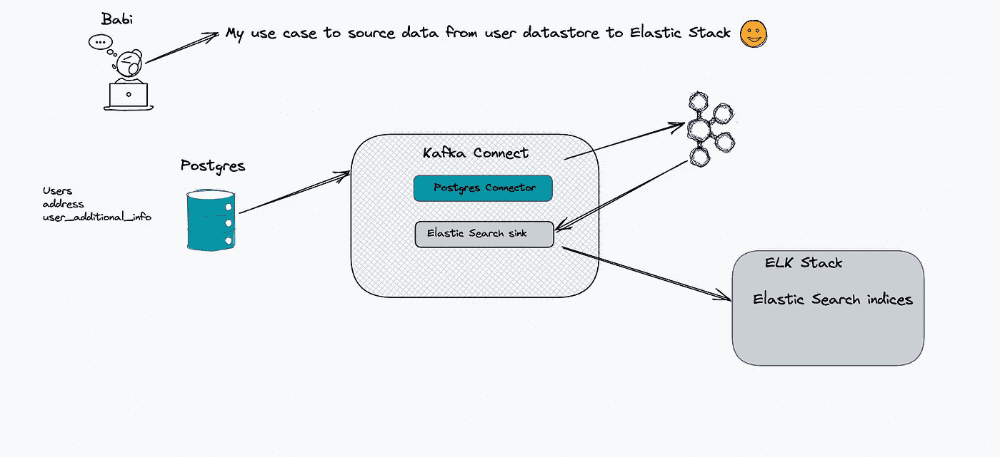

基础架构建立在 docker 之上。所有的资源都打包在一个 docker-compose 文件下。docker-compose 文件非常大，所以我不在这里张贴。请在这里找到 ***GitHub 链接***[](https://github.com/ereshzealous/debezium-sync-example/tree/main/pg-es-synch)****。****

*docker-compose 用于设置演示所需的基础设施:*

*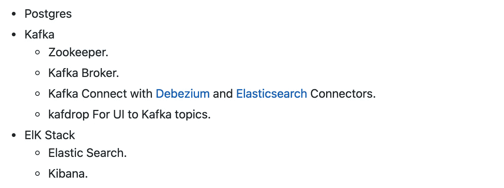*

***演示***

```
***export DEBEZIUM_VERSION=1.4 (or latest)**

# Build the docker file using docker compose. It will take a while for first time.
**docker-compose up --build**

# Configure the connectors. For simplicity I created shell script. 
**./init.sh***
```

*我在 Postgres 启动时加载了一些记录，数据库名是`user_data`，表是`users`、`user_address`和`user_additional_info`。所以当 docker-compose 完成时，记录就在那里了。*

> ***注:每次脚本生成随机数据。id 可以彼此不同。***

```
***FROM debezium/postgres:latest
COPY ./create_schema.sql /home/create_schema.sql
COPY ./seed_data.sql /home/seed_data.sql
COPY ./init-db.sh /docker-entrypoint-initdb.d/init-db.sh***
```

***创建 debezium 连接器***

****Postgres 数据连接器****

****弹性搜索用户汇表索引****

***检查 Postgres 数据库实例中的数据***

*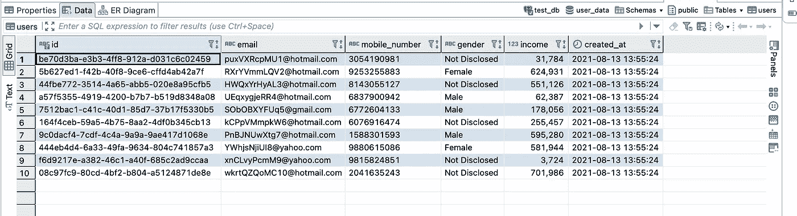*

***同样，入住弹性搜索指数***

*我已经在 docker-compose 中添加了 Kibana，这样我们就可以从 Kibana 开发控制台查询弹性搜索。请 [***点击这里的***](http://localhost:5601/app/kibana#/dev_tools/console?_g=()) 本地加载 Kibana dev 控制台。*

*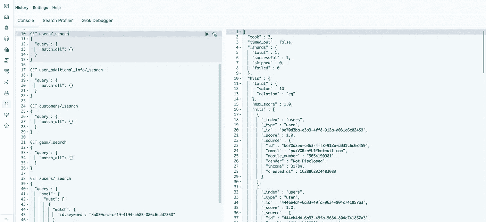*

***现在让我们更新任何记录，看看这是否反映在弹性搜索中。***

*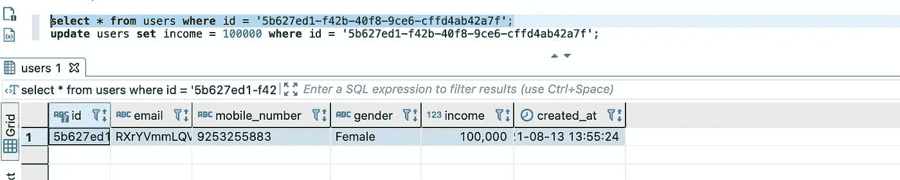*

***让我们对照弹性搜索进行查询***

*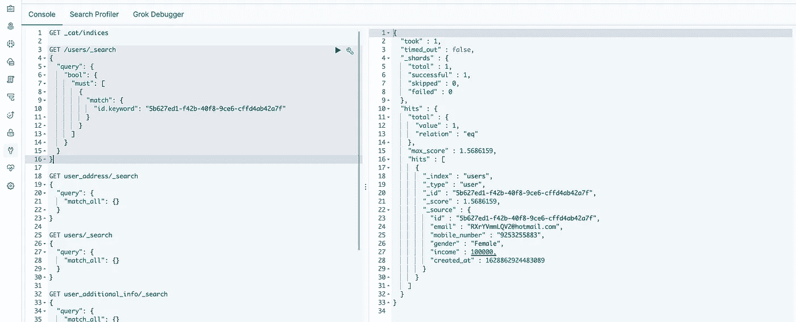*

***让我们从源系统中删除该记录***

*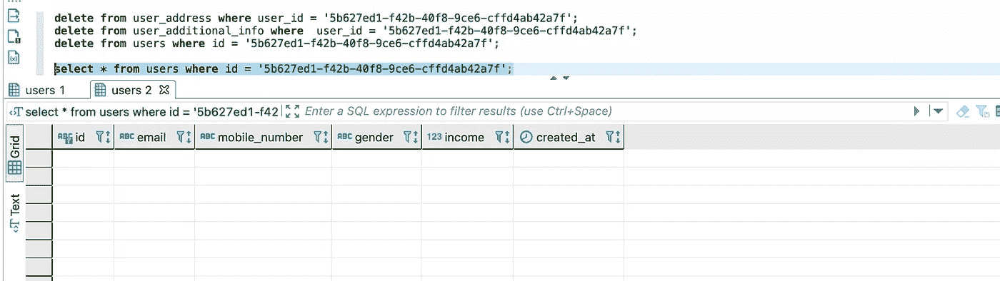*

***让我们在弹性搜索索引中验证***

*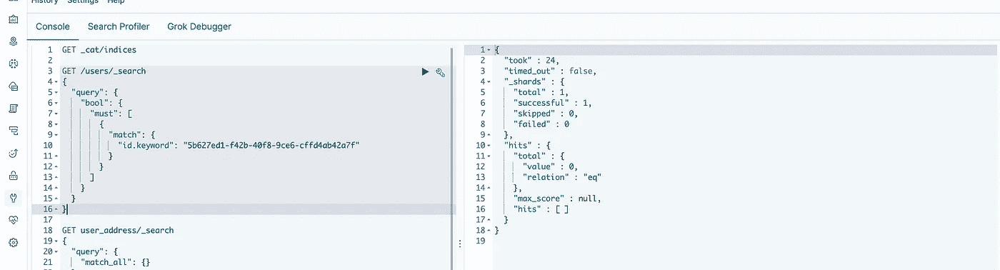*

***让我们检查卡夫卡事件的消息***

*我们使用了 ***Kafdrop*** 作为 UI。我们可以看到一个主题上发布的消息列表。要在本地打开 Kafdrop，请点击[此处](http://localhost:9100/)*

*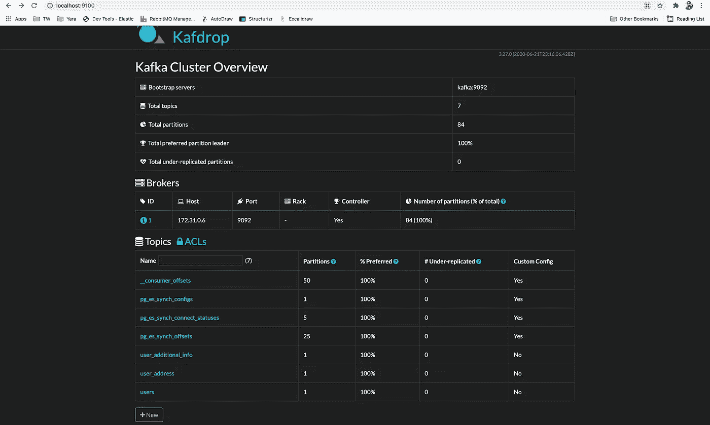*

*`users`、`user_address`和`user_additional_info`是与源数据库表相关的主题*

*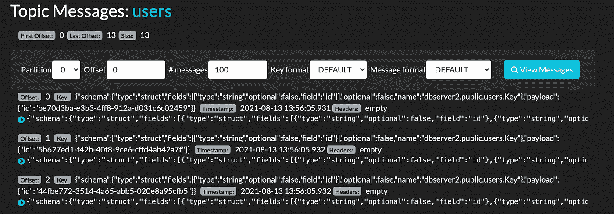*

*让我们理解 Debezium Kafka 连接器为数据变更产生的消息内容。*

*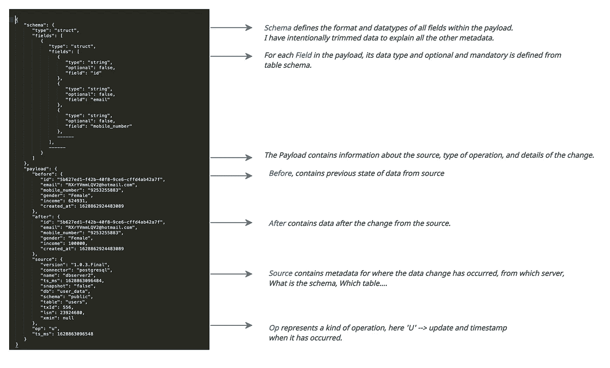*

*Babi 还有另一个用例。他是这样说的*

*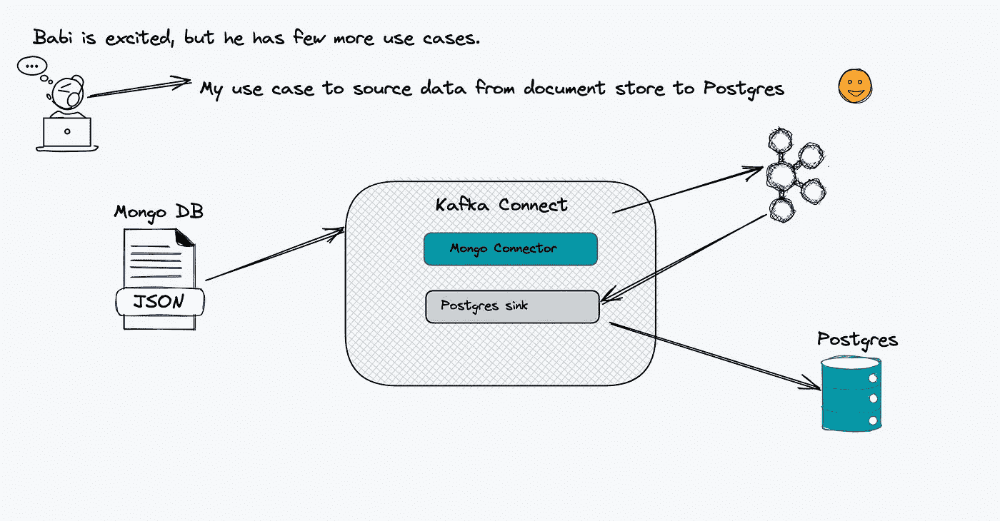*

*我在 Github 回购 [*这里*](https://github.com/ereshzealous/debezium-sync-example/tree/main/mongo-pg-synch) *已经明确记载了。**

*Babi 被说服了，但是他还有最后一个用例。*

*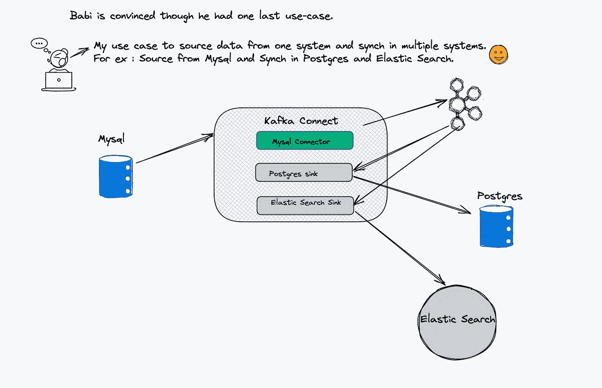*

*我已经在 GitHub repo [这里](https://github.com/ereshzealous/debezium-sync-example/tree/main/mysql-pg-es-compound-synch)明确记录了。*

*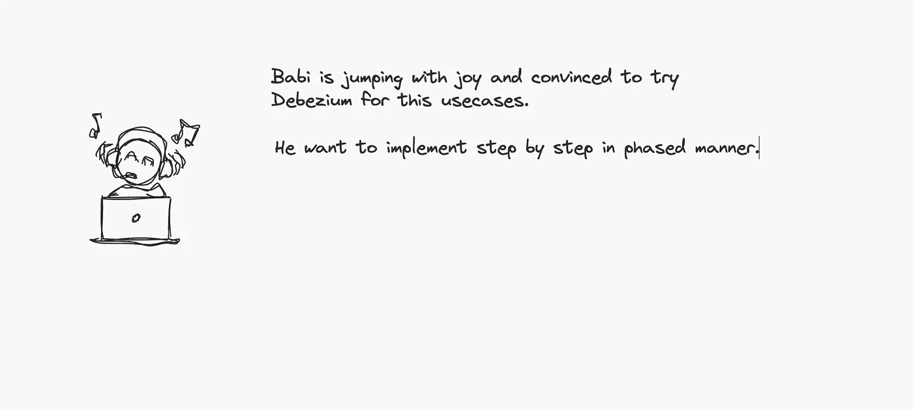*

***实现与目标系统同步的一些复杂性***

*当从 RDBMS 同步数据到 Elastic search 时，我们经常会遇到问题，Debezium connectors 中有很多选项可以定制连接选项。但是根据我的经验，我在将 Postgres 整合到弹性搜索时没有遇到什么问题。*

*但是我只为 Postgres 创建了一个源连接器，将更改作为流发布到 Kafka。然后，我编写了我们的语言和框架的自定义消费者来消费消息，并在弹性搜索中更新索引。简单的方法可能是使用 lambda 来消费来自卡夫卡的信息。*

****参考文献****

 *[## Debezium 建筑

### 最常见的是，通过 Apache Kafka Connect 部署 Debezium。Kafka Connect 是一个框架和运行时，用于…

debezium.io](https://debezium.io/documentation/reference/architecture.html)* *[](https://www.striim.com/change-data-capture-cdc-what-it-is-and-how-it-works/) [## 变更数据捕获(CDC):它是什么以及如何工作

### 关系数据库中捕获的业务事务对于理解业务运营的状态至关重要…

www.striim.com](https://www.striim.com/change-data-capture-cdc-what-it-is-and-how-it-works/) [](https://www.hvr-software.com/blog/change-data-capture/) [## 变更数据捕获(CDC)有哪些不同的方法？

### 在这篇博文中，我将描述执行变更数据捕获的四种常用方法:diff、date-modified…

www.hvr-software.com](https://www.hvr-software.com/blog/change-data-capture/)*